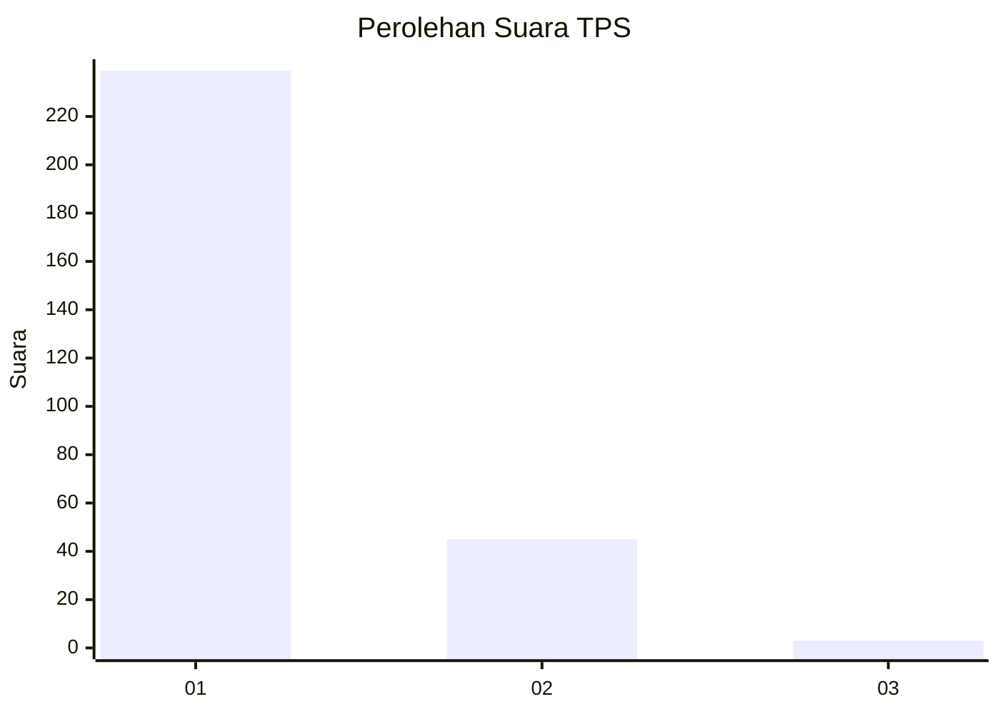
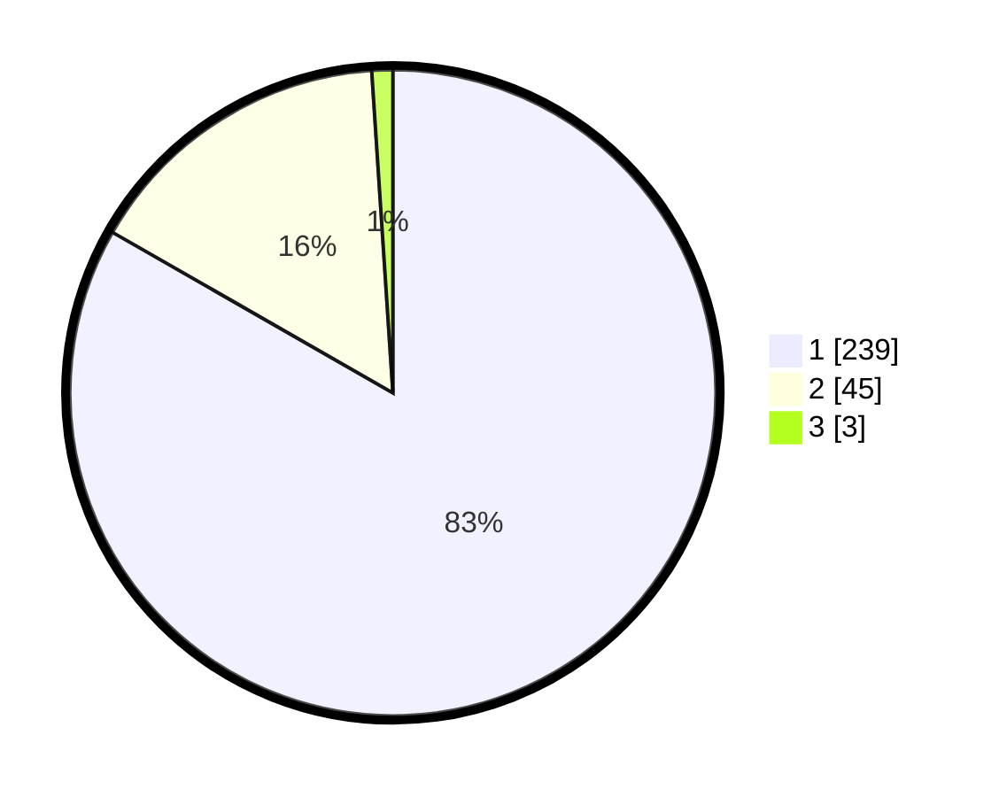

# Hasil

## Grafik

## Tabel

| No. | Nama Paslon    | Suara | Suara (raw) | Persentase |
|:--- |:-------------- | -----:| -----------:| ----------:|
| 1   | ANIES MUHAIMIN | 239   | [239][p-1]  | 83,28      |
| 2   | PRABOWO GIBRAN | 45    | [45][p-2]   | 15,68      |
| 3   | GANJAR MAHFUD  | 3     | [3][p-3]    | 1,05       |

[p-1]: https://github.com/gigit-pemilu/pemilu-2024-35-jawa-timur/blob/main/pilpres/hitung-suara/sub/35-jawa-timur/sub/28-pamekasan/sub/07-pegantenan/sub/2013-tanjung/sub/007-tps/sub/paslon-1.txt
[p-2]: https://github.com/gigit-pemilu/pemilu-2024-35-jawa-timur/blob/main/pilpres/hitung-suara/sub/35-jawa-timur/sub/28-pamekasan/sub/07-pegantenan/sub/2013-tanjung/sub/007-tps/sub/paslon-2.txt
[p-3]: https://github.com/gigit-pemilu/pemilu-2024-35-jawa-timur/blob/main/pilpres/hitung-suara/sub/35-jawa-timur/sub/28-pamekasan/sub/07-pegantenan/sub/2013-tanjung/sub/007-tps/sub/paslon-3.txt

## Foto C Plano

https://sirekap-obj-formc.kpu.go.id/b459/pemilu/ppwp/35/28/07/20/13/3528072013007-20240215-060400--be7c23de-f02a-48f6-9148-93b1cadfc05d.jpg

https://sirekap-obj-formc.kpu.go.id/b459/pemilu/ppwp/35/28/07/20/13/3528072013007-20240215-060506--3a2faa1e-5e8f-417b-976a-3a174eeae8bb.jpg

https://sirekap-obj-formc.kpu.go.id/b459/pemilu/ppwp/35/28/07/20/13/3528072013007-20240215-060122--b85ba405-4f2f-44f5-9477-0aab83f19c96.jpg

## Metadata

| Key        | Value               |
| ---------- | ------------------- |
| Time Stamp | 2024-02-15 21:30:27 |

