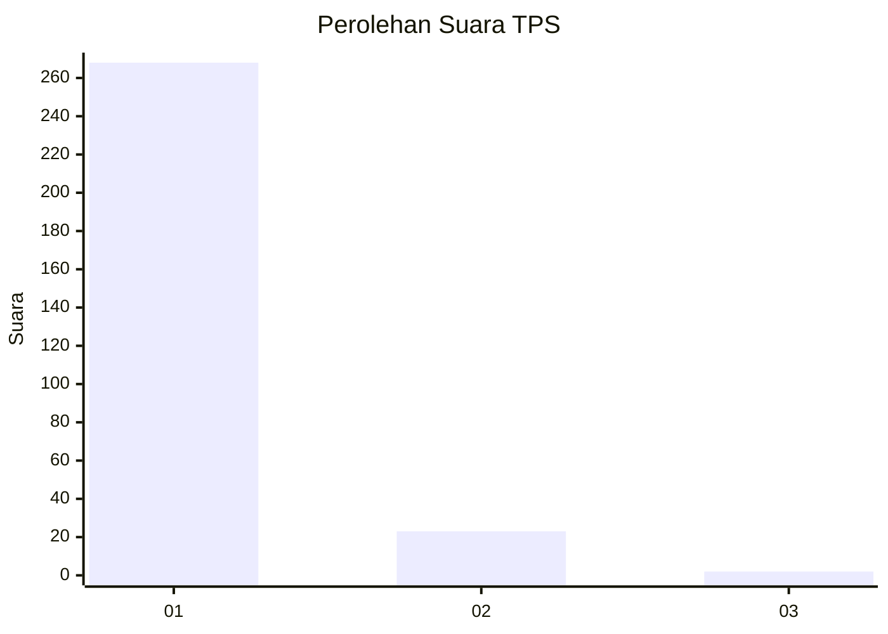
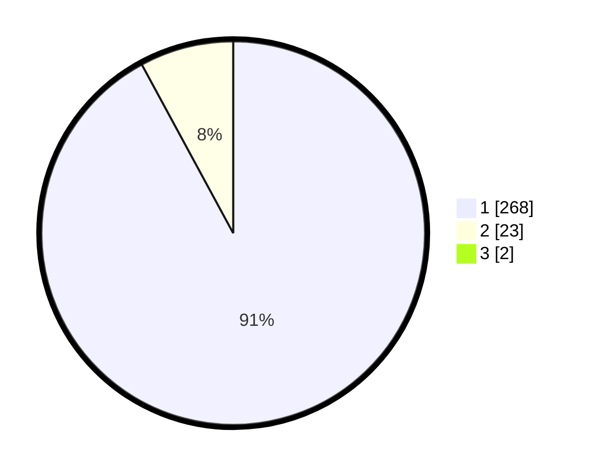

# Hasil

## Grafik

## Tabel

| No. | Nama Paslon    | Suara | Suara (raw) | Persentase |
|:--- |:-------------- | -----:| -----------:| ----------:|
| 1   | ANIES MUHAIMIN | 268   | [268][p-1]  | 91,47      |
| 2   | PRABOWO GIBRAN | 23    | [23][p-2]   | 7,85       |
| 3   | GANJAR MAHFUD  | 2     | [2][p-3]    | 0,68       |

[p-1]: https://github.com/gigit-pemilu/pemilu-2024/blob/main/pilpres/hitung-suara/sub/35-jawa-timur/sub/28-pamekasan/sub/07-pegantenan/sub/2013-tanjung/sub/009-tps/sub/paslon-1.txt
[p-2]: https://github.com/gigit-pemilu/pemilu-2024/blob/main/pilpres/hitung-suara/sub/35-jawa-timur/sub/28-pamekasan/sub/07-pegantenan/sub/2013-tanjung/sub/009-tps/sub/paslon-2.txt
[p-3]: https://github.com/gigit-pemilu/pemilu-2024/blob/main/pilpres/hitung-suara/sub/35-jawa-timur/sub/28-pamekasan/sub/07-pegantenan/sub/2013-tanjung/sub/009-tps/sub/paslon-3.txt

## Foto C Plano

https://sirekap-obj-formc.kpu.go.id/7c44/pemilu/ppwp/35/28/07/20/13/3528072013009-20240214-222226--435dd282-7ca7-4d73-91b1-0c190b5737e3.jpg

https://sirekap-obj-formc.kpu.go.id/7c44/pemilu/ppwp/35/28/07/20/13/3528072013009-20240214-222136--609ee9ad-9c3d-4dad-8a63-a3ad2c32899b.jpg

https://sirekap-obj-formc.kpu.go.id/7c44/pemilu/ppwp/35/28/07/20/13/3528072013009-20240214-222306--79b39c9a-c169-4c7f-8d46-23fd4c56e1bd.jpg

## Metadata

| Key        | Value               |
| ---------- | ------------------- |
| Time Stamp | 2024-02-15 21:30:27 |

