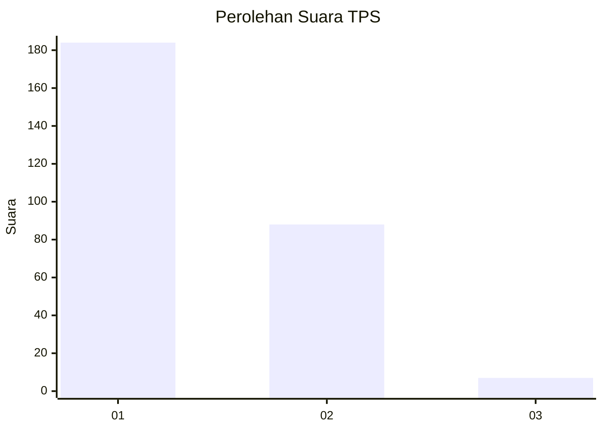
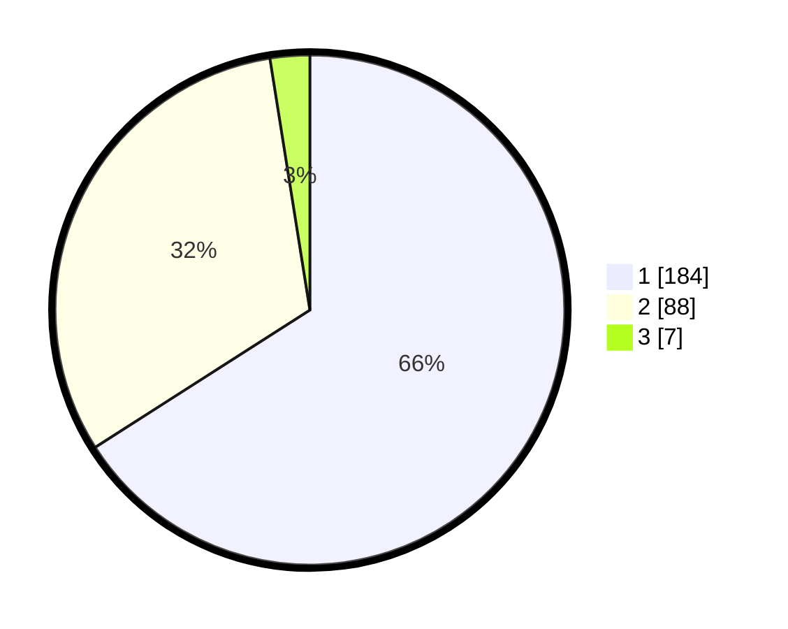

# Hasil

## Grafik

## Tabel

| No. | Nama Paslon    | Suara | Suara (raw) | Persentase |
|:--- |:-------------- | -----:| -----------:| ----------:|
| 1   | ANIES MUHAIMIN | 184   | [184][p-1]  | 65,95      |
| 2   | PRABOWO GIBRAN | 88    | [88][p-2]   | 31,54      |
| 3   | GANJAR MAHFUD  | 7     | [7][p-3]    | 2,51       |

[p-1]: https://github.com/gigit-pemilu/pemilu-2024-35-jawa-timur/blob/main/pilpres/hitung-suara/sub/35-jawa-timur/sub/28-pamekasan/sub/07-pegantenan/sub/2013-tanjung/sub/012-tps/sub/paslon-1.txt
[p-2]: https://github.com/gigit-pemilu/pemilu-2024-35-jawa-timur/blob/main/pilpres/hitung-suara/sub/35-jawa-timur/sub/28-pamekasan/sub/07-pegantenan/sub/2013-tanjung/sub/012-tps/sub/paslon-2.txt
[p-3]: https://github.com/gigit-pemilu/pemilu-2024-35-jawa-timur/blob/main/pilpres/hitung-suara/sub/35-jawa-timur/sub/28-pamekasan/sub/07-pegantenan/sub/2013-tanjung/sub/012-tps/sub/paslon-3.txt

## Foto C Plano

https://sirekap-obj-formc.kpu.go.id/1dfd/pemilu/ppwp/35/28/07/20/13/3528072013012-20240215-060832--a2bef53f-3d28-474f-a41d-c13eecf754af.jpg

https://sirekap-obj-formc.kpu.go.id/1dfd/pemilu/ppwp/35/28/07/20/13/3528072013012-20240215-063346--224c585d-d278-457d-b82a-b9d4a7f3b1cb.jpg

https://sirekap-obj-formc.kpu.go.id/1dfd/pemilu/ppwp/35/28/07/20/13/3528072013012-20240215-060904--34451b8c-091e-49e3-996b-5e06f3a3e4c5.jpg

## Metadata

| Key        | Value               |
| ---------- | ------------------- |
| Time Stamp | 2024-02-15 21:30:27 |

