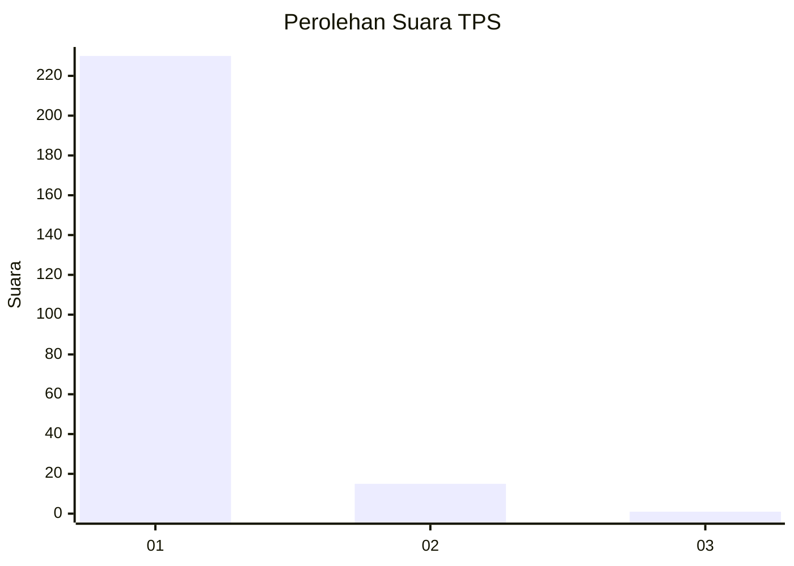
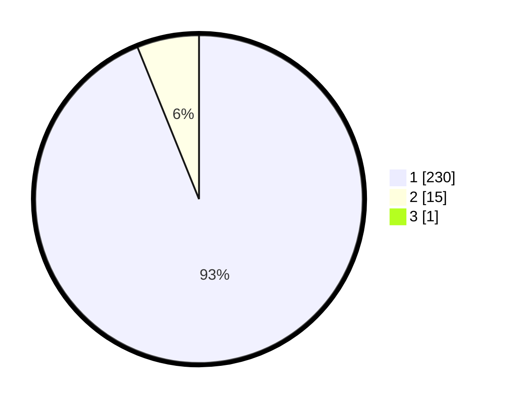

# Hasil

## Grafik

## Tabel

| No. | Nama Paslon    | Suara | Suara (raw) | Persentase |
|:--- |:-------------- | -----:| -----------:| ----------:|
| 1   | ANIES MUHAIMIN | 230   | [230][p-1]  | 93,50      |
| 2   | PRABOWO GIBRAN | 15    | [15][p-2]   | 6,10       |
| 3   | GANJAR MAHFUD  | 1     | [1][p-3]    | 0,41       |

[p-1]: https://github.com/gigit-pemilu/pemilu-2024/blob/main/pilpres/hitung-suara/sub/35-jawa-timur/sub/28-pamekasan/sub/07-pegantenan/sub/2013-tanjung/sub/014-tps/sub/paslon-1.txt
[p-2]: https://github.com/gigit-pemilu/pemilu-2024/blob/main/pilpres/hitung-suara/sub/35-jawa-timur/sub/28-pamekasan/sub/07-pegantenan/sub/2013-tanjung/sub/014-tps/sub/paslon-2.txt
[p-3]: https://github.com/gigit-pemilu/pemilu-2024/blob/main/pilpres/hitung-suara/sub/35-jawa-timur/sub/28-pamekasan/sub/07-pegantenan/sub/2013-tanjung/sub/014-tps/sub/paslon-3.txt

## Foto C Plano

https://sirekap-obj-formc.kpu.go.id/809b/pemilu/ppwp/35/28/07/20/13/3528072013014-20240214-190510--01355b9d-773e-4efc-936f-f9287ecfe0eb.jpg

https://sirekap-obj-formc.kpu.go.id/809b/pemilu/ppwp/35/28/07/20/13/3528072013014-20240214-190724--bc52a904-1c31-42ed-8880-6acc3ea52df1.jpg

https://sirekap-obj-formc.kpu.go.id/809b/pemilu/ppwp/35/28/07/20/13/3528072013014-20240214-190902--e7341d48-11de-4675-8b3a-4f84f18bad74.jpg

## Metadata

| Key        | Value               |
| ---------- | ------------------- |
| Time Stamp | 2024-02-15 21:30:27 |

