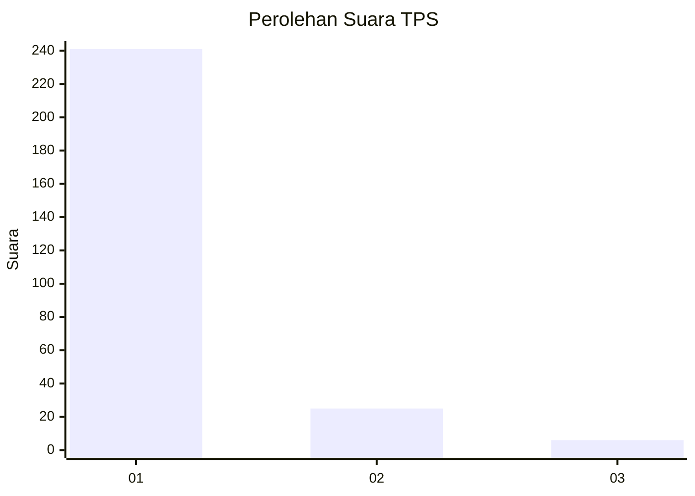
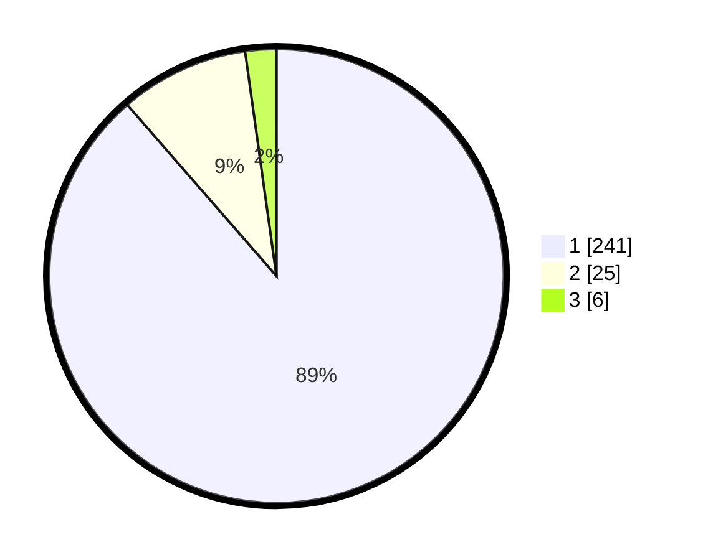

# Hasil

## Grafik

## Tabel

| No. | Nama Paslon    | Suara | Suara (raw) | Persentase |
|:--- |:-------------- | -----:| -----------:| ----------:|
| 1   | ANIES MUHAIMIN | 241   | [241][p-1]  | 88,60      |
| 2   | PRABOWO GIBRAN | 25    | [25][p-2]   | 9,19       |
| 3   | GANJAR MAHFUD  | 6     | [6][p-3]    | 2,21       |

[p-1]: https://github.com/gigit-pemilu/pemilu-2024/blob/main/pilpres/hitung-suara/sub/35-jawa-timur/sub/28-pamekasan/sub/07-pegantenan/sub/2013-tanjung/sub/017-tps/sub/paslon-1.txt
[p-2]: https://github.com/gigit-pemilu/pemilu-2024/blob/main/pilpres/hitung-suara/sub/35-jawa-timur/sub/28-pamekasan/sub/07-pegantenan/sub/2013-tanjung/sub/017-tps/sub/paslon-2.txt
[p-3]: https://github.com/gigit-pemilu/pemilu-2024/blob/main/pilpres/hitung-suara/sub/35-jawa-timur/sub/28-pamekasan/sub/07-pegantenan/sub/2013-tanjung/sub/017-tps/sub/paslon-3.txt

## Foto C Plano

https://sirekap-obj-formc.kpu.go.id/ac0c/pemilu/ppwp/35/28/07/20/13/3528072013017-20240214-202648--dacc4e4c-7c74-4abf-af4b-70c8bcbe5e8b.jpg

https://sirekap-obj-formc.kpu.go.id/ac0c/pemilu/ppwp/35/28/07/20/13/3528072013017-20240214-202859--61c4e9fc-a971-4774-b033-c04945409a60.jpg

https://sirekap-obj-formc.kpu.go.id/ac0c/pemilu/ppwp/35/28/07/20/13/3528072013017-20240214-202951--4c7703f8-9bd4-43f2-99ba-f834f6d660a4.jpg

## Metadata

| Key        | Value               |
| ---------- | ------------------- |
| Time Stamp | 2024-02-15 22:00:27 |

