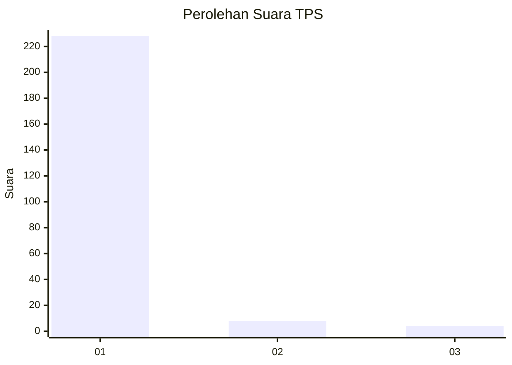
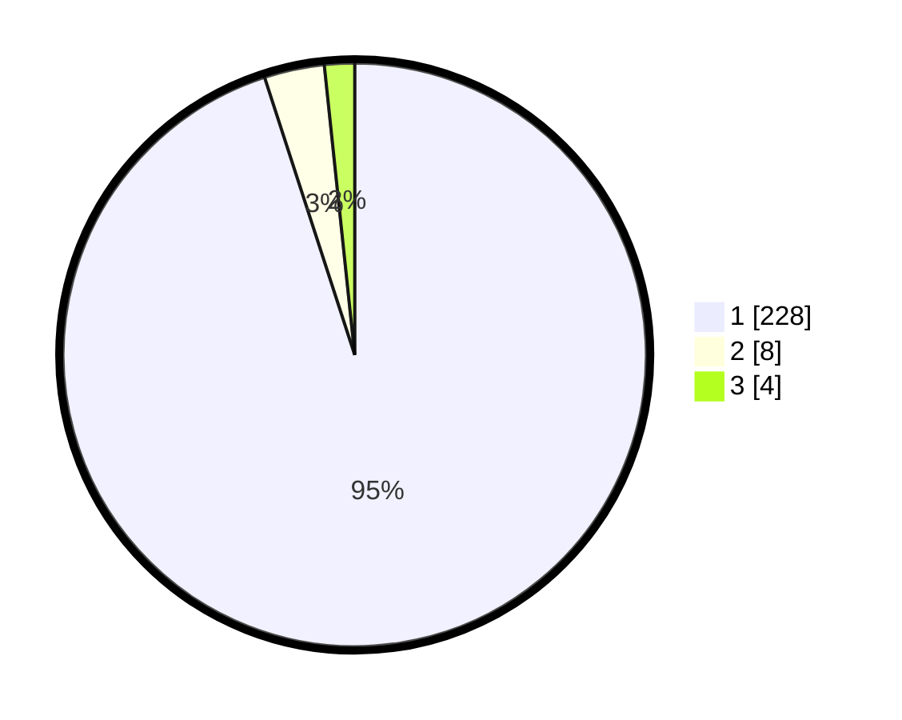

# Hasil

## Grafik

## Tabel

| No. | Nama Paslon    | Suara | Suara (raw) | Persentase |
|:--- |:-------------- | -----:| -----------:| ----------:|
| 1   | ANIES MUHAIMIN | 228   | [228][p-1]  | 95,00      |
| 2   | PRABOWO GIBRAN | 8     | [8][p-2]    | 3,33       |
| 3   | GANJAR MAHFUD  | 4     | [4][p-3]    | 1,67       |

[p-1]: https://github.com/gigit-pemilu/pemilu-2024/blob/main/pilpres/hitung-suara/sub/35-jawa-timur/sub/28-pamekasan/sub/07-pegantenan/sub/2013-tanjung/sub/019-tps/sub/paslon-1.txt
[p-2]: https://github.com/gigit-pemilu/pemilu-2024/blob/main/pilpres/hitung-suara/sub/35-jawa-timur/sub/28-pamekasan/sub/07-pegantenan/sub/2013-tanjung/sub/019-tps/sub/paslon-2.txt
[p-3]: https://github.com/gigit-pemilu/pemilu-2024/blob/main/pilpres/hitung-suara/sub/35-jawa-timur/sub/28-pamekasan/sub/07-pegantenan/sub/2013-tanjung/sub/019-tps/sub/paslon-3.txt

## Foto C Plano

https://sirekap-obj-formc.kpu.go.id/714e/pemilu/ppwp/35/28/07/20/13/3528072013019-20240214-194457--4effb6f9-14e3-4ba7-ba19-24d9514d2d0b.jpg

https://sirekap-obj-formc.kpu.go.id/714e/pemilu/ppwp/35/28/07/20/13/3528072013019-20240214-194731--cbe5515b-b0f4-430e-b470-cd064370eeb3.jpg

https://sirekap-obj-formc.kpu.go.id/714e/pemilu/ppwp/35/28/07/20/13/3528072013019-20240214-194834--15111ed5-5941-4d35-b89e-402ba4935c6b.jpg

## Metadata

| Key        | Value               |
| ---------- | ------------------- |
| Time Stamp | 2024-02-15 22:00:27 |

