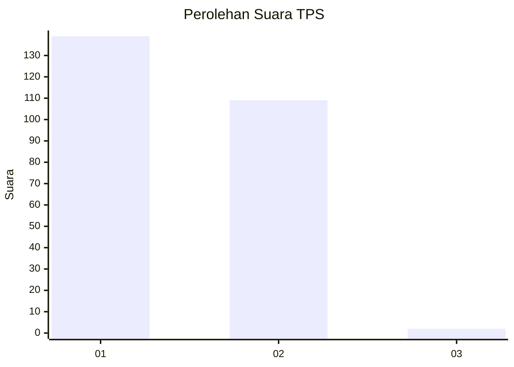
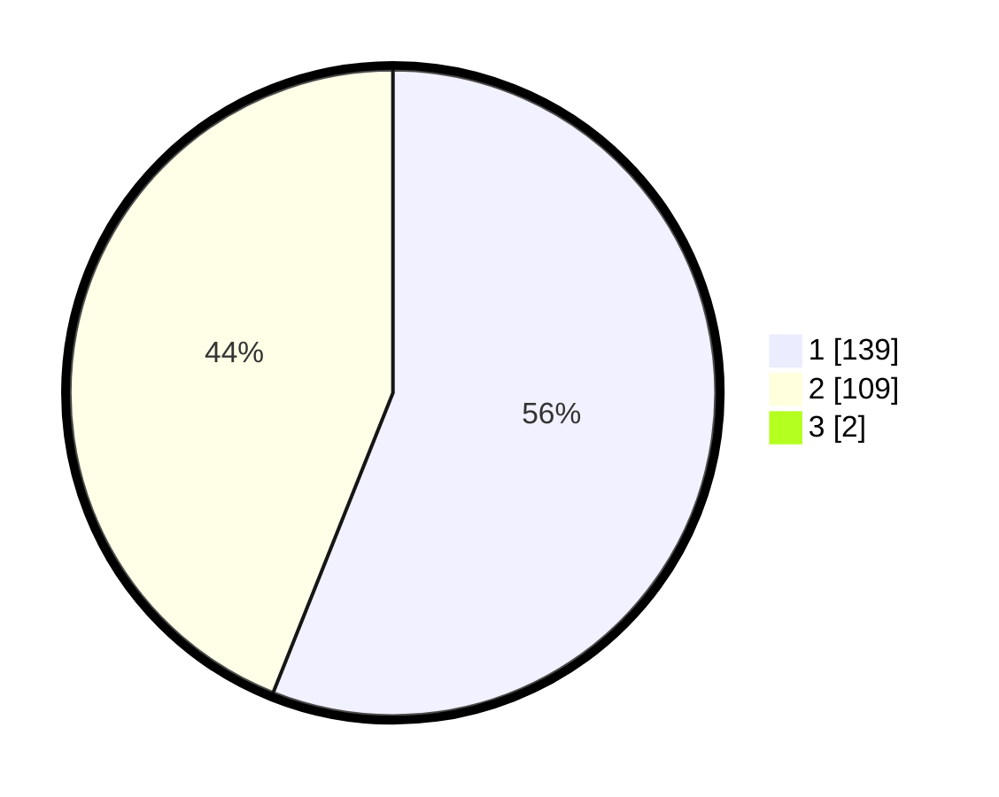

# Hasil

## Grafik

## Tabel

| No. | Nama Paslon    | Suara | Suara (raw) | Persentase |
|:--- |:-------------- | -----:| -----------:| ----------:|
| 1   | ANIES MUHAIMIN | 139   | [139][p-1]  | 55,60      |
| 2   | PRABOWO GIBRAN | 109   | [109][p-2]  | 43,60      |
| 3   | GANJAR MAHFUD  | 2     | [2][p-3]    | 0,80       |

[p-1]: https://github.com/gigit-pemilu/pemilu-2024-35-jawa-timur/blob/main/pilpres/hitung-suara/sub/35-jawa-timur/sub/28-pamekasan/sub/08-larangan/sub/2001-peltong/sub/002-tps/sub/paslon-1.txt
[p-2]: https://github.com/gigit-pemilu/pemilu-2024-35-jawa-timur/blob/main/pilpres/hitung-suara/sub/35-jawa-timur/sub/28-pamekasan/sub/08-larangan/sub/2001-peltong/sub/002-tps/sub/paslon-2.txt
[p-3]: https://github.com/gigit-pemilu/pemilu-2024-35-jawa-timur/blob/main/pilpres/hitung-suara/sub/35-jawa-timur/sub/28-pamekasan/sub/08-larangan/sub/2001-peltong/sub/002-tps/sub/paslon-3.txt

## Foto C Plano

https://sirekap-obj-formc.kpu.go.id/1b2e/pemilu/ppwp/35/28/08/20/01/3528082001002-20240215-111442--c105fe40-2e14-4dff-b686-933fc8cee5b2.jpg

https://sirekap-obj-formc.kpu.go.id/1b2e/pemilu/ppwp/35/28/08/20/01/3528082001002-20240215-111547--5d46015b-f57d-41ef-8765-870b20af2952.jpg

https://sirekap-obj-formc.kpu.go.id/1b2e/pemilu/ppwp/35/28/08/20/01/3528082001002-20240215-105031--42e3314f-4fd8-417f-b459-c936451b3811.jpg

## Metadata

| Key        | Value               |
| ---------- | ------------------- |
| Time Stamp | 2024-02-17 16:36:25 |

