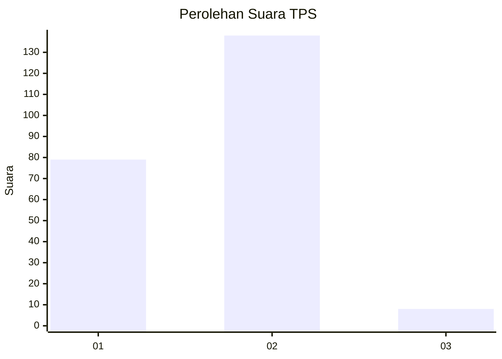
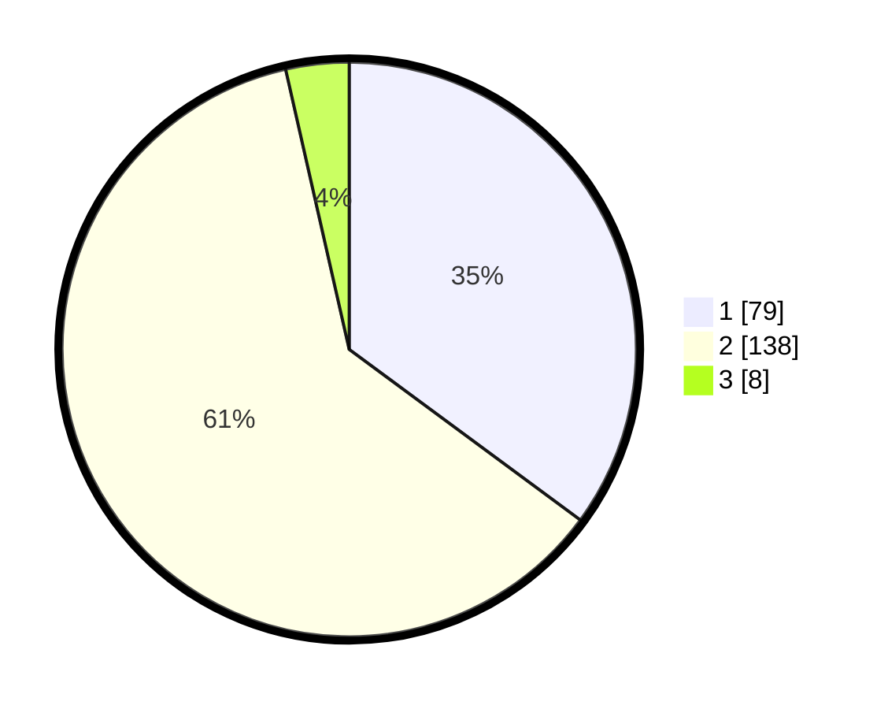

# Hasil

## Grafik

## Tabel

| No. | Nama Paslon    | Suara | Suara (raw) | Persentase |
|:--- |:-------------- | -----:| -----------:| ----------:|
| 1   | ANIES MUHAIMIN | 79    | [79][p-1]   | 35,11      |
| 2   | PRABOWO GIBRAN | 138   | [138][p-2]  | 61,33      |
| 3   | GANJAR MAHFUD  | 8     | [8][p-3]    | 3,56       |

[p-1]: https://github.com/gigit-pemilu/pemilu-2024-35-jawa-timur/blob/main/pilpres/hitung-suara/sub/35-jawa-timur/sub/28-pamekasan/sub/08-larangan/sub/2001-peltong/sub/005-tps/sub/paslon-1.txt
[p-2]: https://github.com/gigit-pemilu/pemilu-2024-35-jawa-timur/blob/main/pilpres/hitung-suara/sub/35-jawa-timur/sub/28-pamekasan/sub/08-larangan/sub/2001-peltong/sub/005-tps/sub/paslon-2.txt
[p-3]: https://github.com/gigit-pemilu/pemilu-2024-35-jawa-timur/blob/main/pilpres/hitung-suara/sub/35-jawa-timur/sub/28-pamekasan/sub/08-larangan/sub/2001-peltong/sub/005-tps/sub/paslon-3.txt

## Foto C Plano

https://sirekap-obj-formc.kpu.go.id/8e36/pemilu/ppwp/35/28/08/20/01/3528082001005-20240215-111457--a16ef727-59a5-41bd-b3c3-accb30cf9a95.jpg

https://sirekap-obj-formc.kpu.go.id/8e36/pemilu/ppwp/35/28/08/20/01/3528082001005-20240215-111547--1c4752ce-3f28-43a8-af35-22138381685c.jpg

https://sirekap-obj-formc.kpu.go.id/8e36/pemilu/ppwp/35/28/08/20/01/3528082001005-20240215-111627--c30a6f1b-0d45-4101-a682-4627f1c9b704.jpg

## Metadata

| Key        | Value               |
| ---------- | ------------------- |
| Time Stamp | 2024-02-17 16:36:25 |

