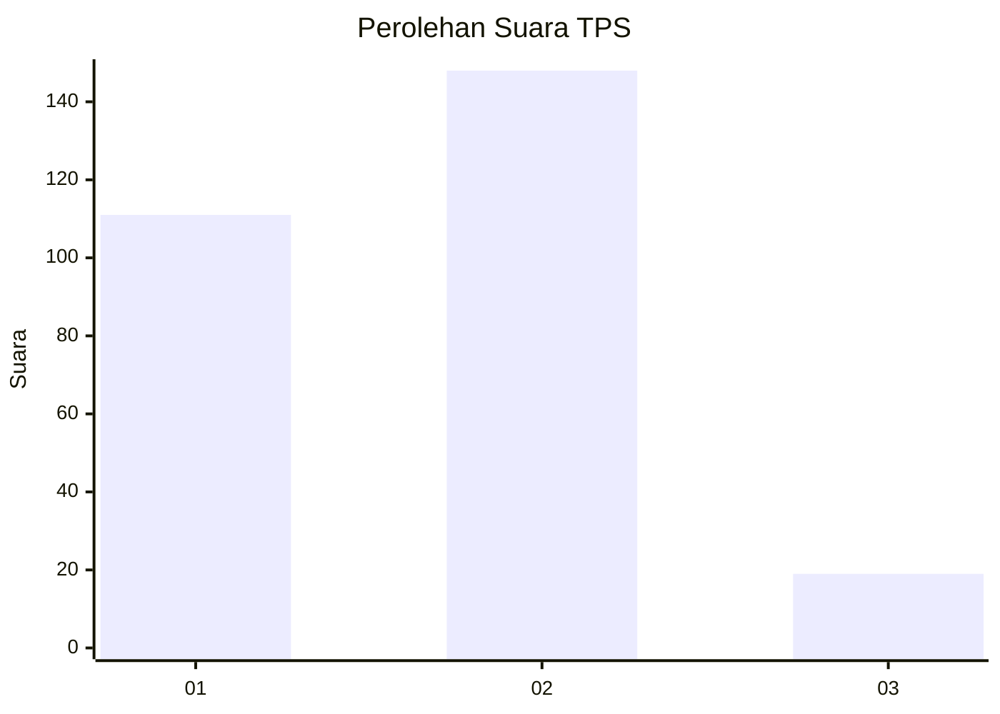

# Hasil

## Grafik

## Tabel

| No. | Nama Paslon    | Suara | Suara (raw) | Persentase |
|:--- |:-------------- | -----:| -----------:| ----------:|
| 1   | ANIES MUHAIMIN | 111   | [111][p-1]  | 39,93      |
| 2   | PRABOWO GIBRAN | 148   | [148][p-2]  | 53,24      |
| 3   | GANJAR MAHFUD  | 19    | [19][p-3]   | 6,83       |

[p-1]: https://github.com/gigit-pemilu/pemilu-2024-35-jawa-timur/blob/main/pilpres/hitung-suara/sub/35-jawa-timur/sub/28-pamekasan/sub/08-larangan/sub/2002-blumbungan/sub/001-tps/sub/paslon-1.txt
[p-2]: https://github.com/gigit-pemilu/pemilu-2024-35-jawa-timur/blob/main/pilpres/hitung-suara/sub/35-jawa-timur/sub/28-pamekasan/sub/08-larangan/sub/2002-blumbungan/sub/001-tps/sub/paslon-2.txt
[p-3]: https://github.com/gigit-pemilu/pemilu-2024-35-jawa-timur/blob/main/pilpres/hitung-suara/sub/35-jawa-timur/sub/28-pamekasan/sub/08-larangan/sub/2002-blumbungan/sub/001-tps/sub/paslon-3.txt

## Foto C Plano

https://sirekap-obj-formc.kpu.go.id/06a9/pemilu/ppwp/35/28/08/20/02/3528082002001-20240214-205520--1a6c1ad8-99c0-4c09-a234-53d72d9dda6e.jpg

https://sirekap-obj-formc.kpu.go.id/06a9/pemilu/ppwp/35/28/08/20/02/3528082002001-20240214-214033--c4ec2138-f725-401c-a7dd-c54e7bae29cf.jpg

https://sirekap-obj-formc.kpu.go.id/06a9/pemilu/ppwp/35/28/08/20/02/3528082002001-20240214-214201--27f5da53-feb5-4650-97e3-9f74a958af9e.jpg

## Metadata

| Key        | Value               |
| ---------- | ------------------- |
| Time Stamp | 2024-02-19 21:00:00 |

