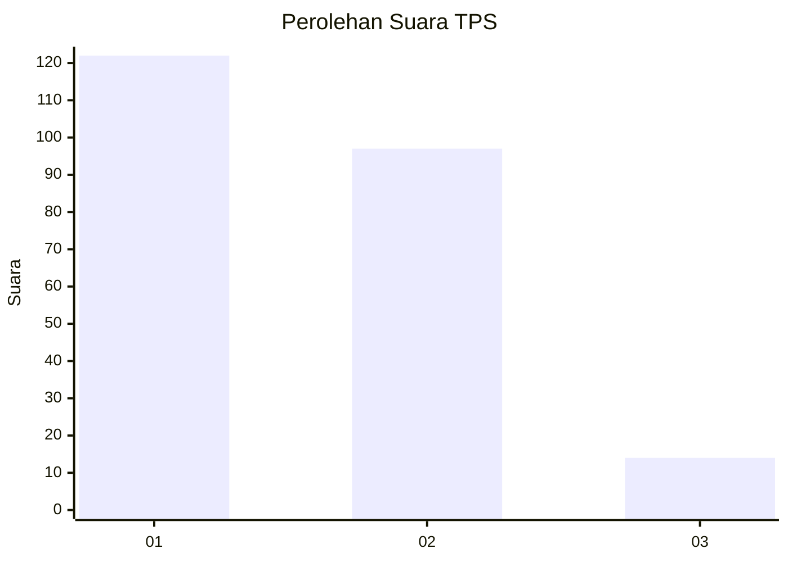
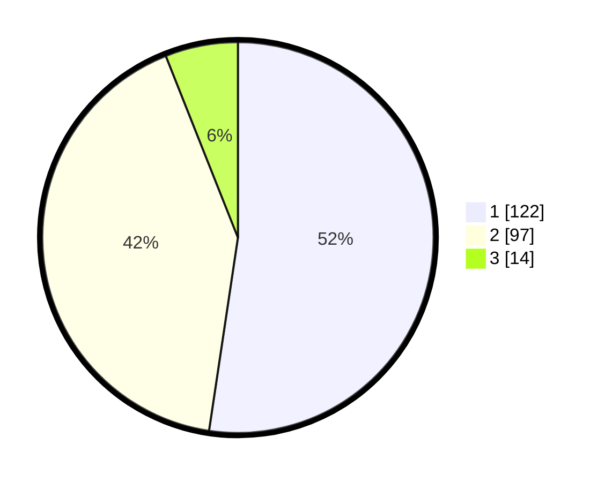

# Hasil

## Grafik

## Tabel

| No. | Nama Paslon    | Suara | Suara (raw) | Persentase |
|:--- |:-------------- | -----:| -----------:| ----------:|
| 1   | ANIES MUHAIMIN | 122   | [122][p-1]  | 52,36      |
| 2   | PRABOWO GIBRAN | 97    | [97][p-2]   | 41,63      |
| 3   | GANJAR MAHFUD  | 14    | [14][p-3]   | 6,01       |

[p-1]: https://github.com/gigit-pemilu/pemilu-2024-35-jawa-timur/blob/main/pilpres/hitung-suara/sub/35-jawa-timur/sub/28-pamekasan/sub/08-larangan/sub/2002-blumbungan/sub/004-tps/sub/paslon-1.txt
[p-2]: https://github.com/gigit-pemilu/pemilu-2024-35-jawa-timur/blob/main/pilpres/hitung-suara/sub/35-jawa-timur/sub/28-pamekasan/sub/08-larangan/sub/2002-blumbungan/sub/004-tps/sub/paslon-2.txt
[p-3]: https://github.com/gigit-pemilu/pemilu-2024-35-jawa-timur/blob/main/pilpres/hitung-suara/sub/35-jawa-timur/sub/28-pamekasan/sub/08-larangan/sub/2002-blumbungan/sub/004-tps/sub/paslon-3.txt

## Foto C Plano

https://sirekap-obj-formc.kpu.go.id/1657/pemilu/ppwp/35/28/08/20/02/3528082002004-20240214-214359--72c74409-3418-44c9-befd-73f2d4247aa9.jpg

https://sirekap-obj-formc.kpu.go.id/1657/pemilu/ppwp/35/28/08/20/02/3528082002004-20240214-214404--5a219f3c-6d46-4ac6-97ea-05fb198ed246.jpg

https://sirekap-obj-formc.kpu.go.id/1657/pemilu/ppwp/35/28/08/20/02/3528082002004-20240214-214408--35f37cf5-1faa-4383-b981-e395e5a6310b.jpg

## Metadata

| Key        | Value               |
| ---------- | ------------------- |
| Time Stamp | 2024-02-17 16:36:25 |

