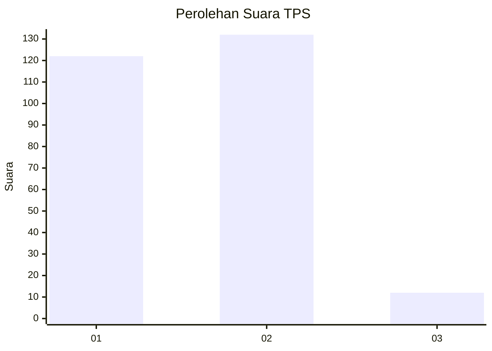
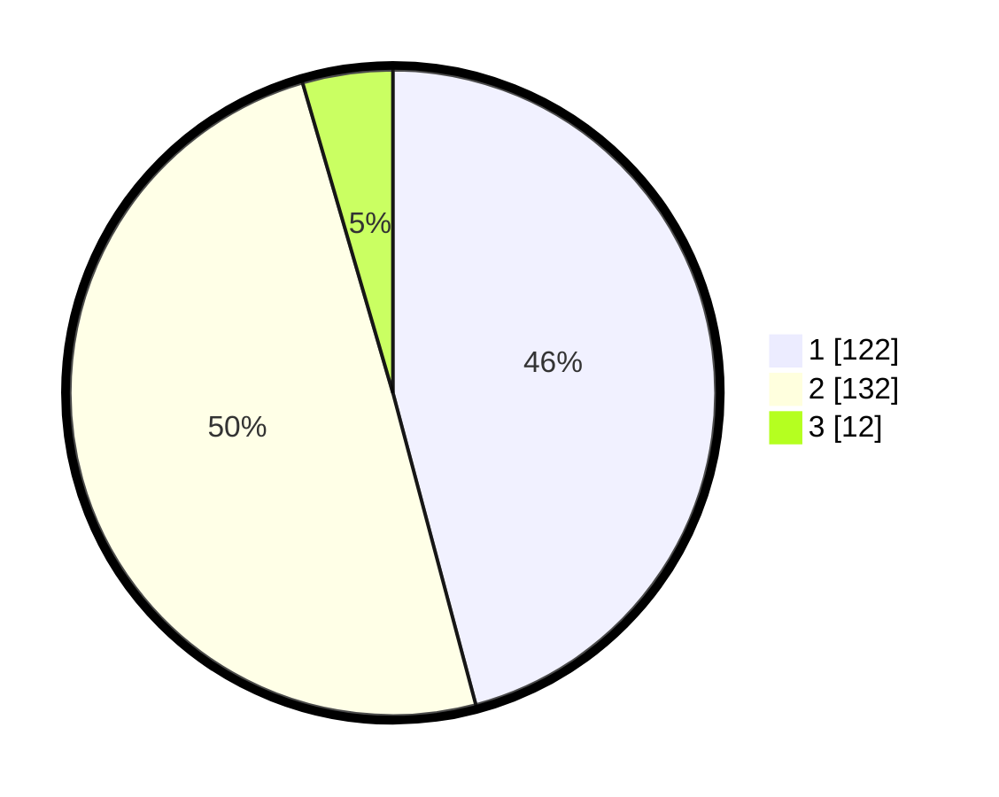

# Hasil

## Grafik

## Tabel

| No. | Nama Paslon    | Suara | Suara (raw) | Persentase |
|:--- |:-------------- | -----:| -----------:| ----------:|
| 1   | ANIES MUHAIMIN | 122   | [122][p-1]  | 45,86      |
| 2   | PRABOWO GIBRAN | 132   | [132][p-2]  | 49,62      |
| 3   | GANJAR MAHFUD  | 12    | [12][p-3]   | 4,51       |

[p-1]: https://github.com/gigit-pemilu/pemilu-2024-35-jawa-timur/blob/main/pilpres/hitung-suara/sub/35-jawa-timur/sub/28-pamekasan/sub/08-larangan/sub/2002-blumbungan/sub/005-tps/sub/paslon-1.txt
[p-2]: https://github.com/gigit-pemilu/pemilu-2024-35-jawa-timur/blob/main/pilpres/hitung-suara/sub/35-jawa-timur/sub/28-pamekasan/sub/08-larangan/sub/2002-blumbungan/sub/005-tps/sub/paslon-2.txt
[p-3]: https://github.com/gigit-pemilu/pemilu-2024-35-jawa-timur/blob/main/pilpres/hitung-suara/sub/35-jawa-timur/sub/28-pamekasan/sub/08-larangan/sub/2002-blumbungan/sub/005-tps/sub/paslon-3.txt

## Foto C Plano

https://sirekap-obj-formc.kpu.go.id/919e/pemilu/ppwp/35/28/08/20/02/3528082002005-20240215-031920--d21cddc1-80a8-49c1-b3dc-07e651e320fc.jpg

https://sirekap-obj-formc.kpu.go.id/919e/pemilu/ppwp/35/28/08/20/02/3528082002005-20240215-032051--8c844312-9984-45c7-ad78-e7c02f7ef31c.jpg

## Metadata

| Key        | Value               |
| ---------- | ------------------- |
| Time Stamp | 2024-02-25 16:00:00 |

