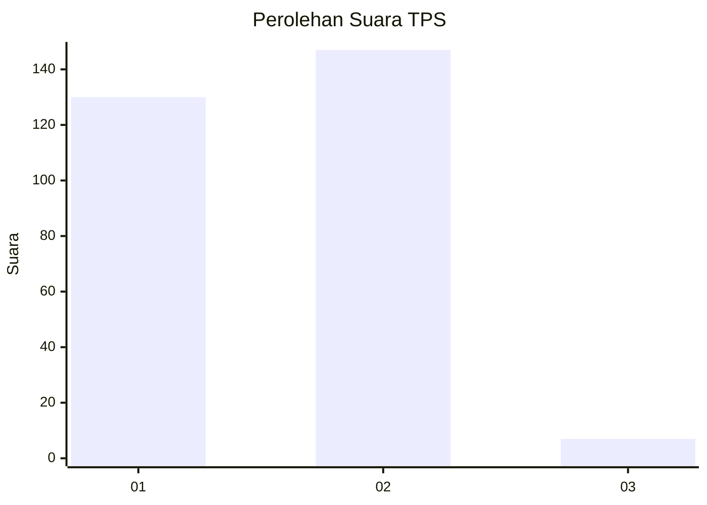
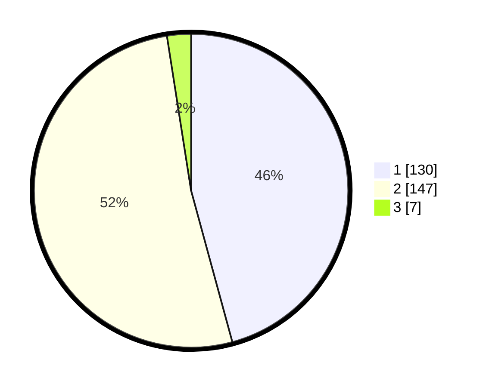

# Hasil

## Grafik

## Tabel

| No. | Nama Paslon    | Suara | Suara (raw) | Persentase |
|:--- |:-------------- | -----:| -----------:| ----------:|
| 1   | ANIES MUHAIMIN | 130   | [130][p-1]  | 45,77      |
| 2   | PRABOWO GIBRAN | 147   | [147][p-2]  | 51,76      |
| 3   | GANJAR MAHFUD  | 7     | [7][p-3]    | 2,46       |

[p-1]: https://github.com/gigit-pemilu/pemilu-2024-35-jawa-timur/blob/main/pilpres/hitung-suara/sub/35-jawa-timur/sub/28-pamekasan/sub/08-larangan/sub/2002-blumbungan/sub/006-tps/sub/paslon-1.txt
[p-2]: https://github.com/gigit-pemilu/pemilu-2024-35-jawa-timur/blob/main/pilpres/hitung-suara/sub/35-jawa-timur/sub/28-pamekasan/sub/08-larangan/sub/2002-blumbungan/sub/006-tps/sub/paslon-2.txt
[p-3]: https://github.com/gigit-pemilu/pemilu-2024-35-jawa-timur/blob/main/pilpres/hitung-suara/sub/35-jawa-timur/sub/28-pamekasan/sub/08-larangan/sub/2002-blumbungan/sub/006-tps/sub/paslon-3.txt

## Foto C Plano

https://sirekap-obj-formc.kpu.go.id/4efa/pemilu/ppwp/35/28/08/20/02/3528082002006-20240215-102830--17d2befe-5e63-4c8f-a4a9-0651a6df9120.jpg

https://sirekap-obj-formc.kpu.go.id/4efa/pemilu/ppwp/35/28/08/20/02/3528082002006-20240215-103039--830cd0ba-9d3e-49d4-b386-96f4aa53347f.jpg

https://sirekap-obj-formc.kpu.go.id/4efa/pemilu/ppwp/35/28/08/20/02/3528082002006-20240215-103151--e9d360d2-0b12-49d9-9517-f6945a5012cf.jpg

## Metadata

| Key        | Value               |
| ---------- | ------------------- |
| Time Stamp | 2024-02-17 16:36:25 |

