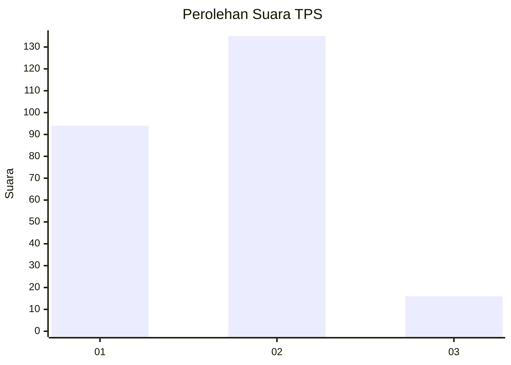

# Hasil

## Grafik

## Tabel

| No. | Nama Paslon    | Suara | Suara (raw) | Persentase |
|:--- |:-------------- | -----:| -----------:| ----------:|
| 1   | ANIES MUHAIMIN | 94    | [94][p-1]   | 38,37      |
| 2   | PRABOWO GIBRAN | 135   | [135][p-2]  | 55,10      |
| 3   | GANJAR MAHFUD  | 16    | [16][p-3]   | 6,53       |

[p-1]: https://github.com/gigit-pemilu/pemilu-2024/blob/main/pilpres/hitung-suara/sub/35-jawa-timur/sub/28-pamekasan/sub/08-larangan/sub/2002-blumbungan/sub/010-tps/sub/paslon-1.txt
[p-2]: https://github.com/gigit-pemilu/pemilu-2024/blob/main/pilpres/hitung-suara/sub/35-jawa-timur/sub/28-pamekasan/sub/08-larangan/sub/2002-blumbungan/sub/010-tps/sub/paslon-2.txt
[p-3]: https://github.com/gigit-pemilu/pemilu-2024/blob/main/pilpres/hitung-suara/sub/35-jawa-timur/sub/28-pamekasan/sub/08-larangan/sub/2002-blumbungan/sub/010-tps/sub/paslon-3.txt

## Foto C Plano

https://sirekap-obj-formc.kpu.go.id/b9eb/pemilu/ppwp/35/28/08/20/02/3528082002010-20240214-223516--5a04f228-49af-4f2e-bf61-3d8678efb068.jpg

https://sirekap-obj-formc.kpu.go.id/b9eb/pemilu/ppwp/35/28/08/20/02/3528082002010-20240214-223654--f82561fa-fc1e-47e2-99cb-89eca0bcfd47.jpg

https://sirekap-obj-formc.kpu.go.id/b9eb/pemilu/ppwp/35/28/08/20/02/3528082002010-20240214-223820--ff14b76b-6b77-44ec-bacc-5d300b6d3134.jpg

## Metadata

| Key        | Value               |
| ---------- | ------------------- |
| Time Stamp | 2024-02-17 16:36:25 |

