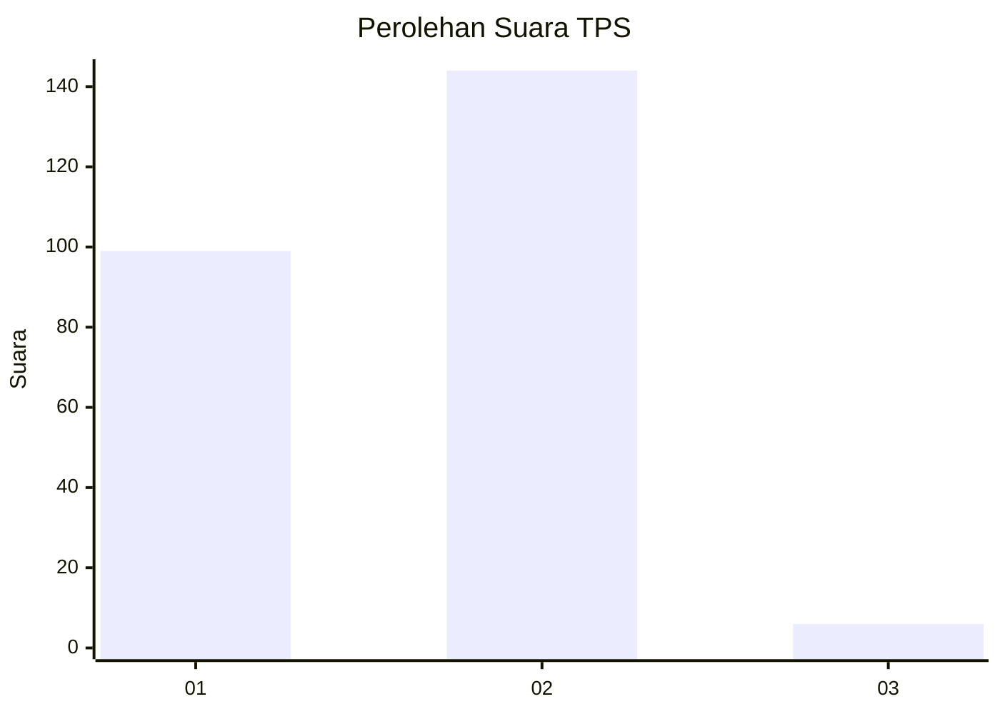
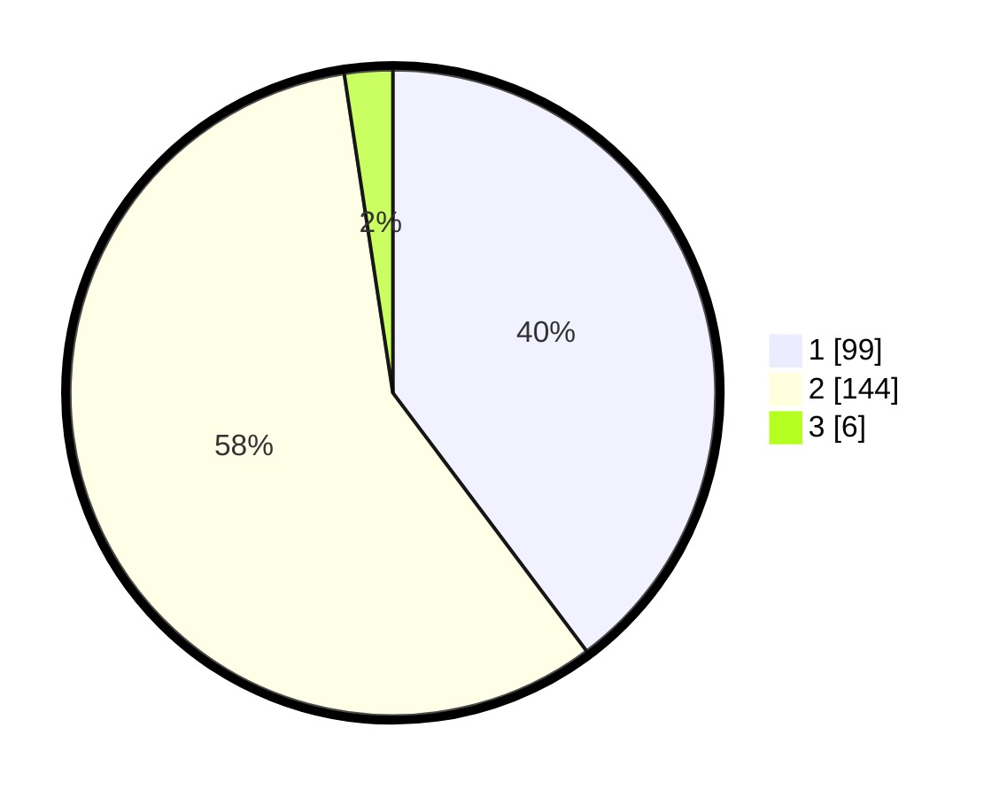

# Hasil

## Grafik

## Tabel

| No. | Nama Paslon    | Suara | Suara (raw) | Persentase |
|:--- |:-------------- | -----:| -----------:| ----------:|
| 1   | ANIES MUHAIMIN | 99    | [99][p-1]   | 39,76      |
| 2   | PRABOWO GIBRAN | 144   | [144][p-2]  | 57,83      |
| 3   | GANJAR MAHFUD  | 6     | [6][p-3]    | 2,41       |

[p-1]: https://github.com/gigit-pemilu/pemilu-2024/blob/main/pilpres/hitung-suara/sub/35-jawa-timur/sub/28-pamekasan/sub/08-larangan/sub/2002-blumbungan/sub/011-tps/sub/paslon-1.txt
[p-2]: https://github.com/gigit-pemilu/pemilu-2024/blob/main/pilpres/hitung-suara/sub/35-jawa-timur/sub/28-pamekasan/sub/08-larangan/sub/2002-blumbungan/sub/011-tps/sub/paslon-2.txt
[p-3]: https://github.com/gigit-pemilu/pemilu-2024/blob/main/pilpres/hitung-suara/sub/35-jawa-timur/sub/28-pamekasan/sub/08-larangan/sub/2002-blumbungan/sub/011-tps/sub/paslon-3.txt

## Foto C Plano

https://sirekap-obj-formc.kpu.go.id/af69/pemilu/ppwp/35/28/08/20/02/3528082002011-20240215-001543--cdbff9e8-4656-4730-89a8-2cd401f4c5fe.jpg

https://sirekap-obj-formc.kpu.go.id/af69/pemilu/ppwp/35/28/08/20/02/3528082002011-20240215-001738--aa98687e-22ac-4ea8-903e-2eeef3dd6c29.jpg

https://sirekap-obj-formc.kpu.go.id/af69/pemilu/ppwp/35/28/08/20/02/3528082002011-20240215-001909--0cd2e728-540e-48e6-94c3-88777ac610e0.jpg

## Metadata

| Key        | Value               |
| ---------- | ------------------- |
| Time Stamp | 2024-02-25 18:00:00 |

