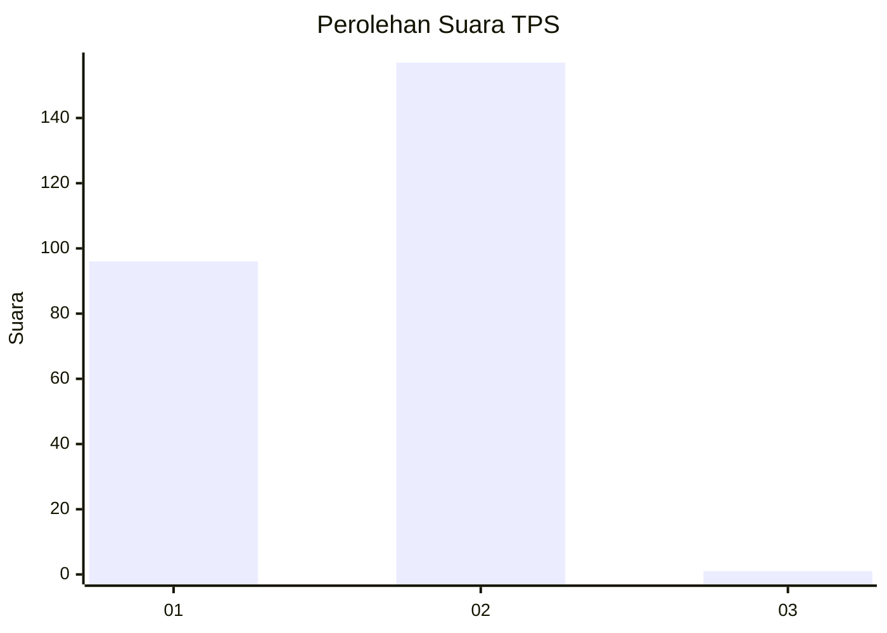
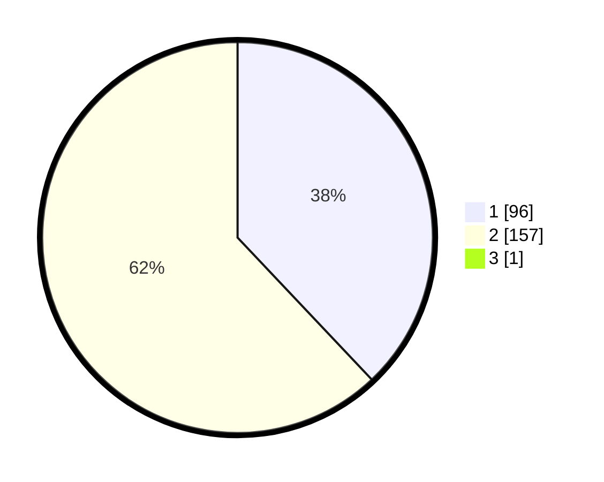

# Hasil

## Grafik

## Tabel

| No. | Nama Paslon    | Suara | Suara (raw) | Persentase |
|:--- |:-------------- | -----:| -----------:| ----------:|
| 1   | ANIES MUHAIMIN | 96    | [96][p-1]   | 37,80      |
| 2   | PRABOWO GIBRAN | 157   | [157][p-2]  | 61,81      |
| 3   | GANJAR MAHFUD  | 1     | [1][p-3]    | 0,39       |

[p-1]: https://github.com/gigit-pemilu/pemilu-2024/blob/main/pilpres/hitung-suara/sub/35-jawa-timur/sub/28-pamekasan/sub/08-larangan/sub/2002-blumbungan/sub/012-tps/sub/paslon-1.txt
[p-2]: https://github.com/gigit-pemilu/pemilu-2024/blob/main/pilpres/hitung-suara/sub/35-jawa-timur/sub/28-pamekasan/sub/08-larangan/sub/2002-blumbungan/sub/012-tps/sub/paslon-2.txt
[p-3]: https://github.com/gigit-pemilu/pemilu-2024/blob/main/pilpres/hitung-suara/sub/35-jawa-timur/sub/28-pamekasan/sub/08-larangan/sub/2002-blumbungan/sub/012-tps/sub/paslon-3.txt

## Foto C Plano

https://sirekap-obj-formc.kpu.go.id/0df6/pemilu/ppwp/35/28/08/20/02/3528082002012-20240215-004247--3538f9aa-fdbc-4725-820d-3db291e21e2f.jpg

https://sirekap-obj-formc.kpu.go.id/0df6/pemilu/ppwp/35/28/08/20/02/3528082002012-20240215-004516--a553d629-8f10-4387-9e12-860701ea04fe.jpg

https://sirekap-obj-formc.kpu.go.id/0df6/pemilu/ppwp/35/28/08/20/02/3528082002012-20240215-004657--a89aab51-ce32-41d3-8db1-99fb4abc8bee.jpg

## Metadata

| Key        | Value               |
| ---------- | ------------------- |
| Time Stamp | 2024-02-25 13:00:00 |

