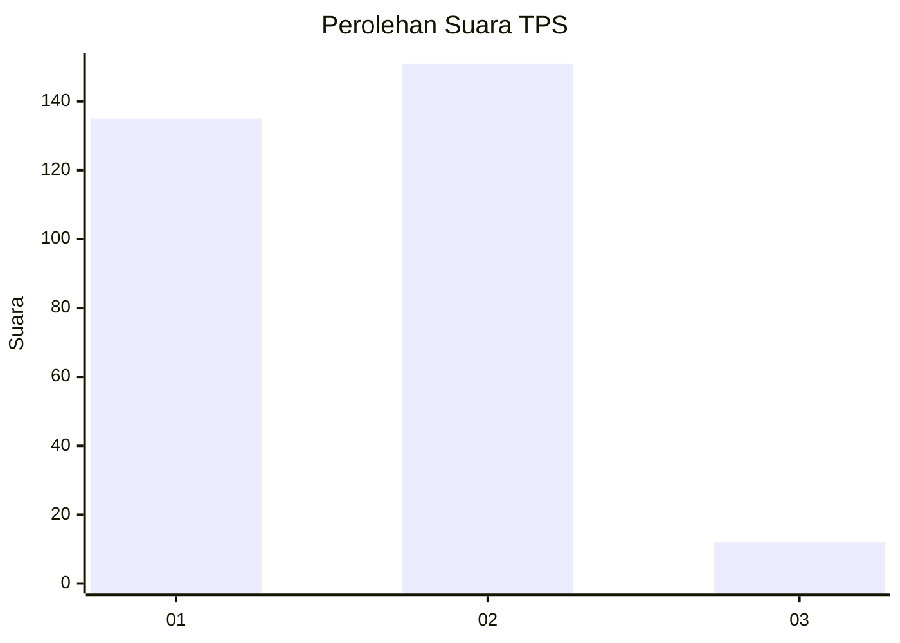
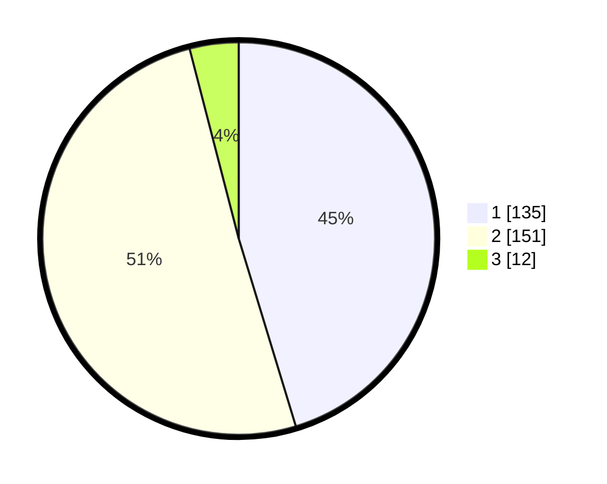

# Hasil

## Grafik

## Tabel

| No. | Nama Paslon    | Suara | Suara (raw) | Persentase |
|:--- |:-------------- | -----:| -----------:| ----------:|
| 1   | ANIES MUHAIMIN | 135   | [135][p-1]  | 45,30      |
| 2   | PRABOWO GIBRAN | 151   | [151][p-2]  | 50,67      |
| 3   | GANJAR MAHFUD  | 12    | [12][p-3]   | 4,03       |

[p-1]: https://github.com/gigit-pemilu/pemilu-2024/blob/main/pilpres/hitung-suara/sub/35-jawa-timur/sub/28-pamekasan/sub/08-larangan/sub/2002-blumbungan/sub/021-tps/sub/paslon-1.txt
[p-2]: https://github.com/gigit-pemilu/pemilu-2024/blob/main/pilpres/hitung-suara/sub/35-jawa-timur/sub/28-pamekasan/sub/08-larangan/sub/2002-blumbungan/sub/021-tps/sub/paslon-2.txt
[p-3]: https://github.com/gigit-pemilu/pemilu-2024/blob/main/pilpres/hitung-suara/sub/35-jawa-timur/sub/28-pamekasan/sub/08-larangan/sub/2002-blumbungan/sub/021-tps/sub/paslon-3.txt

## Foto C Plano

https://sirekap-obj-formc.kpu.go.id/7d37/pemilu/ppwp/35/28/08/20/02/3528082002021-20240215-024210--0abba3fe-959e-4804-9c89-c07ed7344545.jpg

https://sirekap-obj-formc.kpu.go.id/7d37/pemilu/ppwp/35/28/08/20/02/3528082002021-20240215-024329--a12b46bc-caf8-4652-ac52-e8ab3a877599.jpg

https://sirekap-obj-formc.kpu.go.id/7d37/pemilu/ppwp/35/28/08/20/02/3528082002021-20240215-024457--9d906924-9e6f-4680-a44e-356823558d5b.jpg

## Metadata

| Key        | Value               |
| ---------- | ------------------- |
| Time Stamp | 2024-02-17 16:36:25 |

