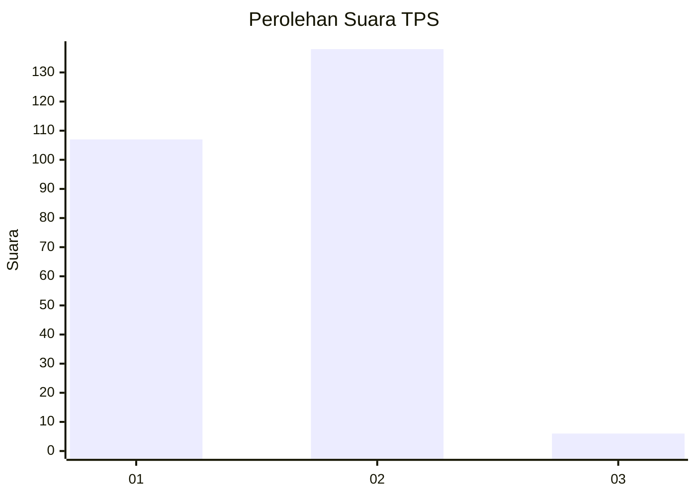
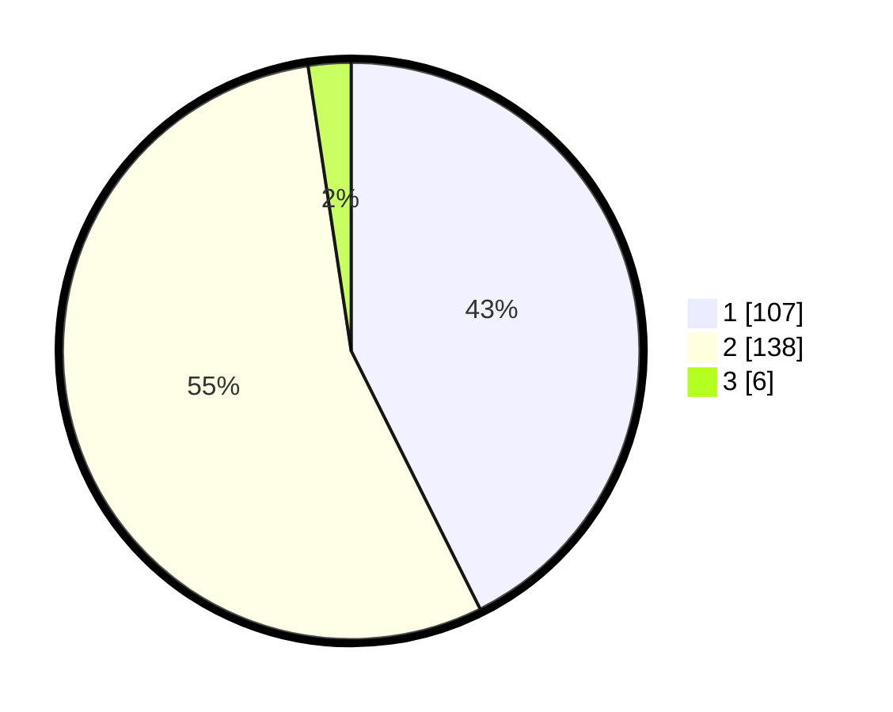

# Hasil

## Grafik

## Tabel

| No. | Nama Paslon    | Suara | Suara (raw) | Persentase |
|:--- |:-------------- | -----:| -----------:| ----------:|
| 1   | ANIES MUHAIMIN | 107   | [107][p-1]  | 42,63      |
| 2   | PRABOWO GIBRAN | 138   | [138][p-2]  | 54,98      |
| 3   | GANJAR MAHFUD  | 6     | [6][p-3]    | 2,39       |

[p-1]: https://github.com/gigit-pemilu/pemilu-2024-35-jawa-timur/blob/main/pilpres/hitung-suara/sub/35-jawa-timur/sub/28-pamekasan/sub/08-larangan/sub/2002-blumbungan/sub/024-tps/sub/paslon-1.txt
[p-2]: https://github.com/gigit-pemilu/pemilu-2024-35-jawa-timur/blob/main/pilpres/hitung-suara/sub/35-jawa-timur/sub/28-pamekasan/sub/08-larangan/sub/2002-blumbungan/sub/024-tps/sub/paslon-2.txt
[p-3]: https://github.com/gigit-pemilu/pemilu-2024-35-jawa-timur/blob/main/pilpres/hitung-suara/sub/35-jawa-timur/sub/28-pamekasan/sub/08-larangan/sub/2002-blumbungan/sub/024-tps/sub/paslon-3.txt

## Foto C Plano

https://sirekap-obj-formc.kpu.go.id/9de9/pemilu/ppwp/35/28/08/20/02/3528082002024-20240214-212654--3a56b43f-3c2b-4c5f-bf8a-8228df26f854.jpg

https://sirekap-obj-formc.kpu.go.id/9de9/pemilu/ppwp/35/28/08/20/02/3528082002024-20240214-212738--7089445c-c8b7-4530-b0d9-3436258b9b63.jpg

https://sirekap-obj-formc.kpu.go.id/9de9/pemilu/ppwp/35/28/08/20/02/3528082002024-20240214-212809--acdc8944-4ad0-4f74-b951-d974bbc3b754.jpg

## Metadata

| Key        | Value               |
| ---------- | ------------------- |
| Time Stamp | 2024-02-17 16:36:25 |

