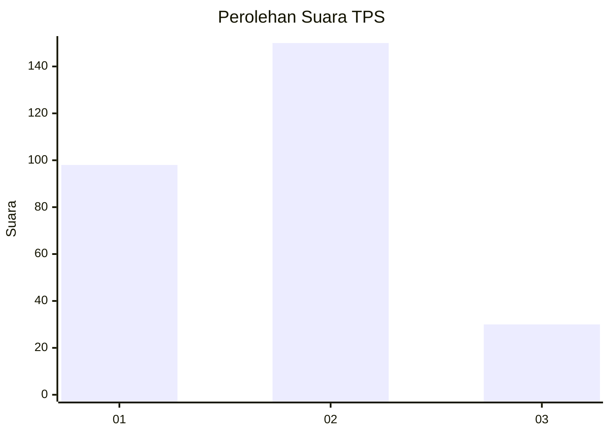
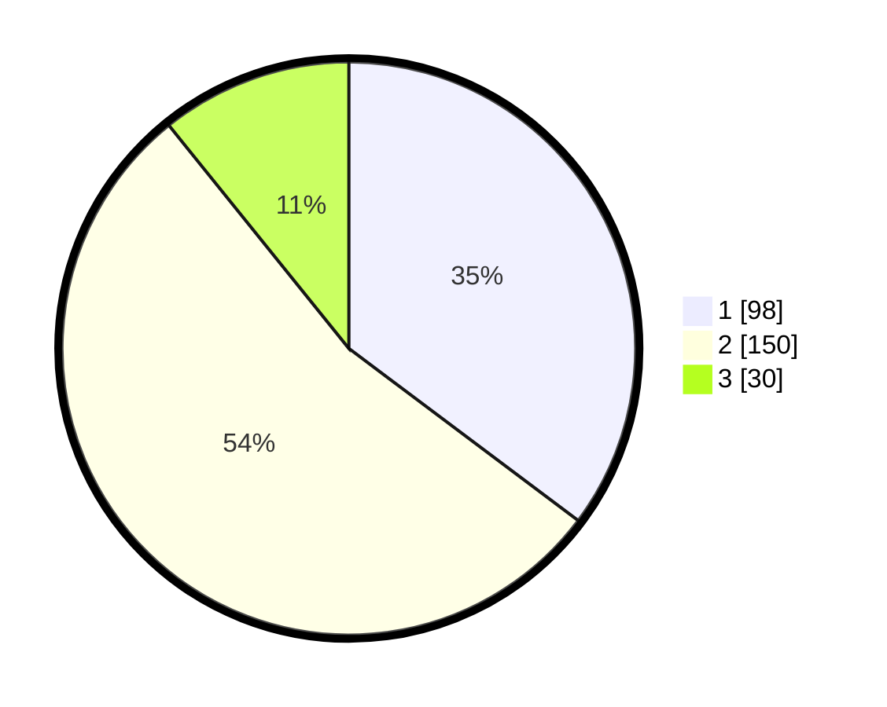

# Hasil

## Grafik

## Tabel

| No. | Nama Paslon    | Suara | Suara (raw) | Persentase |
|:--- |:-------------- | -----:| -----------:| ----------:|
| 1   | ANIES MUHAIMIN | 98    | [98][p-1]   | 35,25      |
| 2   | PRABOWO GIBRAN | 150   | [150][p-2]  | 53,96      |
| 3   | GANJAR MAHFUD  | 30    | [30][p-3]   | 10,79      |

[p-1]: https://github.com/gigit-pemilu/pemilu-2024-35-jawa-timur/blob/main/pilpres/hitung-suara/sub/35-jawa-timur/sub/28-pamekasan/sub/08-larangan/sub/2002-blumbungan/sub/028-tps/sub/paslon-1.txt
[p-2]: https://github.com/gigit-pemilu/pemilu-2024-35-jawa-timur/blob/main/pilpres/hitung-suara/sub/35-jawa-timur/sub/28-pamekasan/sub/08-larangan/sub/2002-blumbungan/sub/028-tps/sub/paslon-2.txt
[p-3]: https://github.com/gigit-pemilu/pemilu-2024-35-jawa-timur/blob/main/pilpres/hitung-suara/sub/35-jawa-timur/sub/28-pamekasan/sub/08-larangan/sub/2002-blumbungan/sub/028-tps/sub/paslon-3.txt

## Foto C Plano

https://sirekap-obj-formc.kpu.go.id/222c/pemilu/ppwp/35/28/08/20/02/3528082002028-20240215-072216--9fa64fe7-5783-48ba-868b-86b4c24854a8.jpg

https://sirekap-obj-formc.kpu.go.id/222c/pemilu/ppwp/35/28/08/20/02/3528082002028-20240215-072237--15d8a2ae-200a-4544-8d61-d84adddd377e.jpg

https://sirekap-obj-formc.kpu.go.id/222c/pemilu/ppwp/35/28/08/20/02/3528082002028-20240215-072248--328eafa4-ce82-4754-98fa-7a14ee03047b.jpg

## Metadata

| Key        | Value               |
| ---------- | ------------------- |
| Time Stamp | 2024-02-17 16:36:25 |

