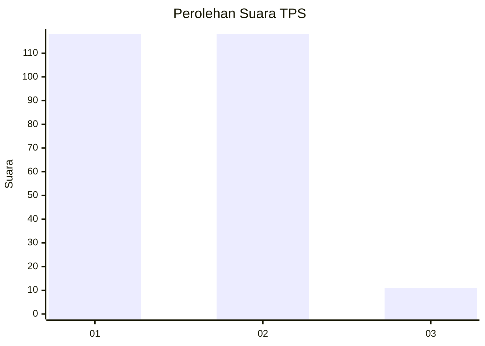
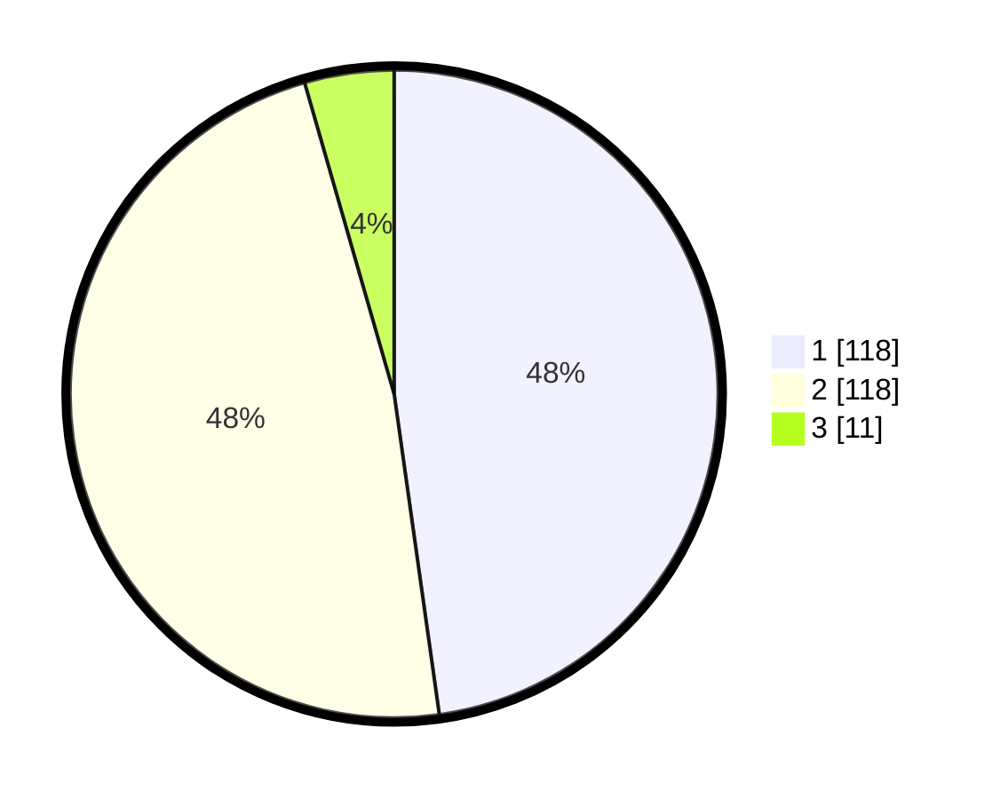

# Hasil

## Grafik

## Tabel

| No. | Nama Paslon    | Suara | Suara (raw) | Persentase |
|:--- |:-------------- | -----:| -----------:| ----------:|
| 1   | ANIES MUHAIMIN | 118   | [118][p-1]  | 47,77      |
| 2   | PRABOWO GIBRAN | 118   | [118][p-2]  | 47,77      |
| 3   | GANJAR MAHFUD  | 11    | [11][p-3]   | 4,45       |

[p-1]: https://github.com/gigit-pemilu/pemilu-2024/blob/main/pilpres/hitung-suara/sub/35-jawa-timur/sub/28-pamekasan/sub/08-larangan/sub/2002-blumbungan/sub/031-tps/sub/paslon-1.txt
[p-2]: https://github.com/gigit-pemilu/pemilu-2024/blob/main/pilpres/hitung-suara/sub/35-jawa-timur/sub/28-pamekasan/sub/08-larangan/sub/2002-blumbungan/sub/031-tps/sub/paslon-2.txt
[p-3]: https://github.com/gigit-pemilu/pemilu-2024/blob/main/pilpres/hitung-suara/sub/35-jawa-timur/sub/28-pamekasan/sub/08-larangan/sub/2002-blumbungan/sub/031-tps/sub/paslon-3.txt

## Foto C Plano

https://sirekap-obj-formc.kpu.go.id/9557/pemilu/ppwp/35/28/08/20/02/3528082002031-20240215-022515--2686ae9c-bc00-44b6-93d1-2fe99055cd35.jpg

https://sirekap-obj-formc.kpu.go.id/9557/pemilu/ppwp/35/28/08/20/02/3528082002031-20240215-022532--274770c7-e9cf-4c87-938e-d52938ca3317.jpg

https://sirekap-obj-formc.kpu.go.id/9557/pemilu/ppwp/35/28/08/20/02/3528082002031-20240215-022539--e8b9c9a3-df67-48c7-b35e-2a078ccf03b6.jpg

## Metadata

| Key        | Value               |
| ---------- | ------------------- |
| Time Stamp | 2024-02-17 16:36:25 |

