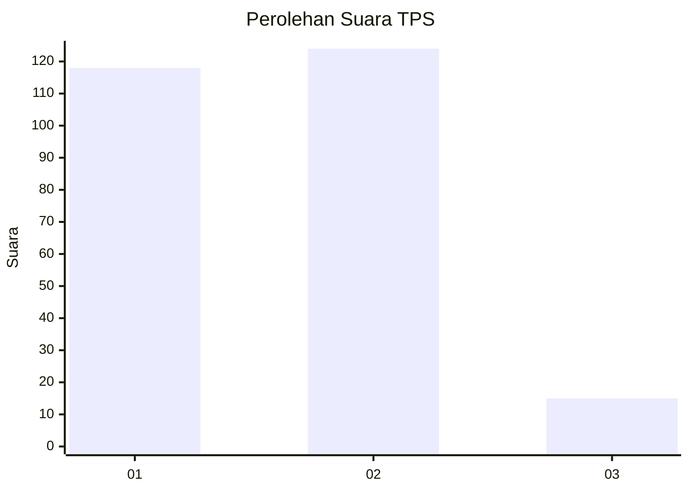
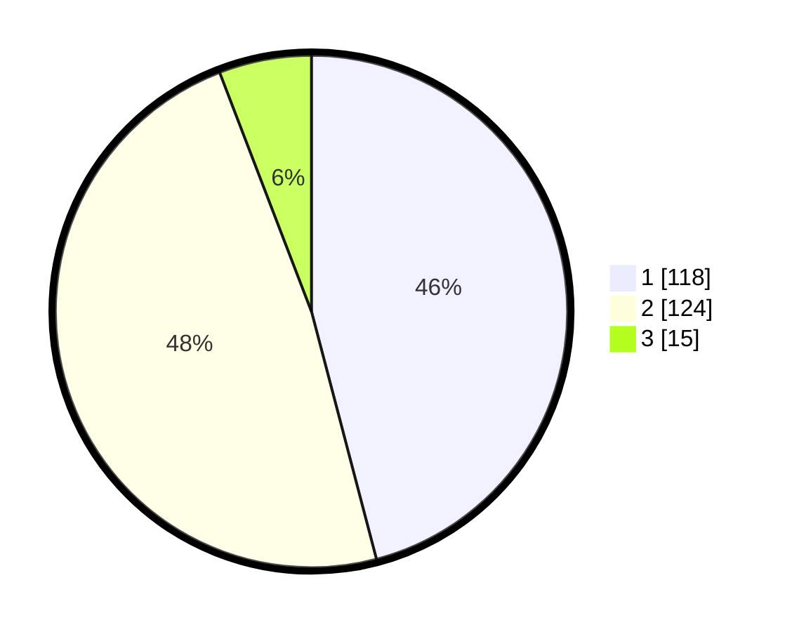

# Hasil

## Grafik

## Tabel

| No. | Nama Paslon    | Suara | Suara (raw) | Persentase |
|:--- |:-------------- | -----:| -----------:| ----------:|
| 1   | ANIES MUHAIMIN | 118   | [118][p-1]  | 45,91      |
| 2   | PRABOWO GIBRAN | 124   | [124][p-2]  | 48,25      |
| 3   | GANJAR MAHFUD  | 15    | [15][p-3]   | 5,84       |

[p-1]: https://github.com/gigit-pemilu/pemilu-2024/blob/main/pilpres/hitung-suara/sub/35-jawa-timur/sub/28-pamekasan/sub/08-larangan/sub/2002-blumbungan/sub/032-tps/sub/paslon-1.txt
[p-2]: https://github.com/gigit-pemilu/pemilu-2024/blob/main/pilpres/hitung-suara/sub/35-jawa-timur/sub/28-pamekasan/sub/08-larangan/sub/2002-blumbungan/sub/032-tps/sub/paslon-2.txt
[p-3]: https://github.com/gigit-pemilu/pemilu-2024/blob/main/pilpres/hitung-suara/sub/35-jawa-timur/sub/28-pamekasan/sub/08-larangan/sub/2002-blumbungan/sub/032-tps/sub/paslon-3.txt

## Foto C Plano

https://sirekap-obj-formc.kpu.go.id/ac09/pemilu/ppwp/35/28/08/20/02/3528082002032-20240214-211613--06956774-3634-4327-b958-9fbd47fee6e9.jpg

https://sirekap-obj-formc.kpu.go.id/ac09/pemilu/ppwp/35/28/08/20/02/3528082002032-20240214-211809--42f9edf2-a514-414d-a548-cb7ad2651d33.jpg

https://sirekap-obj-formc.kpu.go.id/ac09/pemilu/ppwp/35/28/08/20/02/3528082002032-20240214-211933--3effead2-69c0-4772-878f-32511ba7c93b.jpg

## Metadata

| Key        | Value               |
| ---------- | ------------------- |
| Time Stamp | 2024-02-17 16:36:25 |

