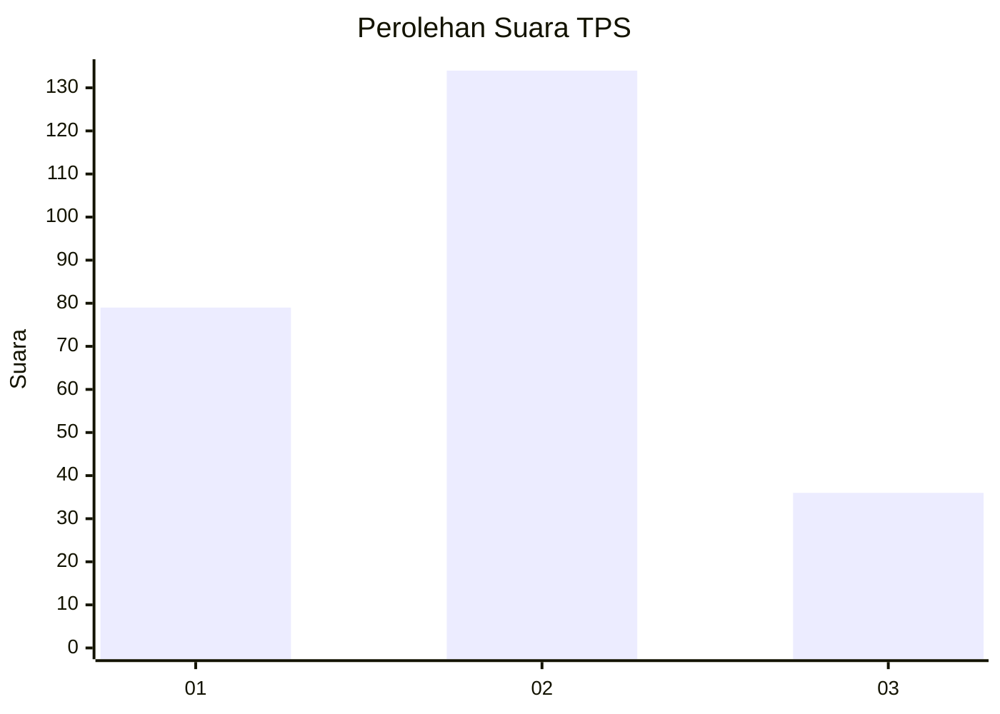
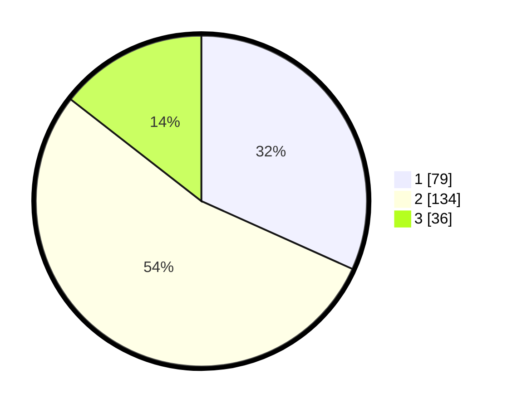

# Hasil

## Grafik

## Tabel

| No. | Nama Paslon    | Suara | Suara (raw) | Persentase |
|:--- |:-------------- | -----:| -----------:| ----------:|
| 1   | ANIES MUHAIMIN | 79    | [79][p-1]   | 31,73      |
| 2   | PRABOWO GIBRAN | 134   | [134][p-2]  | 53,82      |
| 3   | GANJAR MAHFUD  | 36    | [36][p-3]   | 14,46      |

[p-1]: https://github.com/gigit-pemilu/pemilu-2024-35-jawa-timur/blob/main/pilpres/hitung-suara/sub/35-jawa-timur/sub/28-pamekasan/sub/08-larangan/sub/2002-blumbungan/sub/033-tps/sub/paslon-1.txt
[p-2]: https://github.com/gigit-pemilu/pemilu-2024-35-jawa-timur/blob/main/pilpres/hitung-suara/sub/35-jawa-timur/sub/28-pamekasan/sub/08-larangan/sub/2002-blumbungan/sub/033-tps/sub/paslon-2.txt
[p-3]: https://github.com/gigit-pemilu/pemilu-2024-35-jawa-timur/blob/main/pilpres/hitung-suara/sub/35-jawa-timur/sub/28-pamekasan/sub/08-larangan/sub/2002-blumbungan/sub/033-tps/sub/paslon-3.txt

## Foto C Plano

https://sirekap-obj-formc.kpu.go.id/550c/pemilu/ppwp/35/28/08/20/02/3528082002033-20240214-223548--d3e1f903-037b-4989-8a3e-dfc12f790f98.jpg

https://sirekap-obj-formc.kpu.go.id/550c/pemilu/ppwp/35/28/08/20/02/3528082002033-20240215-062254--e7190816-d023-4743-bd25-8c89208eb01b.jpg

https://sirekap-obj-formc.kpu.go.id/550c/pemilu/ppwp/35/28/08/20/02/3528082002033-20240215-071210--e5b3c106-d3e6-4b49-9fd4-677b77cd3253.jpg

## Metadata

| Key        | Value               |
| ---------- | ------------------- |
| Time Stamp | 2024-02-17 16:36:25 |

