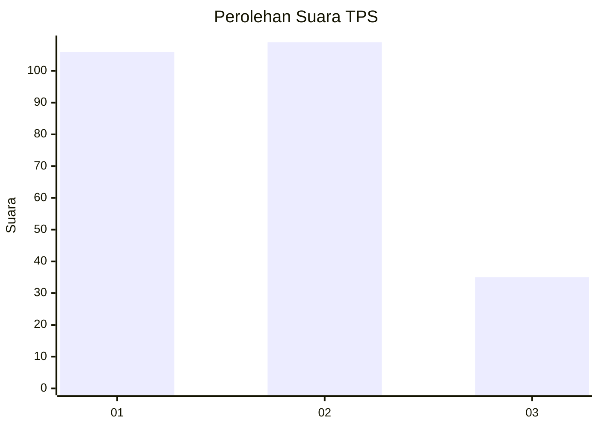
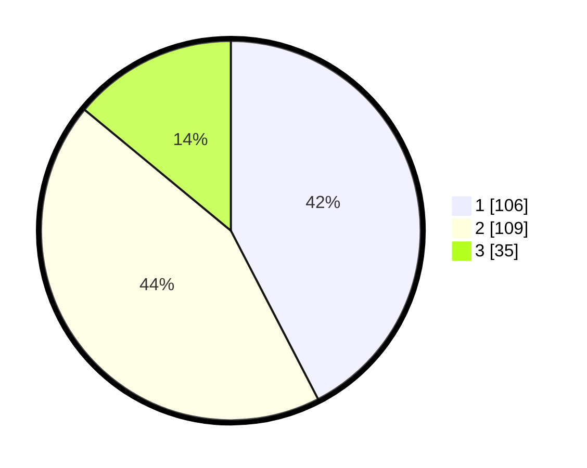

# Hasil

## Grafik

## Tabel

| No. | Nama Paslon    | Suara | Suara (raw) | Persentase |
|:--- |:-------------- | -----:| -----------:| ----------:|
| 1   | ANIES MUHAIMIN | 106   | [106][p-1]  | 42,40      |
| 2   | PRABOWO GIBRAN | 109   | [109][p-2]  | 43,60      |
| 3   | GANJAR MAHFUD  | 35    | [35][p-3]   | 14,00      |

[p-1]: https://github.com/gigit-pemilu/pemilu-2024/blob/main/pilpres/hitung-suara/sub/35-jawa-timur/sub/28-pamekasan/sub/08-larangan/sub/2002-blumbungan/sub/040-tps/sub/paslon-1.txt
[p-2]: https://github.com/gigit-pemilu/pemilu-2024/blob/main/pilpres/hitung-suara/sub/35-jawa-timur/sub/28-pamekasan/sub/08-larangan/sub/2002-blumbungan/sub/040-tps/sub/paslon-2.txt
[p-3]: https://github.com/gigit-pemilu/pemilu-2024/blob/main/pilpres/hitung-suara/sub/35-jawa-timur/sub/28-pamekasan/sub/08-larangan/sub/2002-blumbungan/sub/040-tps/sub/paslon-3.txt

## Foto C Plano

https://sirekap-obj-formc.kpu.go.id/d199/pemilu/ppwp/35/28/08/20/02/3528082002040-20240214-220257--267417d4-4b02-44ad-bbcc-3eb48d78b9e1.jpg

https://sirekap-obj-formc.kpu.go.id/d199/pemilu/ppwp/35/28/08/20/02/3528082002040-20240214-215921--7e6c2d42-249e-470e-925b-55632d3e5e18.jpg

https://sirekap-obj-formc.kpu.go.id/d199/pemilu/ppwp/35/28/08/20/02/3528082002040-20240214-220038--7cd91561-e82d-40e0-8478-ca704a1bc56f.jpg

## Metadata

| Key        | Value               |
| ---------- | ------------------- |
| Time Stamp | 2024-02-17 16:36:25 |

