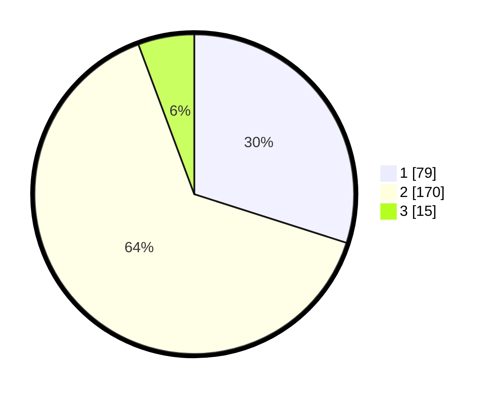

# Hasil

## Grafik

## Tabel

| No. | Nama Paslon    | Suara | Suara (raw) | Persentase |
|:--- |:-------------- | -----:| -----------:| ----------:|
| 1   | ANIES MUHAIMIN | 79    | [79][p-1]   | 29,92      |
| 2   | PRABOWO GIBRAN | 170   | [170][p-2]  | 64,39      |
| 3   | GANJAR MAHFUD  | 15    | [15][p-3]   | 5,68       |

[p-1]: https://github.com/gigit-pemilu/pemilu-2024-35-jawa-timur/blob/main/pilpres/hitung-suara/sub/35-jawa-timur/sub/28-pamekasan/sub/08-larangan/sub/2003-trasak/sub/008-tps/sub/paslon-1.txt
[p-2]: https://github.com/gigit-pemilu/pemilu-2024-35-jawa-timur/blob/main/pilpres/hitung-suara/sub/35-jawa-timur/sub/28-pamekasan/sub/08-larangan/sub/2003-trasak/sub/008-tps/sub/paslon-2.txt
[p-3]: https://github.com/gigit-pemilu/pemilu-2024-35-jawa-timur/blob/main/pilpres/hitung-suara/sub/35-jawa-timur/sub/28-pamekasan/sub/08-larangan/sub/2003-trasak/sub/008-tps/sub/paslon-3.txt

## Foto C Plano

https://sirekap-obj-formc.kpu.go.id/c3dc/pemilu/ppwp/35/28/08/20/03/3528082003008-20240215-000829--8a43889f-a052-4b36-9536-e43f2326b8f6.jpg

https://sirekap-obj-formc.kpu.go.id/c3dc/pemilu/ppwp/35/28/08/20/03/3528082003008-20240215-001151--fd4090e6-3dba-42cb-8f06-8bf52cc252ad.jpg

https://sirekap-obj-formc.kpu.go.id/c3dc/pemilu/ppwp/35/28/08/20/03/3528082003008-20240215-001608--b9e38c17-4955-4129-a4bc-5226e553c44f.jpg

## Metadata

| Key        | Value               |
| ---------- | ------------------- |
| Time Stamp | 2024-02-17 16:36:25 |

