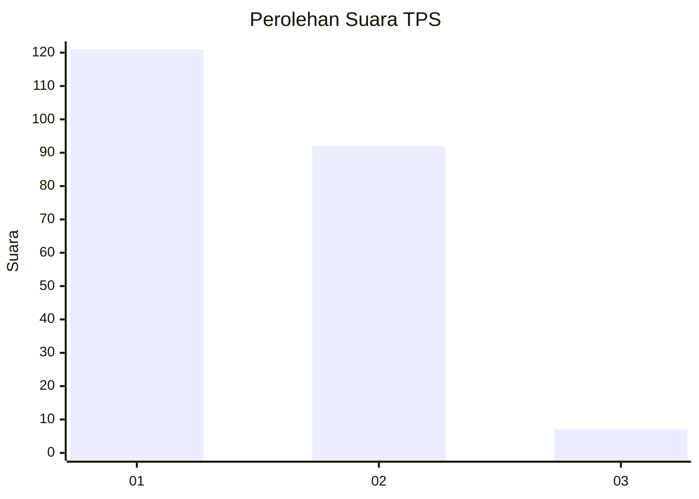
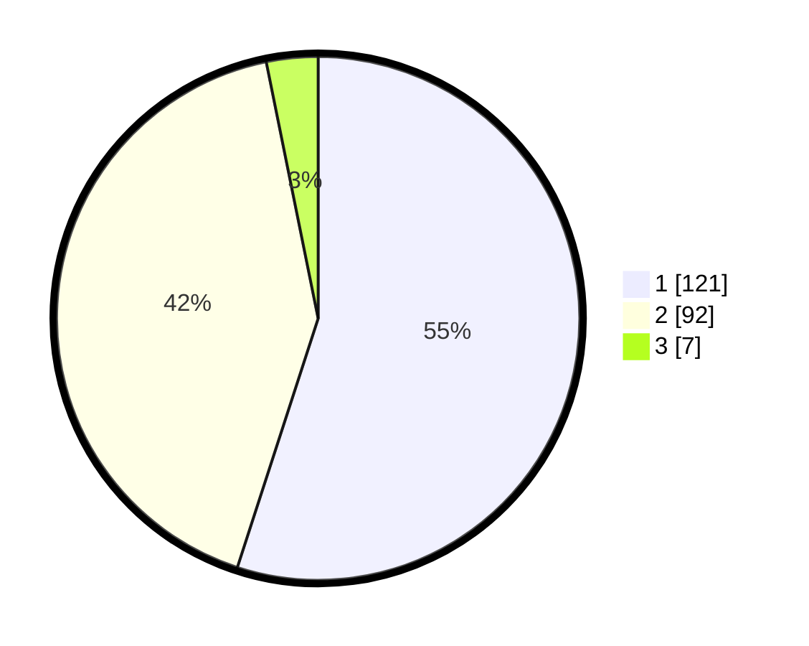

# Hasil

## Grafik

## Tabel

| No. | Nama Paslon    | Suara | Suara (raw) | Persentase |
|:--- |:-------------- | -----:| -----------:| ----------:|
| 1   | ANIES MUHAIMIN | 121   | [121][p-1]  | 55,00      |
| 2   | PRABOWO GIBRAN | 92    | [92][p-2]   | 41,82      |
| 3   | GANJAR MAHFUD  | 7     | [7][p-3]    | 3,18       |

[p-1]: https://github.com/gigit-pemilu/pemilu-2024/blob/main/pilpres/hitung-suara/sub/35-jawa-timur/sub/28-pamekasan/sub/08-larangan/sub/2004-tentenan-barat/sub/001-tps/sub/paslon-1.txt
[p-2]: https://github.com/gigit-pemilu/pemilu-2024/blob/main/pilpres/hitung-suara/sub/35-jawa-timur/sub/28-pamekasan/sub/08-larangan/sub/2004-tentenan-barat/sub/001-tps/sub/paslon-2.txt
[p-3]: https://github.com/gigit-pemilu/pemilu-2024/blob/main/pilpres/hitung-suara/sub/35-jawa-timur/sub/28-pamekasan/sub/08-larangan/sub/2004-tentenan-barat/sub/001-tps/sub/paslon-3.txt

## Foto C Plano

https://sirekap-obj-formc.kpu.go.id/a717/pemilu/ppwp/35/28/08/20/04/3528082004001-20240214-233253--0d4215c1-f61b-4151-89d8-202bd5131737.jpg

https://sirekap-obj-formc.kpu.go.id/a717/pemilu/ppwp/35/28/08/20/04/3528082004001-20240214-233130--687111b5-c54b-4b0c-b673-23b56ef765e6.jpg

https://sirekap-obj-formc.kpu.go.id/a717/pemilu/ppwp/35/28/08/20/04/3528082004001-20240214-233233--09cd19be-8343-420f-8bfd-3de1c1ca64f2.jpg

## Metadata

| Key        | Value               |
| ---------- | ------------------- |
| Time Stamp | 2024-02-25 12:00:00 |

