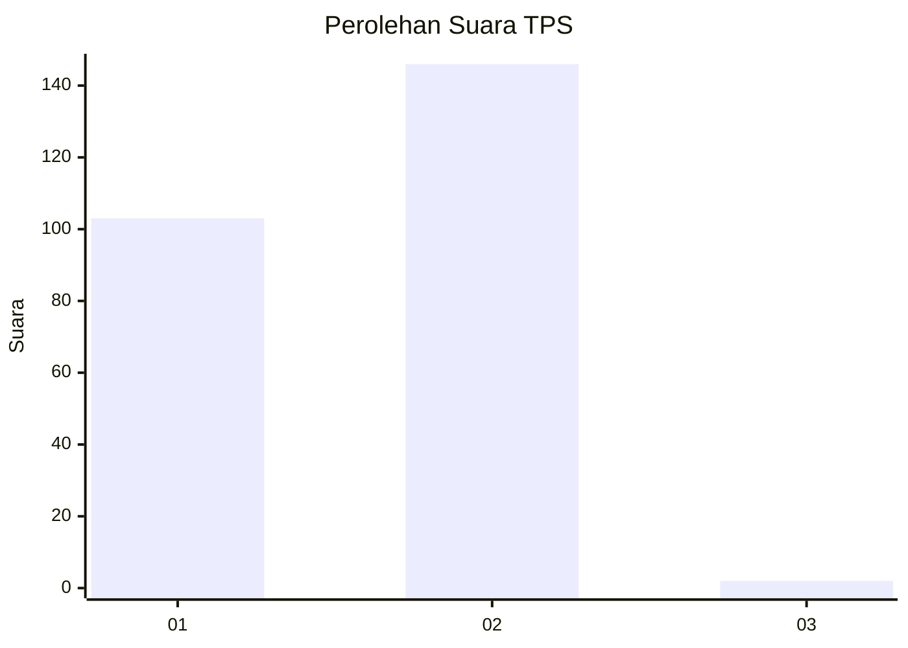
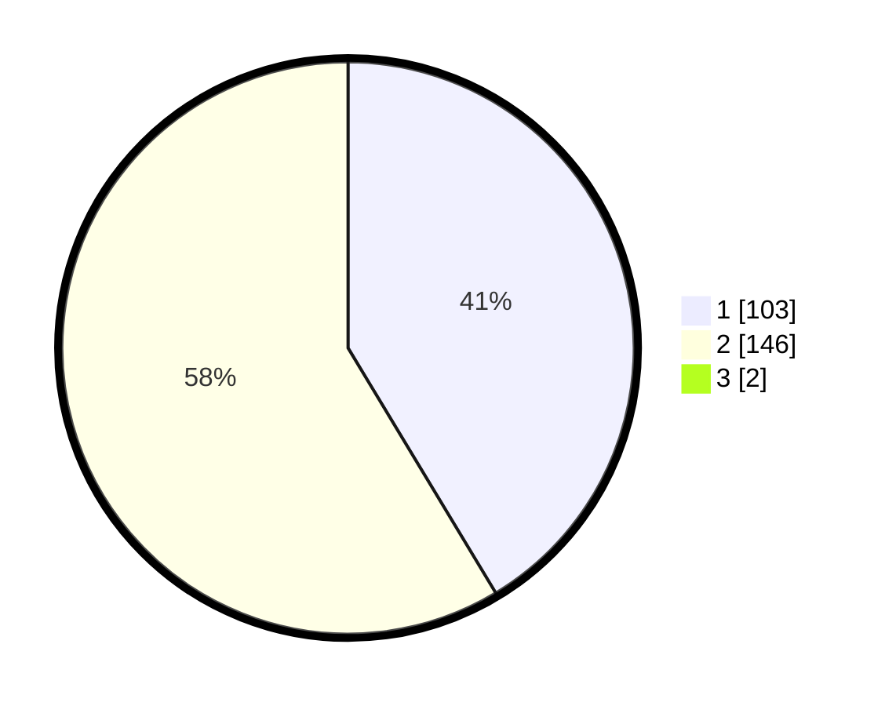

# Hasil

## Grafik

## Tabel

| No. | Nama Paslon    | Suara | Suara (raw) | Persentase |
|:--- |:-------------- | -----:| -----------:| ----------:|
| 1   | ANIES MUHAIMIN | 103   | [103][p-1]  | 41,04      |
| 2   | PRABOWO GIBRAN | 146   | [146][p-2]  | 58,17      |
| 3   | GANJAR MAHFUD  | 2     | [2][p-3]    | 0,80       |

[p-1]: https://github.com/gigit-pemilu/pemilu-2024-35-jawa-timur/blob/main/pilpres/hitung-suara/sub/35-jawa-timur/sub/28-pamekasan/sub/08-larangan/sub/2004-tentenan-barat/sub/002-tps/sub/paslon-1.txt
[p-2]: https://github.com/gigit-pemilu/pemilu-2024-35-jawa-timur/blob/main/pilpres/hitung-suara/sub/35-jawa-timur/sub/28-pamekasan/sub/08-larangan/sub/2004-tentenan-barat/sub/002-tps/sub/paslon-2.txt
[p-3]: https://github.com/gigit-pemilu/pemilu-2024-35-jawa-timur/blob/main/pilpres/hitung-suara/sub/35-jawa-timur/sub/28-pamekasan/sub/08-larangan/sub/2004-tentenan-barat/sub/002-tps/sub/paslon-3.txt

## Foto C Plano

https://sirekap-obj-formc.kpu.go.id/367f/pemilu/ppwp/35/28/08/20/04/3528082004002-20240214-211520--ff3bbcfc-f3f5-4a1e-aedd-ae334ac585f6.jpg

https://sirekap-obj-formc.kpu.go.id/367f/pemilu/ppwp/35/28/08/20/04/3528082004002-20240214-211709--988ad8b4-fde0-4a5b-856e-b5bb783f0ba4.jpg

https://sirekap-obj-formc.kpu.go.id/367f/pemilu/ppwp/35/28/08/20/04/3528082004002-20240214-211802--d4790a7a-4c29-497b-a759-7858d9eea1ef.jpg

## Metadata

| Key        | Value               |
| ---------- | ------------------- |
| Time Stamp | 2024-02-24 22:31:28 |

