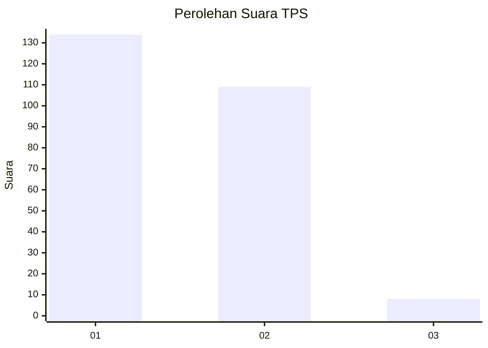
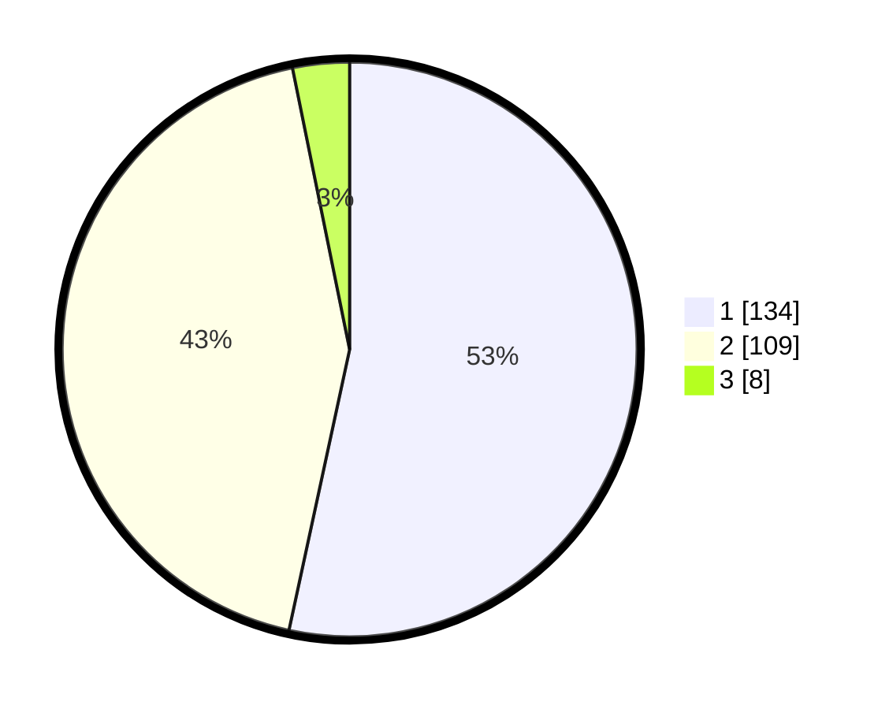

# Hasil

## Grafik

## Tabel

| No. | Nama Paslon    | Suara | Suara (raw) | Persentase |
|:--- |:-------------- | -----:| -----------:| ----------:|
| 1   | ANIES MUHAIMIN | 134   | [134][p-1]  | 53,39      |
| 2   | PRABOWO GIBRAN | 109   | [109][p-2]  | 43,43      |
| 3   | GANJAR MAHFUD  | 8     | [8][p-3]    | 3,19       |

[p-1]: https://github.com/gigit-pemilu/pemilu-2024/blob/main/pilpres/hitung-suara/sub/35-jawa-timur/sub/28-pamekasan/sub/08-larangan/sub/2005-tentenan-timur/sub/003-tps/sub/paslon-1.txt
[p-2]: https://github.com/gigit-pemilu/pemilu-2024/blob/main/pilpres/hitung-suara/sub/35-jawa-timur/sub/28-pamekasan/sub/08-larangan/sub/2005-tentenan-timur/sub/003-tps/sub/paslon-2.txt
[p-3]: https://github.com/gigit-pemilu/pemilu-2024/blob/main/pilpres/hitung-suara/sub/35-jawa-timur/sub/28-pamekasan/sub/08-larangan/sub/2005-tentenan-timur/sub/003-tps/sub/paslon-3.txt

## Foto C Plano

https://sirekap-obj-formc.kpu.go.id/0609/pemilu/ppwp/35/28/08/20/05/3528082005003-20240214-195611--75d5aa79-5749-46a3-bdf3-23aa1201f1f5.jpg

https://sirekap-obj-formc.kpu.go.id/0609/pemilu/ppwp/35/28/08/20/05/3528082005003-20240214-195504--a89687c4-3544-40b6-ba82-2d7b969fc193.jpg

https://sirekap-obj-formc.kpu.go.id/0609/pemilu/ppwp/35/28/08/20/05/3528082005003-20240214-195539--05b458b9-a839-410a-9615-9f8d5acaf7da.jpg

## Metadata

| Key        | Value               |
| ---------- | ------------------- |
| Time Stamp | 2024-02-15 19:00:26 |

