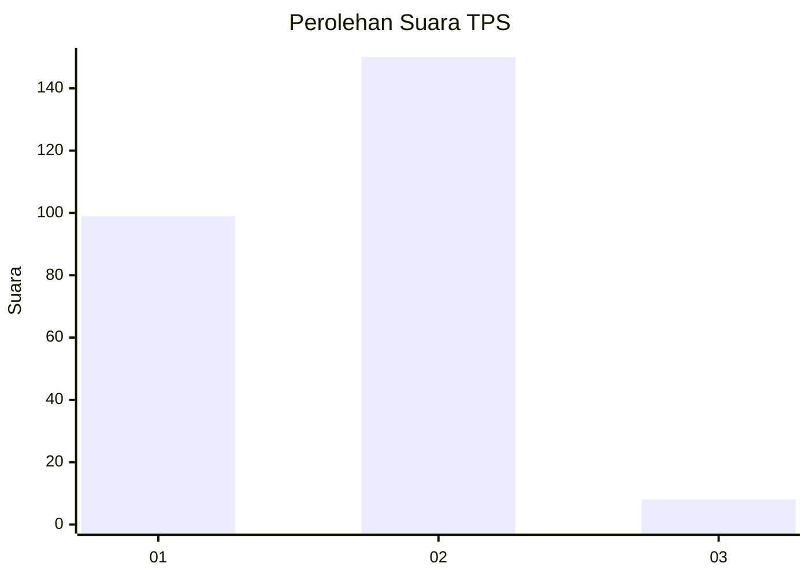
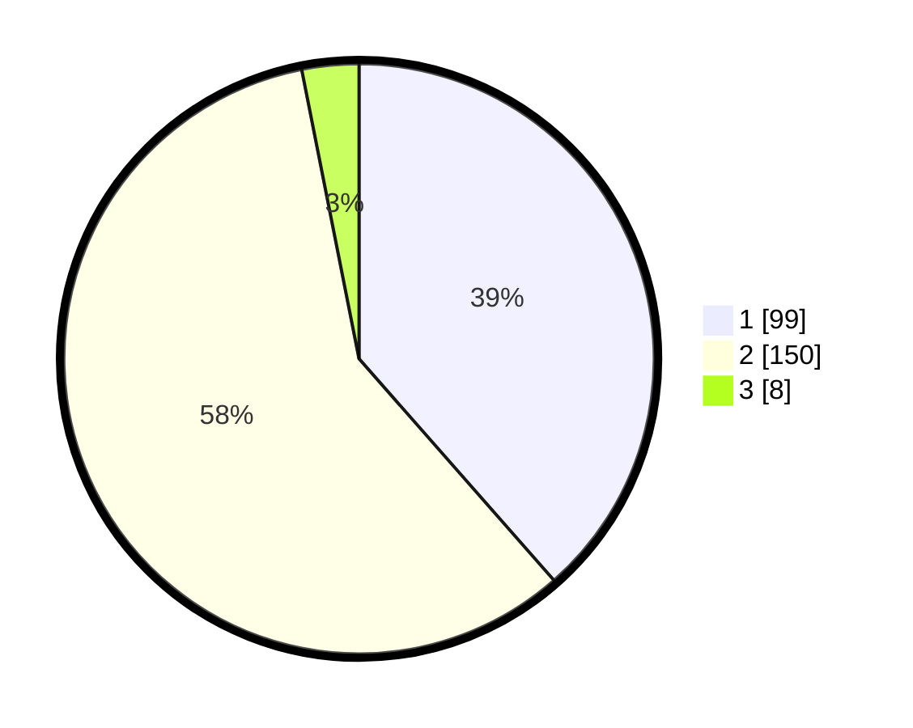

# Hasil

## Grafik

## Tabel

| No. | Nama Paslon    | Suara | Suara (raw) | Persentase |
|:--- |:-------------- | -----:| -----------:| ----------:|
| 1   | ANIES MUHAIMIN | 99    | [99][p-1]   | 38,52      |
| 2   | PRABOWO GIBRAN | 150   | [150][p-2]  | 58,37      |
| 3   | GANJAR MAHFUD  | 8     | [8][p-3]    | 3,11       |

[p-1]: https://github.com/gigit-pemilu/pemilu-2024-35-jawa-timur/blob/main/pilpres/hitung-suara/sub/35-jawa-timur/sub/28-pamekasan/sub/08-larangan/sub/2005-tentenan-timur/sub/004-tps/sub/paslon-1.txt
[p-2]: https://github.com/gigit-pemilu/pemilu-2024-35-jawa-timur/blob/main/pilpres/hitung-suara/sub/35-jawa-timur/sub/28-pamekasan/sub/08-larangan/sub/2005-tentenan-timur/sub/004-tps/sub/paslon-2.txt
[p-3]: https://github.com/gigit-pemilu/pemilu-2024-35-jawa-timur/blob/main/pilpres/hitung-suara/sub/35-jawa-timur/sub/28-pamekasan/sub/08-larangan/sub/2005-tentenan-timur/sub/004-tps/sub/paslon-3.txt

## Foto C Plano

https://sirekap-obj-formc.kpu.go.id/ed6f/pemilu/ppwp/35/28/08/20/05/3528082005004-20240214-210227--c7ac880e-a4f7-4799-ad7a-3099b99cc880.jpg

https://sirekap-obj-formc.kpu.go.id/ed6f/pemilu/ppwp/35/28/08/20/05/3528082005004-20240214-210333--2be25a5d-4a7d-430b-bca7-f0bcca7ddcba.jpg

https://sirekap-obj-formc.kpu.go.id/ed6f/pemilu/ppwp/35/28/08/20/05/3528082005004-20240214-210410--1bf1afdb-f1c8-48ad-8a14-8d8b9992c764.jpg

## Metadata

| Key        | Value               |
| ---------- | ------------------- |
| Time Stamp | 2024-02-17 16:36:25 |

