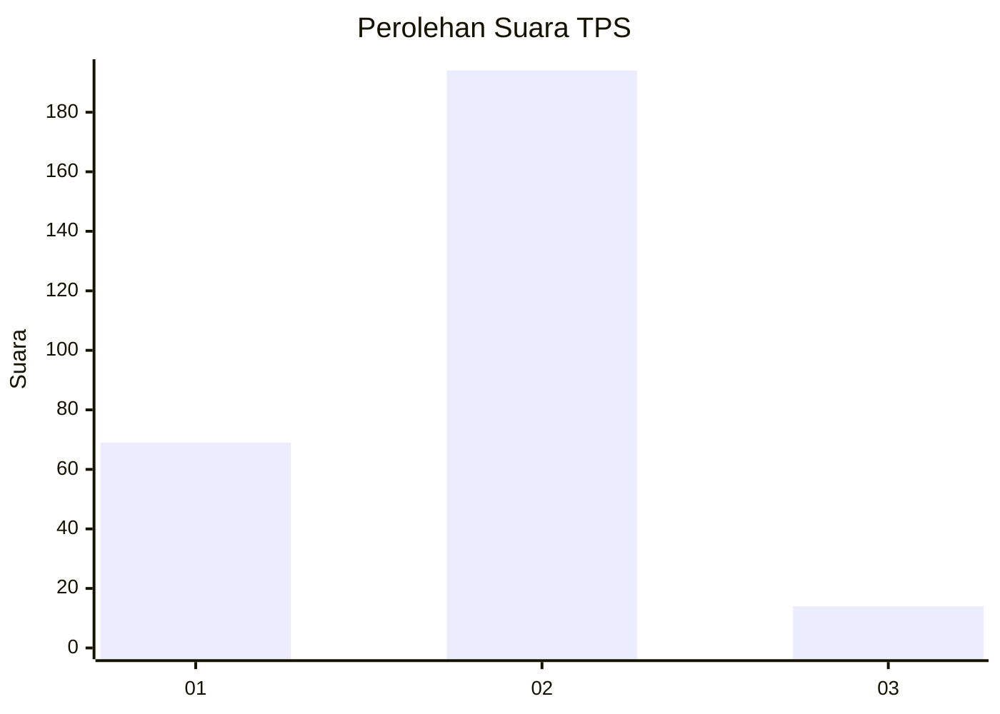
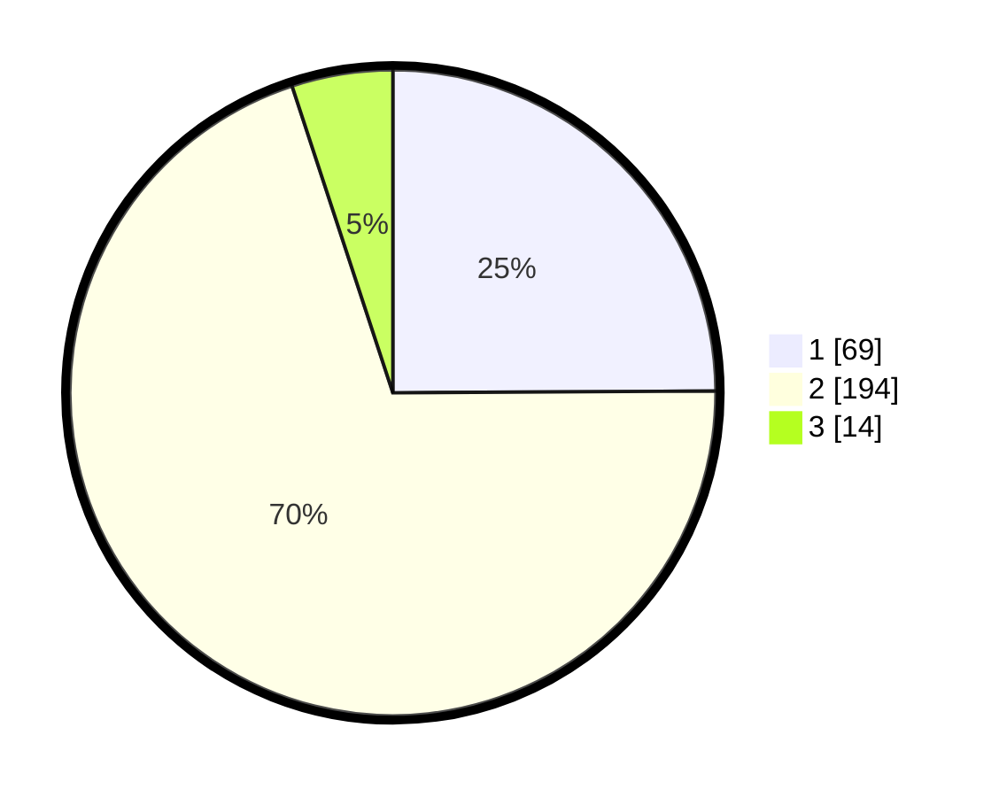

# Hasil

## Grafik

## Tabel

| No. | Nama Paslon    | Suara | Suara (raw) | Persentase |
|:--- |:-------------- | -----:| -----------:| ----------:|
| 1   | ANIES MUHAIMIN | 69    | [69][p-1]   | 24,91      |
| 2   | PRABOWO GIBRAN | 194   | [194][p-2]  | 70,04      |
| 3   | GANJAR MAHFUD  | 14    | [14][p-3]   | 5,05       |

[p-1]: https://github.com/gigit-pemilu/pemilu-2024/blob/main/pilpres/hitung-suara/sub/35-jawa-timur/sub/28-pamekasan/sub/08-larangan/sub/2006-grujugan/sub/004-tps/sub/paslon-1.txt
[p-2]: https://github.com/gigit-pemilu/pemilu-2024/blob/main/pilpres/hitung-suara/sub/35-jawa-timur/sub/28-pamekasan/sub/08-larangan/sub/2006-grujugan/sub/004-tps/sub/paslon-2.txt
[p-3]: https://github.com/gigit-pemilu/pemilu-2024/blob/main/pilpres/hitung-suara/sub/35-jawa-timur/sub/28-pamekasan/sub/08-larangan/sub/2006-grujugan/sub/004-tps/sub/paslon-3.txt

## Foto C Plano

https://sirekap-obj-formc.kpu.go.id/7ecc/pemilu/ppwp/35/28/08/20/06/3528082006004-20240214-233251--4c8463a8-ff55-4bb6-a956-85c5575b3bf7.jpg

https://sirekap-obj-formc.kpu.go.id/7ecc/pemilu/ppwp/35/28/08/20/06/3528082006004-20240214-233543--3c6cf31f-d8fe-4f8c-be6d-c4ebe39b6c7a.jpg

https://sirekap-obj-formc.kpu.go.id/7ecc/pemilu/ppwp/35/28/08/20/06/3528082006004-20240215-090851--7e3a604c-38c9-4f6a-822e-6b0361f41f48.jpg

## Metadata

| Key        | Value               |
| ---------- | ------------------- |
| Time Stamp | 2024-02-15 19:00:26 |

