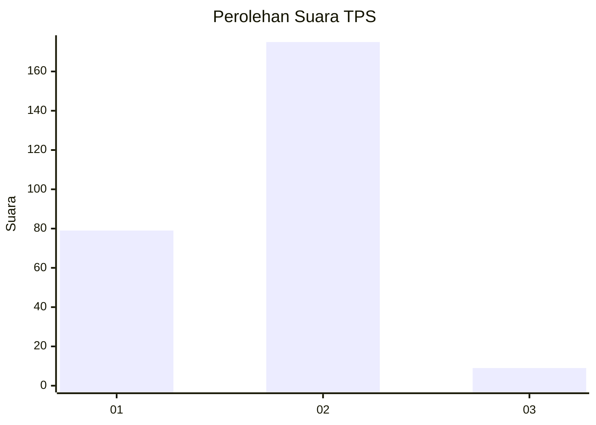
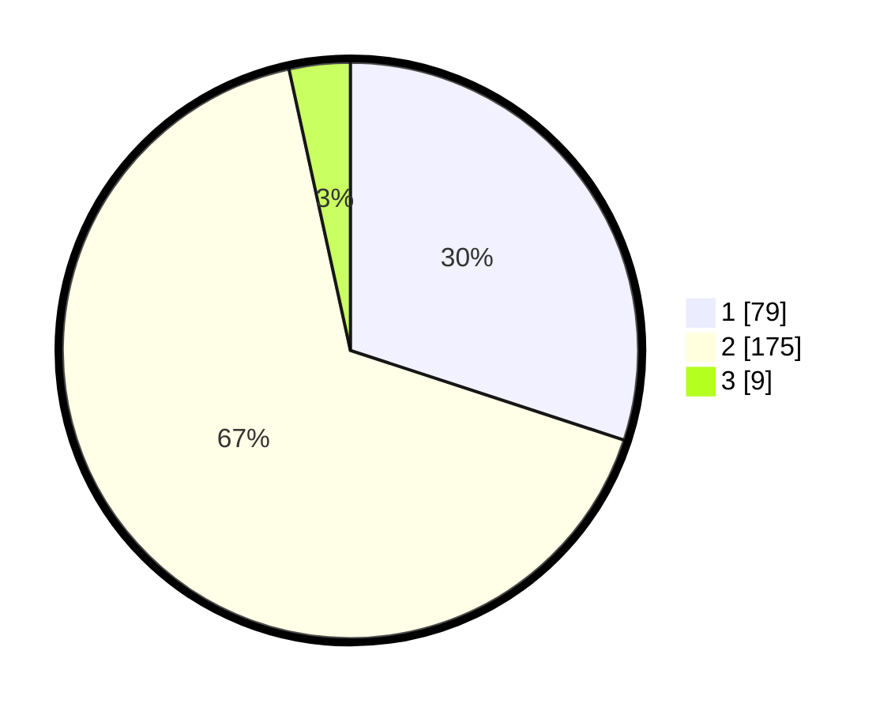

# Hasil

## Grafik

## Tabel

| No. | Nama Paslon    | Suara | Suara (raw) | Persentase |
|:--- |:-------------- | -----:| -----------:| ----------:|
| 1   | ANIES MUHAIMIN | 79    | [79][p-1]   | 30,04      |
| 2   | PRABOWO GIBRAN | 175   | [175][p-2]  | 66,54      |
| 3   | GANJAR MAHFUD  | 9     | [9][p-3]    | 3,42       |

[p-1]: https://github.com/gigit-pemilu/pemilu-2024/blob/main/pilpres/hitung-suara/sub/35-jawa-timur/sub/28-pamekasan/sub/08-larangan/sub/2007-larangan-luar/sub/013-tps/sub/paslon-1.txt
[p-2]: https://github.com/gigit-pemilu/pemilu-2024/blob/main/pilpres/hitung-suara/sub/35-jawa-timur/sub/28-pamekasan/sub/08-larangan/sub/2007-larangan-luar/sub/013-tps/sub/paslon-2.txt
[p-3]: https://github.com/gigit-pemilu/pemilu-2024/blob/main/pilpres/hitung-suara/sub/35-jawa-timur/sub/28-pamekasan/sub/08-larangan/sub/2007-larangan-luar/sub/013-tps/sub/paslon-3.txt

## Foto C Plano

https://sirekap-obj-formc.kpu.go.id/d995/pemilu/ppwp/35/28/08/20/07/3528082007013-20240215-000352--39b89bb3-5958-4af8-b45e-d5a67ac9790b.jpg

https://sirekap-obj-formc.kpu.go.id/d995/pemilu/ppwp/35/28/08/20/07/3528082007013-20240214-232659--eff56d8d-76d0-41b1-a78b-3bdb1377959a.jpg

https://sirekap-obj-formc.kpu.go.id/d995/pemilu/ppwp/35/28/08/20/07/3528082007013-20240214-233048--e9da574e-11d6-4fda-95b4-cdca2b41e508.jpg

## Metadata

| Key        | Value               |
| ---------- | ------------------- |
| Time Stamp | 2024-02-15 19:00:26 |

