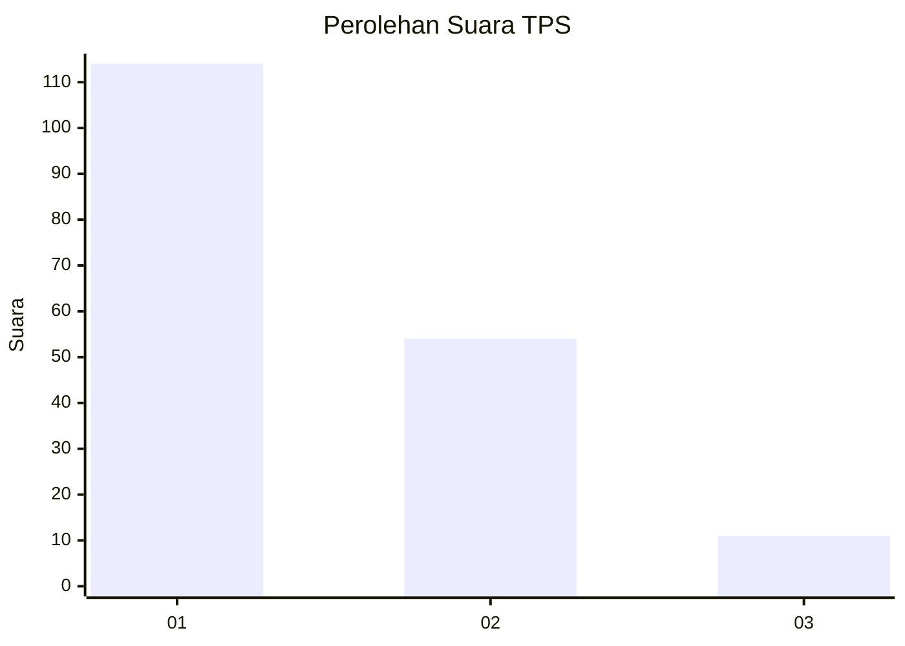
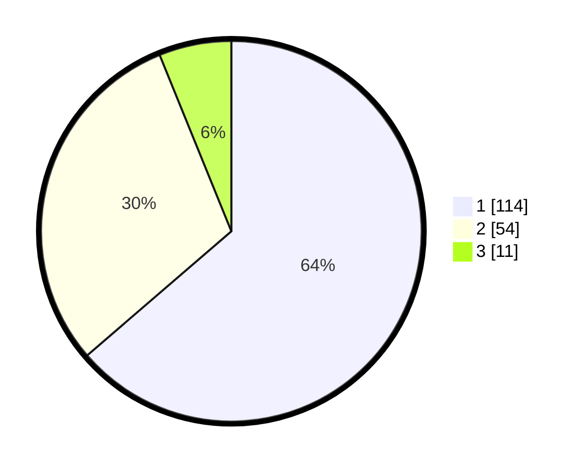

# Hasil

## Grafik

## Tabel

| No. | Nama Paslon    | Suara | Suara (raw) | Persentase |
|:--- |:-------------- | -----:| -----------:| ----------:|
| 1   | ANIES MUHAIMIN | 114   | [114][p-1]  | 63,69      |
| 2   | PRABOWO GIBRAN | 54    | [54][p-2]   | 30,17      |
| 3   | GANJAR MAHFUD  | 11    | [11][p-3]   | 6,15       |

[p-1]: https://github.com/gigit-pemilu/pemilu-2024-35-jawa-timur/blob/main/pilpres/hitung-suara/sub/35-jawa-timur/sub/28-pamekasan/sub/08-larangan/sub/2007-larangan-luar/sub/022-tps/sub/paslon-1.txt
[p-2]: https://github.com/gigit-pemilu/pemilu-2024-35-jawa-timur/blob/main/pilpres/hitung-suara/sub/35-jawa-timur/sub/28-pamekasan/sub/08-larangan/sub/2007-larangan-luar/sub/022-tps/sub/paslon-2.txt
[p-3]: https://github.com/gigit-pemilu/pemilu-2024-35-jawa-timur/blob/main/pilpres/hitung-suara/sub/35-jawa-timur/sub/28-pamekasan/sub/08-larangan/sub/2007-larangan-luar/sub/022-tps/sub/paslon-3.txt

## Foto C Plano

https://sirekap-obj-formc.kpu.go.id/d767/pemilu/ppwp/35/28/08/20/07/3528082007022-20240214-194004--e63c55dc-80f9-4ee2-b1af-1a6821ecf50f.jpg

https://sirekap-obj-formc.kpu.go.id/d767/pemilu/ppwp/35/28/08/20/07/3528082007022-20240214-194223--bf7387c3-0717-4cea-a6b6-86d4946a6a10.jpg

https://sirekap-obj-formc.kpu.go.id/d767/pemilu/ppwp/35/28/08/20/07/3528082007022-20240214-194309--f601e95e-89f2-4667-8419-8d437098f072.jpg

## Metadata

| Key        | Value               |
| ---------- | ------------------- |
| Time Stamp | 2024-02-17 16:36:25 |

