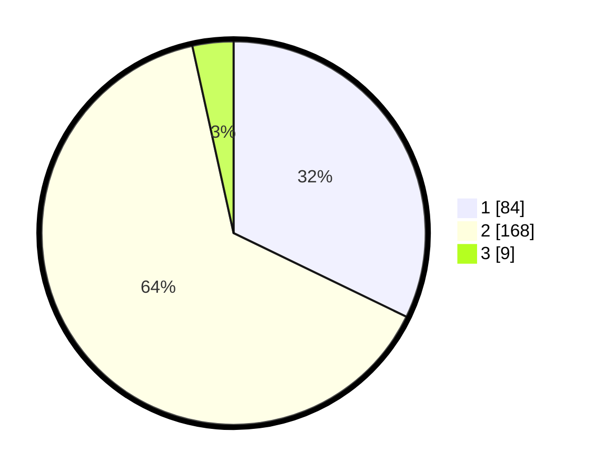

# Hasil

## Grafik

## Tabel

| No. | Nama Paslon    | Suara | Suara (raw) | Persentase |
|:--- |:-------------- | -----:| -----------:| ----------:|
| 1   | ANIES MUHAIMIN | 84    | [84][p-1]   | 32,18      |
| 2   | PRABOWO GIBRAN | 168   | [168][p-2]  | 64,37      |
| 3   | GANJAR MAHFUD  | 9     | [9][p-3]    | 3,45       |

[p-1]: https://github.com/gigit-pemilu/pemilu-2024-35-jawa-timur/blob/main/pilpres/hitung-suara/sub/35-jawa-timur/sub/28-pamekasan/sub/08-larangan/sub/2008-larangan-dalam/sub/001-tps/sub/paslon-1.txt
[p-2]: https://github.com/gigit-pemilu/pemilu-2024-35-jawa-timur/blob/main/pilpres/hitung-suara/sub/35-jawa-timur/sub/28-pamekasan/sub/08-larangan/sub/2008-larangan-dalam/sub/001-tps/sub/paslon-2.txt
[p-3]: https://github.com/gigit-pemilu/pemilu-2024-35-jawa-timur/blob/main/pilpres/hitung-suara/sub/35-jawa-timur/sub/28-pamekasan/sub/08-larangan/sub/2008-larangan-dalam/sub/001-tps/sub/paslon-3.txt

## Foto C Plano

https://sirekap-obj-formc.kpu.go.id/e3e3/pemilu/ppwp/35/28/08/20/08/3528082008001-20240215-093942--acefdfb0-ce87-4a52-88b0-bb31d6e10d8a.jpg

https://sirekap-obj-formc.kpu.go.id/e3e3/pemilu/ppwp/35/28/08/20/08/3528082008001-20240215-093245--88a989ac-9da9-42e0-a620-1f73c76e221a.jpg

https://sirekap-obj-formc.kpu.go.id/e3e3/pemilu/ppwp/35/28/08/20/08/3528082008001-20240215-094344--9870cadd-25e0-4536-bd06-e8f1364b9afa.jpg

## Metadata

| Key        | Value               |
| ---------- | ------------------- |
| Time Stamp | 2024-02-17 16:36:25 |

