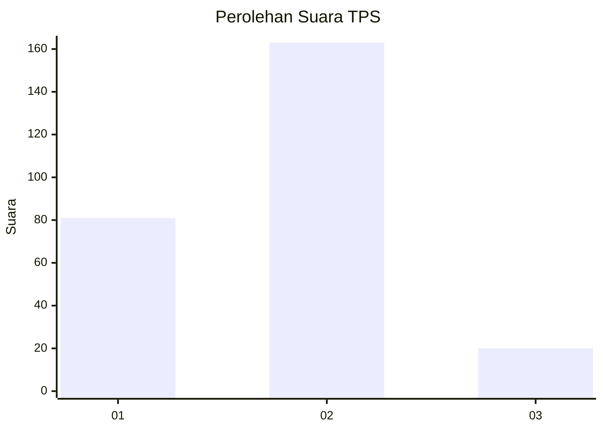
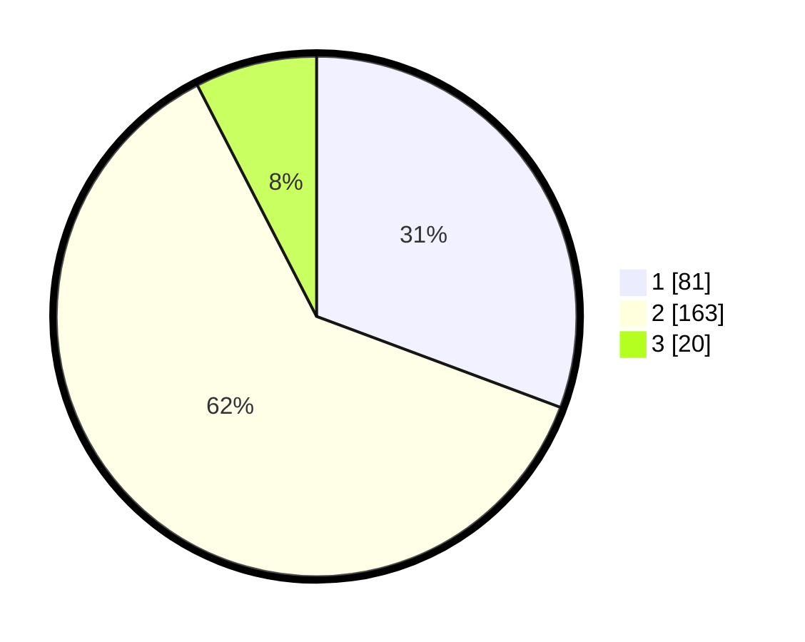

# Hasil

## Grafik

## Tabel

| No. | Nama Paslon    | Suara | Suara (raw) | Persentase |
|:--- |:-------------- | -----:| -----------:| ----------:|
| 1   | ANIES MUHAIMIN | 81    | [81][p-1]   | 30,68      |
| 2   | PRABOWO GIBRAN | 163   | [163][p-2]  | 61,74      |
| 3   | GANJAR MAHFUD  | 20    | [20][p-3]   | 7,58       |

[p-1]: https://github.com/gigit-pemilu/pemilu-2024/blob/main/pilpres/hitung-suara/sub/35-jawa-timur/sub/28-pamekasan/sub/08-larangan/sub/2008-larangan-dalam/sub/002-tps/sub/paslon-1.txt
[p-2]: https://github.com/gigit-pemilu/pemilu-2024/blob/main/pilpres/hitung-suara/sub/35-jawa-timur/sub/28-pamekasan/sub/08-larangan/sub/2008-larangan-dalam/sub/002-tps/sub/paslon-2.txt
[p-3]: https://github.com/gigit-pemilu/pemilu-2024/blob/main/pilpres/hitung-suara/sub/35-jawa-timur/sub/28-pamekasan/sub/08-larangan/sub/2008-larangan-dalam/sub/002-tps/sub/paslon-3.txt

## Foto C Plano

https://sirekap-obj-formc.kpu.go.id/72c6/pemilu/ppwp/35/28/08/20/08/3528082008002-20240215-052149--971b042f-0b0d-4ae2-8d29-9b5d3753d42e.jpg

https://sirekap-obj-formc.kpu.go.id/72c6/pemilu/ppwp/35/28/08/20/08/3528082008002-20240215-052241--d66ce08f-a3b9-489f-8a70-e7e9d18491e1.jpg

https://sirekap-obj-formc.kpu.go.id/72c6/pemilu/ppwp/35/28/08/20/08/3528082008002-20240215-052357--4b55d72c-7a43-49ad-a01e-b7cdad74492e.jpg

## Metadata

| Key        | Value               |
| ---------- | ------------------- |
| Time Stamp | 2024-02-27 17:00:00 |

