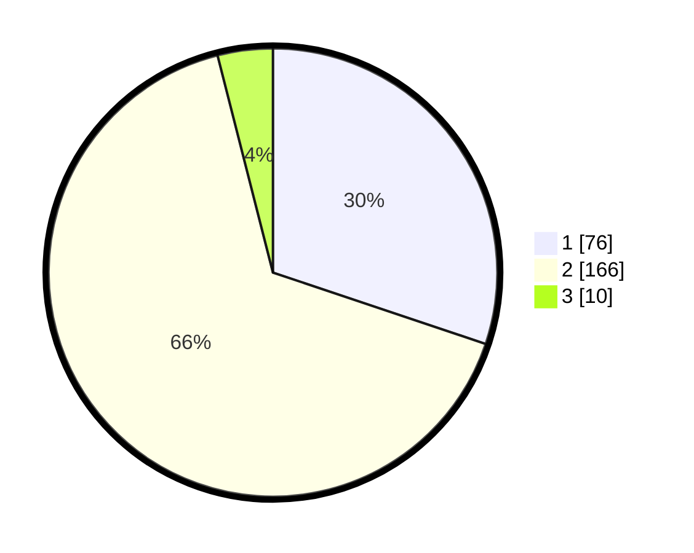

# Hasil

## Grafik

## Tabel

| No. | Nama Paslon    | Suara | Suara (raw) | Persentase |
|:--- |:-------------- | -----:| -----------:| ----------:|
| 1   | ANIES MUHAIMIN | 76    | [76][p-1]   | 30,16      |
| 2   | PRABOWO GIBRAN | 166   | [166][p-2]  | 65,87      |
| 3   | GANJAR MAHFUD  | 10    | [10][p-3]   | 3,97       |

[p-1]: https://github.com/gigit-pemilu/pemilu-2024-35-jawa-timur/blob/main/pilpres/hitung-suara/sub/35-jawa-timur/sub/28-pamekasan/sub/08-larangan/sub/2008-larangan-dalam/sub/004-tps/sub/paslon-1.txt
[p-2]: https://github.com/gigit-pemilu/pemilu-2024-35-jawa-timur/blob/main/pilpres/hitung-suara/sub/35-jawa-timur/sub/28-pamekasan/sub/08-larangan/sub/2008-larangan-dalam/sub/004-tps/sub/paslon-2.txt
[p-3]: https://github.com/gigit-pemilu/pemilu-2024-35-jawa-timur/blob/main/pilpres/hitung-suara/sub/35-jawa-timur/sub/28-pamekasan/sub/08-larangan/sub/2008-larangan-dalam/sub/004-tps/sub/paslon-3.txt

## Foto C Plano

https://sirekap-obj-formc.kpu.go.id/c31b/pemilu/ppwp/35/28/08/20/08/3528082008004-20240215-032032--c2f190c1-a2bc-4d34-b571-2ebe93522f13.jpg

https://sirekap-obj-formc.kpu.go.id/c31b/pemilu/ppwp/35/28/08/20/08/3528082008004-20240215-030335--2b2c9a86-48a1-4802-a1ad-175a2d9a000b.jpg

https://sirekap-obj-formc.kpu.go.id/c31b/pemilu/ppwp/35/28/08/20/08/3528082008004-20240215-030420--559e5d78-9cfb-402c-a94e-80d063973e12.jpg

## Metadata

| Key        | Value               |
| ---------- | ------------------- |
| Time Stamp | 2024-02-24 22:31:28 |

