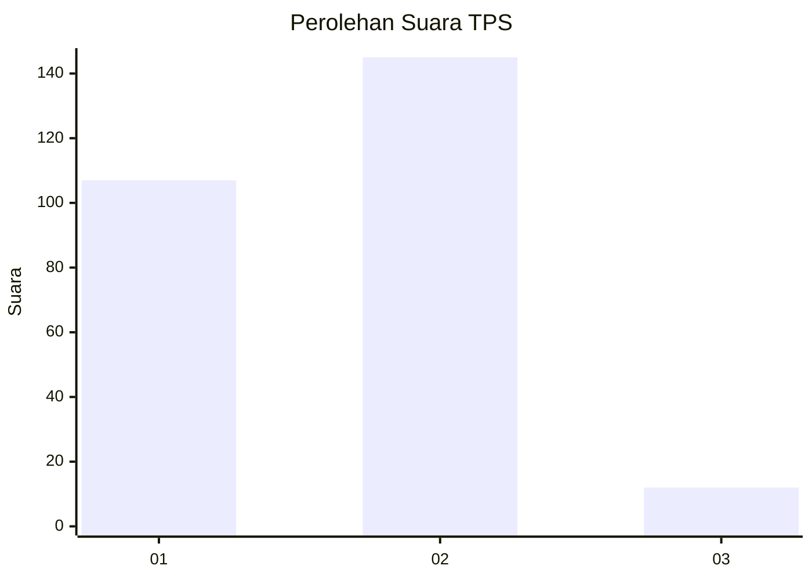
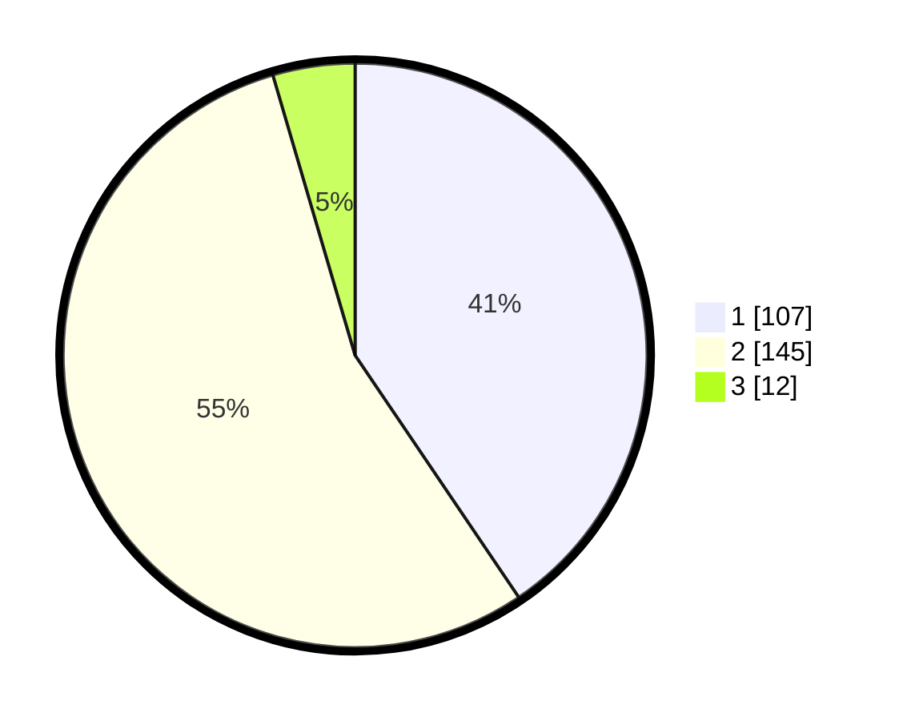

# Hasil

## Grafik

## Tabel

| No. | Nama Paslon    | Suara | Suara (raw) | Persentase |
|:--- |:-------------- | -----:| -----------:| ----------:|
| 1   | ANIES MUHAIMIN | 107   | [107][p-1]  | 40,53      |
| 2   | PRABOWO GIBRAN | 145   | [145][p-2]  | 54,92      |
| 3   | GANJAR MAHFUD  | 12    | [12][p-3]   | 4,55       |

[p-1]: https://github.com/gigit-pemilu/pemilu-2024/blob/main/pilpres/hitung-suara/sub/35-jawa-timur/sub/28-pamekasan/sub/08-larangan/sub/2008-larangan-dalam/sub/005-tps/sub/paslon-1.txt
[p-2]: https://github.com/gigit-pemilu/pemilu-2024/blob/main/pilpres/hitung-suara/sub/35-jawa-timur/sub/28-pamekasan/sub/08-larangan/sub/2008-larangan-dalam/sub/005-tps/sub/paslon-2.txt
[p-3]: https://github.com/gigit-pemilu/pemilu-2024/blob/main/pilpres/hitung-suara/sub/35-jawa-timur/sub/28-pamekasan/sub/08-larangan/sub/2008-larangan-dalam/sub/005-tps/sub/paslon-3.txt

## Foto C Plano

https://sirekap-obj-formc.kpu.go.id/f58f/pemilu/ppwp/35/28/08/20/08/3528082008005-20240215-113407--d5a5b9c1-3091-4482-a6c2-0c94202485de.jpg

https://sirekap-obj-formc.kpu.go.id/f58f/pemilu/ppwp/35/28/08/20/08/3528082008005-20240215-122002--f44c42d1-6860-41d2-b750-7a58ad71951b.jpg

https://sirekap-obj-formc.kpu.go.id/f58f/pemilu/ppwp/35/28/08/20/08/3528082008005-20240215-122145--21709e7b-7fe0-49c7-978b-29dbfc520025.jpg

## Metadata

| Key        | Value               |
| ---------- | ------------------- |
| Time Stamp | 2024-02-17 16:36:25 |

