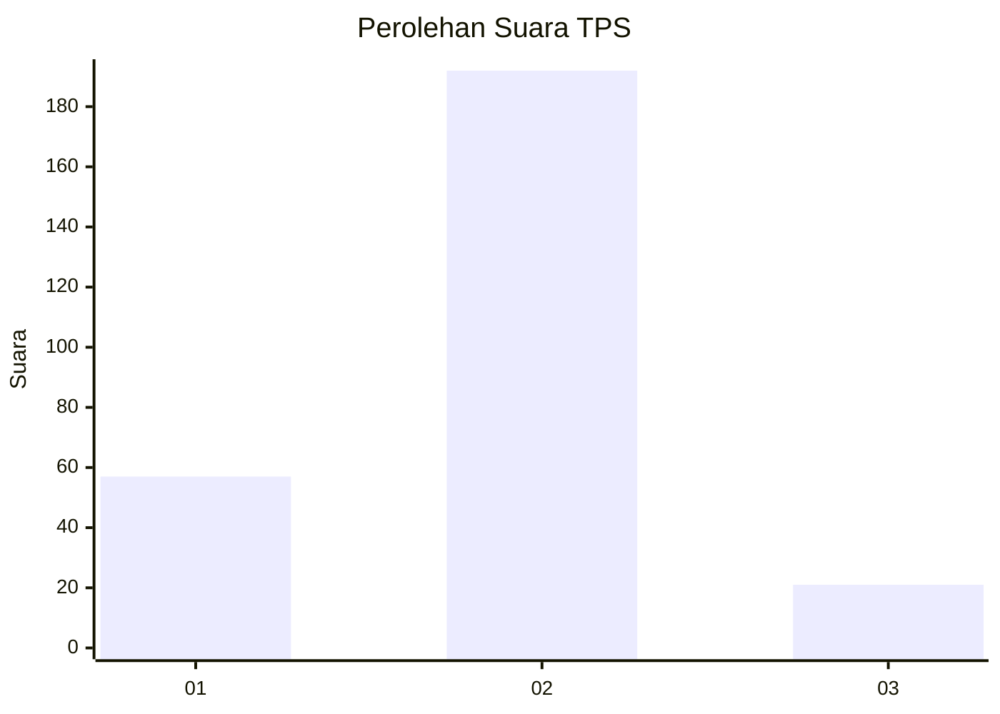
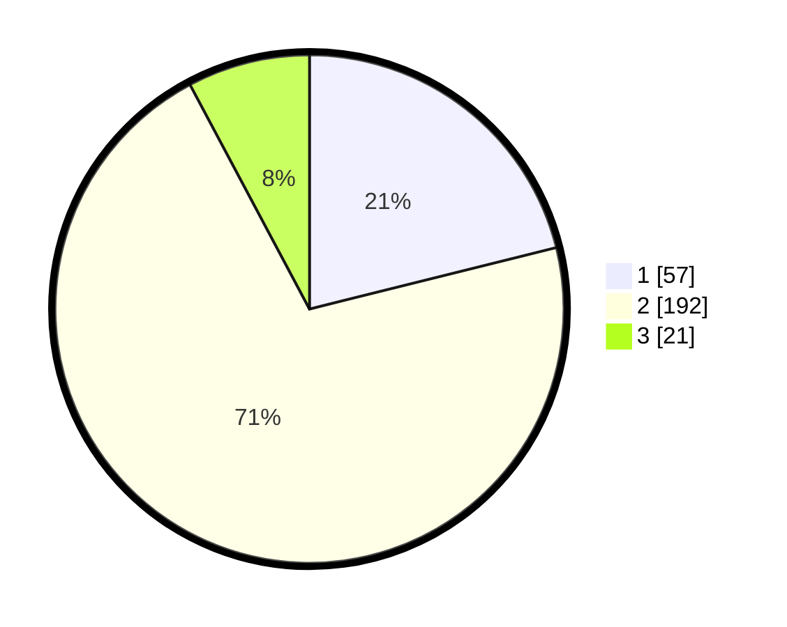

# Hasil

## Grafik

## Tabel

| No. | Nama Paslon    | Suara | Suara (raw) | Persentase |
|:--- |:-------------- | -----:| -----------:| ----------:|
| 1   | ANIES MUHAIMIN | 57    | [57][p-1]   | 21,11      |
| 2   | PRABOWO GIBRAN | 192   | [192][p-2]  | 71,11      |
| 3   | GANJAR MAHFUD  | 21    | [21][p-3]   | 7,78       |

[p-1]: https://github.com/gigit-pemilu/pemilu-2024/blob/main/pilpres/hitung-suara/sub/35-jawa-timur/sub/28-pamekasan/sub/08-larangan/sub/2008-larangan-dalam/sub/008-tps/sub/paslon-1.txt
[p-2]: https://github.com/gigit-pemilu/pemilu-2024/blob/main/pilpres/hitung-suara/sub/35-jawa-timur/sub/28-pamekasan/sub/08-larangan/sub/2008-larangan-dalam/sub/008-tps/sub/paslon-2.txt
[p-3]: https://github.com/gigit-pemilu/pemilu-2024/blob/main/pilpres/hitung-suara/sub/35-jawa-timur/sub/28-pamekasan/sub/08-larangan/sub/2008-larangan-dalam/sub/008-tps/sub/paslon-3.txt

## Foto C Plano

https://sirekap-obj-formc.kpu.go.id/ca5b/pemilu/ppwp/35/28/08/20/08/3528082008008-20240215-081017--147b393f-b00b-4b5b-a566-a34be737cf48.jpg

https://sirekap-obj-formc.kpu.go.id/ca5b/pemilu/ppwp/35/28/08/20/08/3528082008008-20240215-081213--a3275985-b2b8-486c-92b8-bb7bc20a4fae.jpg

https://sirekap-obj-formc.kpu.go.id/ca5b/pemilu/ppwp/35/28/08/20/08/3528082008008-20240215-071833--714d5a18-9b54-43a5-a6ba-4fdbc3d2c39d.jpg

## Metadata

| Key        | Value               |
| ---------- | ------------------- |
| Time Stamp | 2024-02-17 16:36:25 |

