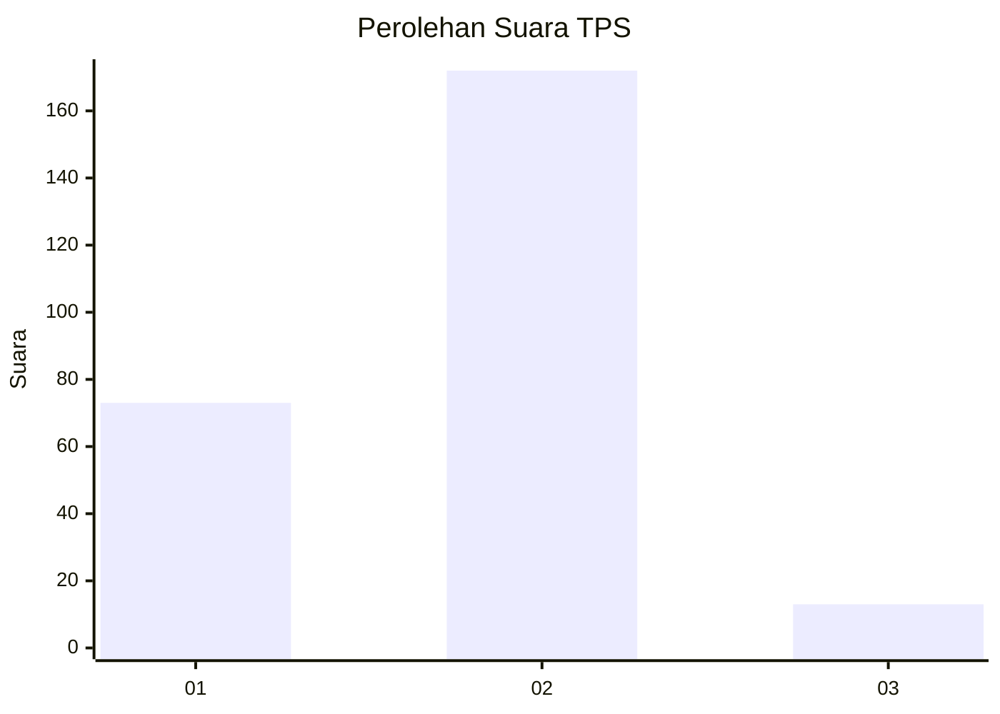
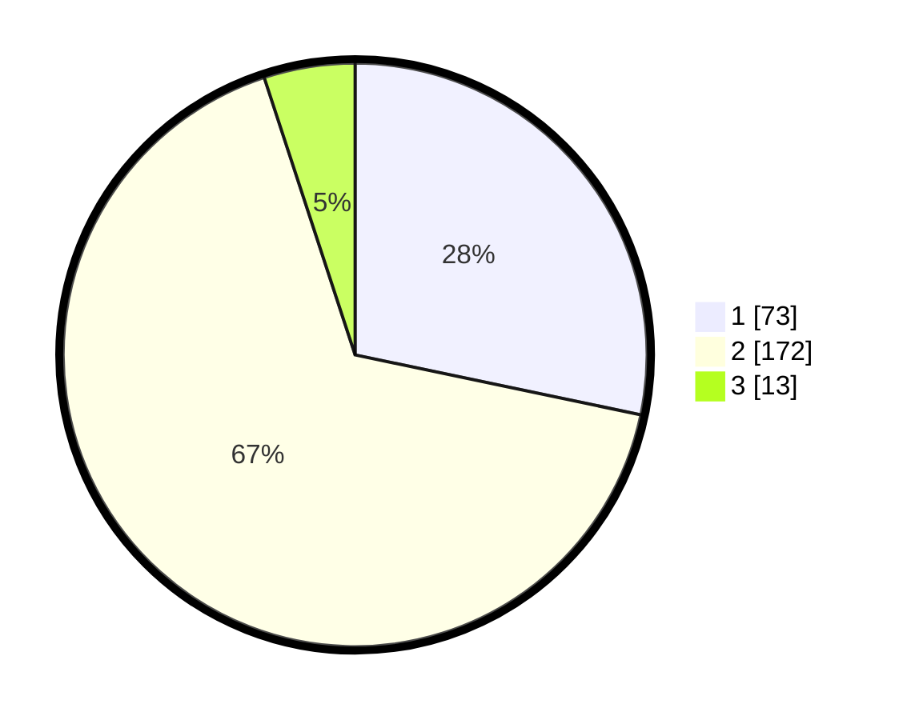

# Hasil

## Grafik

## Tabel

| No. | Nama Paslon    | Suara | Suara (raw) | Persentase |
|:--- |:-------------- | -----:| -----------:| ----------:|
| 1   | ANIES MUHAIMIN | 73    | [73][p-1]   | 28,29      |
| 2   | PRABOWO GIBRAN | 172   | [172][p-2]  | 66,67      |
| 3   | GANJAR MAHFUD  | 13    | [13][p-3]   | 5,04       |

[p-1]: https://github.com/gigit-pemilu/pemilu-2024/blob/main/pilpres/hitung-suara/sub/35-jawa-timur/sub/28-pamekasan/sub/08-larangan/sub/2008-larangan-dalam/sub/012-tps/sub/paslon-1.txt
[p-2]: https://github.com/gigit-pemilu/pemilu-2024/blob/main/pilpres/hitung-suara/sub/35-jawa-timur/sub/28-pamekasan/sub/08-larangan/sub/2008-larangan-dalam/sub/012-tps/sub/paslon-2.txt
[p-3]: https://github.com/gigit-pemilu/pemilu-2024/blob/main/pilpres/hitung-suara/sub/35-jawa-timur/sub/28-pamekasan/sub/08-larangan/sub/2008-larangan-dalam/sub/012-tps/sub/paslon-3.txt

## Foto C Plano

https://sirekap-obj-formc.kpu.go.id/6ad2/pemilu/ppwp/35/28/08/20/08/3528082008012-20240215-084801--8730e018-157a-4b1a-a458-a22b8c8475c8.jpg

https://sirekap-obj-formc.kpu.go.id/6ad2/pemilu/ppwp/35/28/08/20/08/3528082008012-20240215-085439--86bdb1fe-4416-4353-827c-7913e1c7ba4a.jpg

https://sirekap-obj-formc.kpu.go.id/6ad2/pemilu/ppwp/35/28/08/20/08/3528082008012-20240215-085340--5fed5a61-165c-4601-b7a8-886cd1a29d6e.jpg

## Metadata

| Key        | Value               |
| ---------- | ------------------- |
| Time Stamp | 2024-02-24 22:31:28 |

