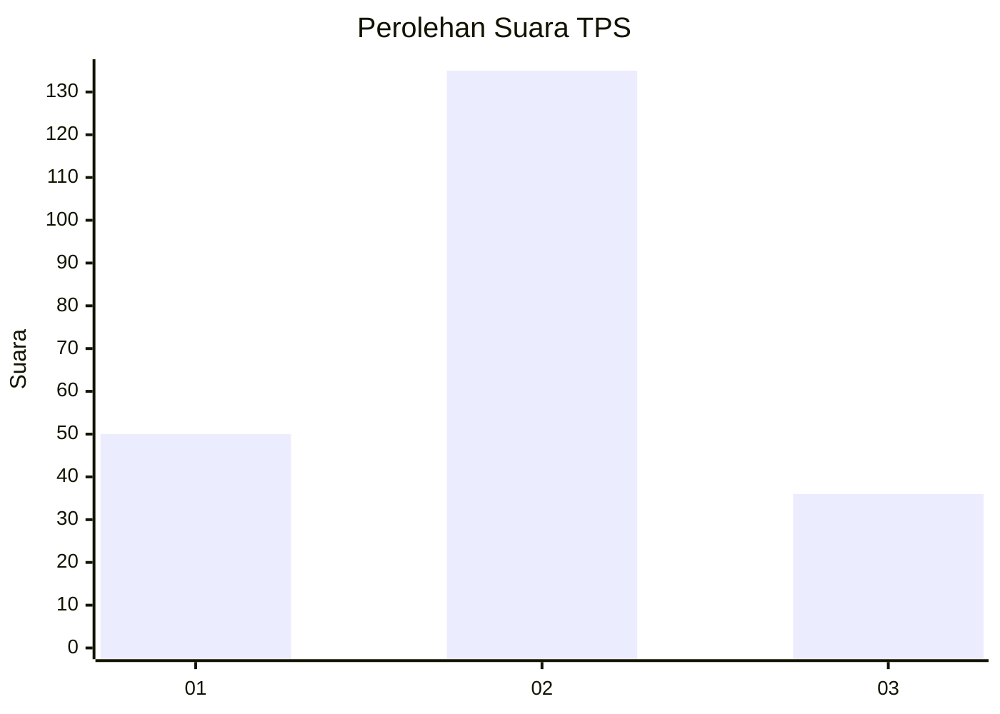

# Hasil

## Grafik

## Tabel

| No. | Nama Paslon    | Suara | Suara (raw) | Persentase |
|:--- |:-------------- | -----:| -----------:| ----------:|
| 1   | ANIES MUHAIMIN | 50    | [50][p-1]   | 22,62      |
| 2   | PRABOWO GIBRAN | 135   | [135][p-2]  | 61,09      |
| 3   | GANJAR MAHFUD  | 36    | [36][p-3]   | 16,29      |

[p-1]: https://github.com/gigit-pemilu/pemilu-2024/blob/main/pilpres/hitung-suara/sub/35-jawa-timur/sub/28-pamekasan/sub/08-larangan/sub/2009-panaguan/sub/003-tps/sub/paslon-1.txt
[p-2]: https://github.com/gigit-pemilu/pemilu-2024/blob/main/pilpres/hitung-suara/sub/35-jawa-timur/sub/28-pamekasan/sub/08-larangan/sub/2009-panaguan/sub/003-tps/sub/paslon-2.txt
[p-3]: https://github.com/gigit-pemilu/pemilu-2024/blob/main/pilpres/hitung-suara/sub/35-jawa-timur/sub/28-pamekasan/sub/08-larangan/sub/2009-panaguan/sub/003-tps/sub/paslon-3.txt

## Foto C Plano

https://sirekap-obj-formc.kpu.go.id/e9fd/pemilu/ppwp/35/28/08/20/09/3528082009003-20240214-230002--8a464894-bee3-4dd0-9aaf-a03363a3778a.jpg

https://sirekap-obj-formc.kpu.go.id/e9fd/pemilu/ppwp/35/28/08/20/09/3528082009003-20240214-221502--63a798cd-f7c4-4896-8ae8-407f7ab26dd4.jpg

https://sirekap-obj-formc.kpu.go.id/e9fd/pemilu/ppwp/35/28/08/20/09/3528082009003-20240214-221730--2dc2390d-ac12-41ca-a6c1-2cae56e2ba0b.jpg

## Metadata

| Key        | Value               |
| ---------- | ------------------- |
| Time Stamp | 2024-02-17 16:36:25 |

