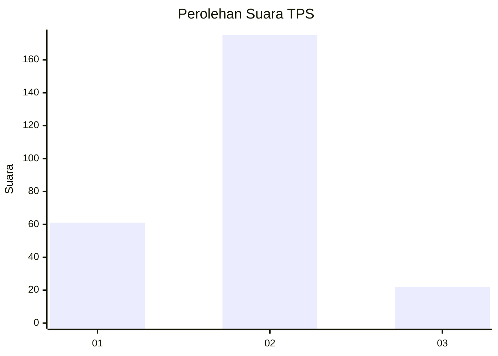
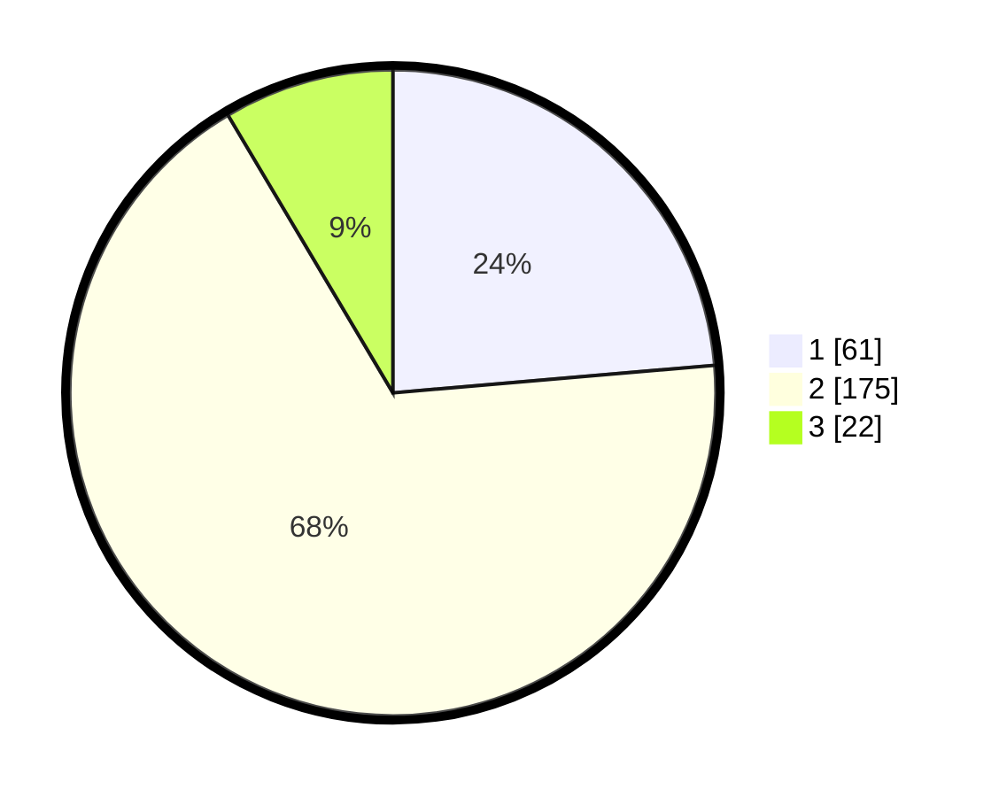

# Hasil

## Grafik

## Tabel

| No. | Nama Paslon    | Suara | Suara (raw) | Persentase |
|:--- |:-------------- | -----:| -----------:| ----------:|
| 1   | ANIES MUHAIMIN | 61    | [61][p-1]   | 23,64      |
| 2   | PRABOWO GIBRAN | 175   | [175][p-2]  | 67,83      |
| 3   | GANJAR MAHFUD  | 22    | [22][p-3]   | 8,53       |

[p-1]: https://github.com/gigit-pemilu/pemilu-2024-35-jawa-timur/blob/main/pilpres/hitung-suara/sub/35-jawa-timur/sub/28-pamekasan/sub/08-larangan/sub/2010-montok/sub/009-tps/sub/paslon-1.txt
[p-2]: https://github.com/gigit-pemilu/pemilu-2024-35-jawa-timur/blob/main/pilpres/hitung-suara/sub/35-jawa-timur/sub/28-pamekasan/sub/08-larangan/sub/2010-montok/sub/009-tps/sub/paslon-2.txt
[p-3]: https://github.com/gigit-pemilu/pemilu-2024-35-jawa-timur/blob/main/pilpres/hitung-suara/sub/35-jawa-timur/sub/28-pamekasan/sub/08-larangan/sub/2010-montok/sub/009-tps/sub/paslon-3.txt

## Foto C Plano

https://sirekap-obj-formc.kpu.go.id/e553/pemilu/ppwp/35/28/08/20/10/3528082010009-20240214-224749--fe277eb2-53fa-4364-911c-cb8a6f136df6.jpg

https://sirekap-obj-formc.kpu.go.id/e553/pemilu/ppwp/35/28/08/20/10/3528082010009-20240214-225350--66b5c989-d737-499f-9dd6-5e4e63c2664d.jpg

https://sirekap-obj-formc.kpu.go.id/e553/pemilu/ppwp/35/28/08/20/10/3528082010009-20240214-225035--a567ff40-7017-4c79-90ae-b6cea3e34471.jpg

## Metadata

| Key        | Value               |
| ---------- | ------------------- |
| Time Stamp | 2024-02-17 16:36:25 |

