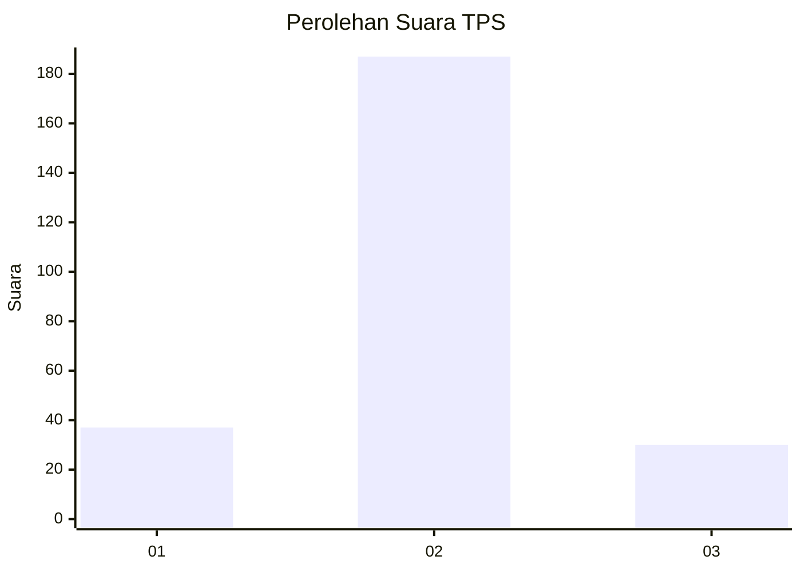
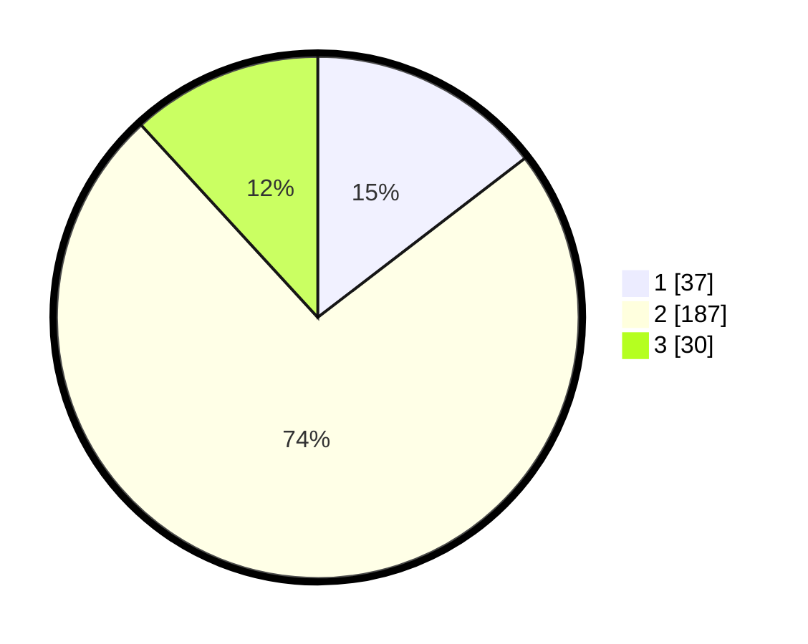

# Hasil

## Grafik

## Tabel

| No. | Nama Paslon    | Suara | Suara (raw) | Persentase |
|:--- |:-------------- | -----:| -----------:| ----------:|
| 1   | ANIES MUHAIMIN | 37    | [37][p-1]   | 14,57      |
| 2   | PRABOWO GIBRAN | 187   | [187][p-2]  | 73,62      |
| 3   | GANJAR MAHFUD  | 30    | [30][p-3]   | 11,81      |

[p-1]: https://github.com/gigit-pemilu/pemilu-2024-35-jawa-timur/blob/main/pilpres/hitung-suara/sub/35-jawa-timur/sub/28-pamekasan/sub/08-larangan/sub/2011-taraban/sub/002-tps/sub/paslon-1.txt
[p-2]: https://github.com/gigit-pemilu/pemilu-2024-35-jawa-timur/blob/main/pilpres/hitung-suara/sub/35-jawa-timur/sub/28-pamekasan/sub/08-larangan/sub/2011-taraban/sub/002-tps/sub/paslon-2.txt
[p-3]: https://github.com/gigit-pemilu/pemilu-2024-35-jawa-timur/blob/main/pilpres/hitung-suara/sub/35-jawa-timur/sub/28-pamekasan/sub/08-larangan/sub/2011-taraban/sub/002-tps/sub/paslon-3.txt

## Foto C Plano

https://sirekap-obj-formc.kpu.go.id/5670/pemilu/ppwp/35/28/08/20/11/3528082011002-20240214-215405--fb5c5351-10cc-47cb-acec-08908d2f0116.jpg

https://sirekap-obj-formc.kpu.go.id/5670/pemilu/ppwp/35/28/08/20/11/3528082011002-20240214-215505--83aa01a6-5822-47a2-aaa4-f3bef41324e3.jpg

https://sirekap-obj-formc.kpu.go.id/5670/pemilu/ppwp/35/28/08/20/11/3528082011002-20240214-215604--6640e6e3-089c-420a-bd22-a721aebe16d2.jpg

## Metadata

| Key        | Value               |
| ---------- | ------------------- |
| Time Stamp | 2024-02-17 16:36:25 |

