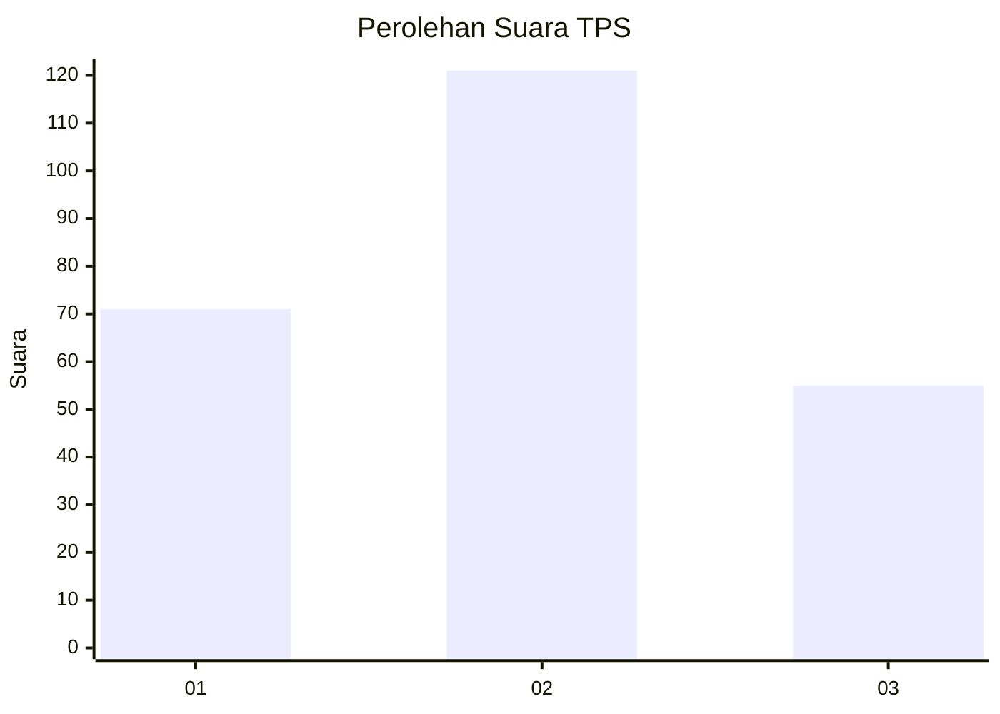
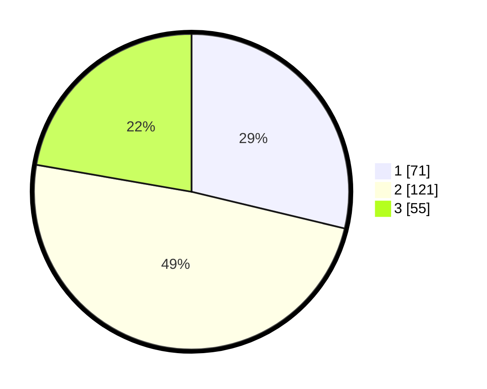

# Hasil

## Grafik

## Tabel

| No. | Nama Paslon    | Suara | Suara (raw) | Persentase |
|:--- |:-------------- | -----:| -----------:| ----------:|
| 1   | ANIES MUHAIMIN | 71    | [71][p-1]   | 28,74      |
| 2   | PRABOWO GIBRAN | 121   | [121][p-2]  | 48,99      |
| 3   | GANJAR MAHFUD  | 55    | [55][p-3]   | 22,27      |

[p-1]: https://github.com/gigit-pemilu/pemilu-2024/blob/main/pilpres/hitung-suara/sub/35-jawa-timur/sub/28-pamekasan/sub/08-larangan/sub/2012-duko-timur/sub/003-tps/sub/paslon-1.txt
[p-2]: https://github.com/gigit-pemilu/pemilu-2024/blob/main/pilpres/hitung-suara/sub/35-jawa-timur/sub/28-pamekasan/sub/08-larangan/sub/2012-duko-timur/sub/003-tps/sub/paslon-2.txt
[p-3]: https://github.com/gigit-pemilu/pemilu-2024/blob/main/pilpres/hitung-suara/sub/35-jawa-timur/sub/28-pamekasan/sub/08-larangan/sub/2012-duko-timur/sub/003-tps/sub/paslon-3.txt

## Foto C Plano

https://sirekap-obj-formc.kpu.go.id/1310/pemilu/ppwp/35/28/08/20/12/3528082012003-20240214-213815--78cf5a23-00c0-4f6d-9264-843c49e5547c.jpg

https://sirekap-obj-formc.kpu.go.id/1310/pemilu/ppwp/35/28/08/20/12/3528082012003-20240214-212704--5447e199-b3a9-41fb-9c6d-51dd6e149970.jpg

https://sirekap-obj-formc.kpu.go.id/1310/pemilu/ppwp/35/28/08/20/12/3528082012003-20240214-214210--9ec3546e-79f0-4ffa-81b5-6d5299769b25.jpg

## Metadata

| Key        | Value               |
| ---------- | ------------------- |
| Time Stamp | 2024-02-17 16:36:25 |

