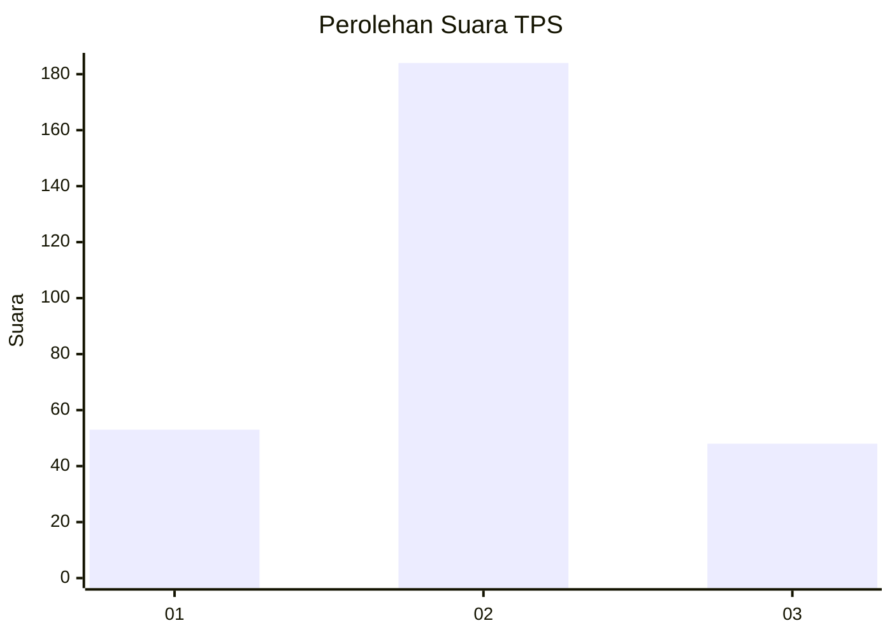
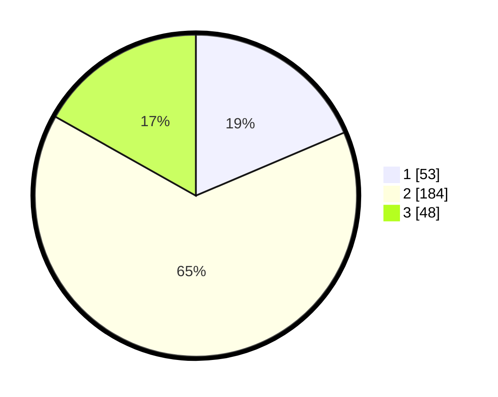

# Hasil

## Grafik

## Tabel

| No. | Nama Paslon    | Suara | Suara (raw) | Persentase |
|:--- |:-------------- | -----:| -----------:| ----------:|
| 1   | ANIES MUHAIMIN | 53    | [53][p-1]   | 18,60      |
| 2   | PRABOWO GIBRAN | 184   | [184][p-2]  | 64,56      |
| 3   | GANJAR MAHFUD  | 48    | [48][p-3]   | 16,84      |

[p-1]: https://github.com/gigit-pemilu/pemilu-2024/blob/main/pilpres/hitung-suara/sub/35-jawa-timur/sub/28-pamekasan/sub/08-larangan/sub/2014-kaduara-barat/sub/004-tps/sub/paslon-1.txt
[p-2]: https://github.com/gigit-pemilu/pemilu-2024/blob/main/pilpres/hitung-suara/sub/35-jawa-timur/sub/28-pamekasan/sub/08-larangan/sub/2014-kaduara-barat/sub/004-tps/sub/paslon-2.txt
[p-3]: https://github.com/gigit-pemilu/pemilu-2024/blob/main/pilpres/hitung-suara/sub/35-jawa-timur/sub/28-pamekasan/sub/08-larangan/sub/2014-kaduara-barat/sub/004-tps/sub/paslon-3.txt

## Foto C Plano

https://sirekap-obj-formc.kpu.go.id/d450/pemilu/ppwp/35/28/08/20/14/3528082014004-20240214-232644--35596400-7c51-4d6f-b447-ba91ccd15933.jpg

https://sirekap-obj-formc.kpu.go.id/d450/pemilu/ppwp/35/28/08/20/14/3528082014004-20240214-232753--5edd071e-c78b-4378-9bf3-db5da888c9b2.jpg

https://sirekap-obj-formc.kpu.go.id/d450/pemilu/ppwp/35/28/08/20/14/3528082014004-20240214-232853--01545e8d-fc0e-4e01-baa4-951709075cdc.jpg

## Metadata

| Key        | Value               |
| ---------- | ------------------- |
| Time Stamp | 2024-02-17 16:36:25 |

