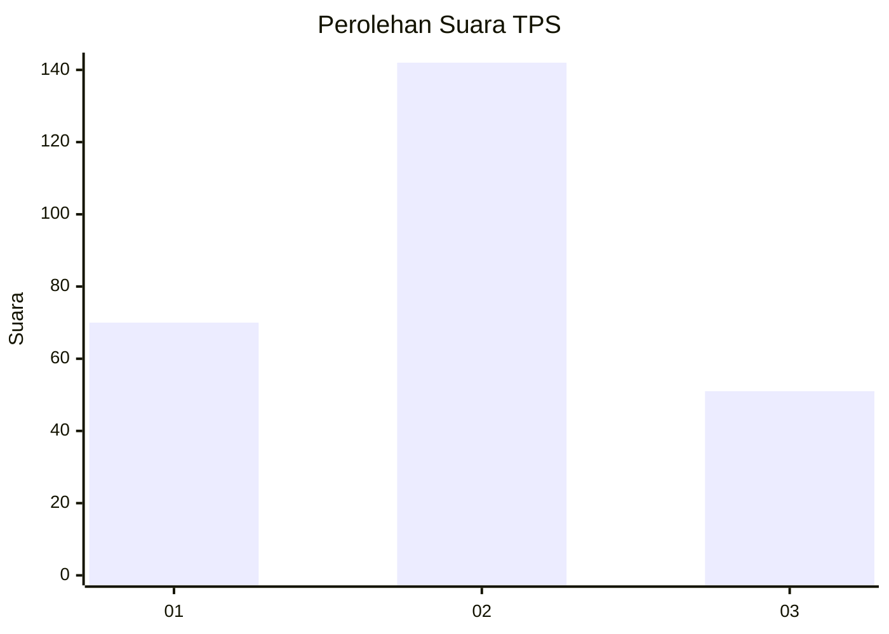
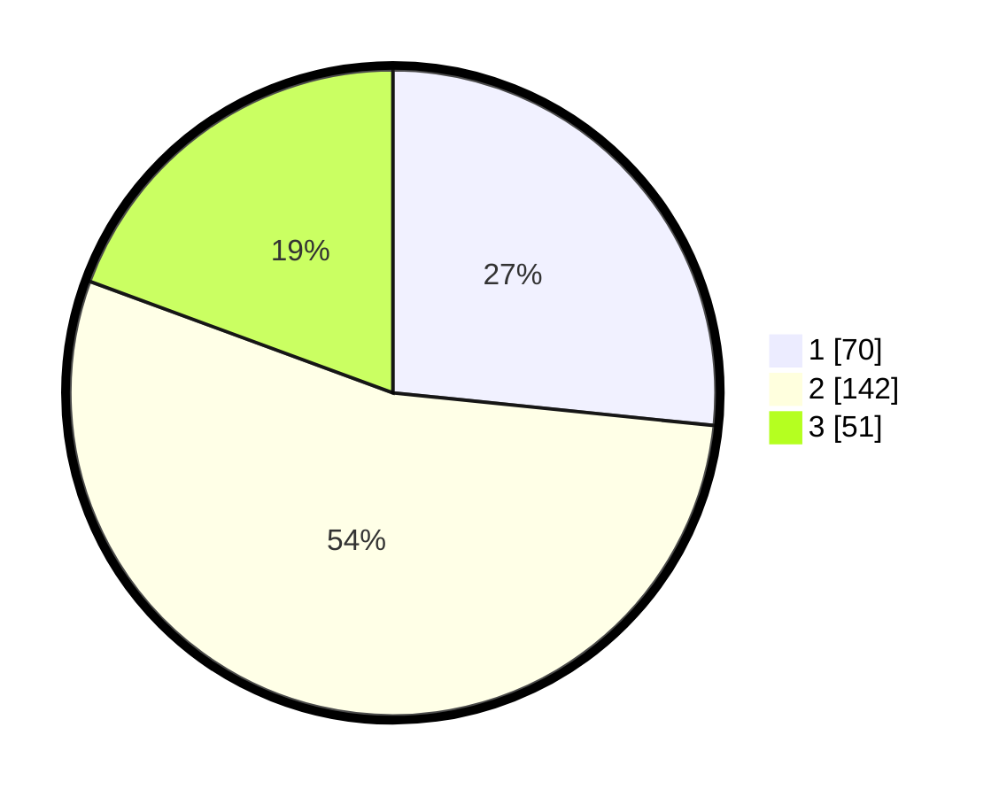

# Hasil

## Grafik

## Tabel

| No. | Nama Paslon    | Suara | Suara (raw) | Persentase |
|:--- |:-------------- | -----:| -----------:| ----------:|
| 1   | ANIES MUHAIMIN | 70    | [70][p-1]   | 26,62      |
| 2   | PRABOWO GIBRAN | 142   | [142][p-2]  | 53,99      |
| 3   | GANJAR MAHFUD  | 51    | [51][p-3]   | 19,39      |

[p-1]: https://github.com/gigit-pemilu/pemilu-2024/blob/main/pilpres/hitung-suara/sub/35-jawa-timur/sub/28-pamekasan/sub/08-larangan/sub/2014-kaduara-barat/sub/007-tps/sub/paslon-1.txt
[p-2]: https://github.com/gigit-pemilu/pemilu-2024/blob/main/pilpres/hitung-suara/sub/35-jawa-timur/sub/28-pamekasan/sub/08-larangan/sub/2014-kaduara-barat/sub/007-tps/sub/paslon-2.txt
[p-3]: https://github.com/gigit-pemilu/pemilu-2024/blob/main/pilpres/hitung-suara/sub/35-jawa-timur/sub/28-pamekasan/sub/08-larangan/sub/2014-kaduara-barat/sub/007-tps/sub/paslon-3.txt

## Foto C Plano

https://sirekap-obj-formc.kpu.go.id/096d/pemilu/ppwp/35/28/08/20/14/3528082014007-20240215-000252--7f4397e1-b86a-48b4-bbe8-201291029070.jpg

https://sirekap-obj-formc.kpu.go.id/096d/pemilu/ppwp/35/28/08/20/14/3528082014007-20240215-000336--b47c7992-0c93-404e-a0b3-b6b036f6dca7.jpg

https://sirekap-obj-formc.kpu.go.id/096d/pemilu/ppwp/35/28/08/20/14/3528082014007-20240215-000501--591e9686-dbdd-4d16-9244-fe114e881340.jpg

## Metadata

| Key        | Value               |
| ---------- | ------------------- |
| Time Stamp | 2024-02-17 16:36:25 |

