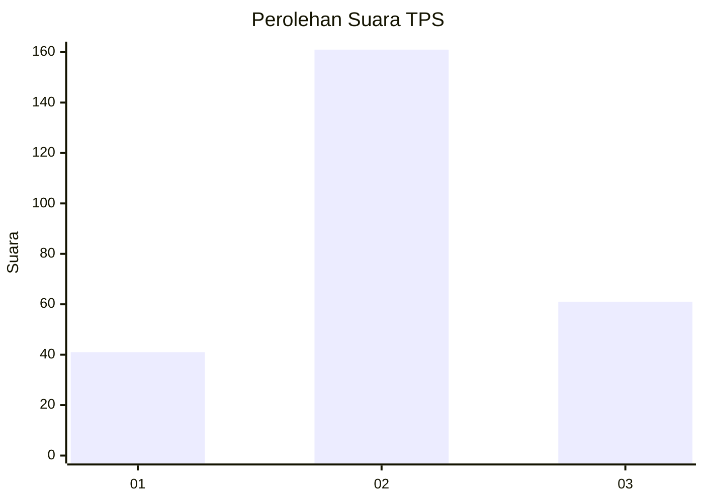
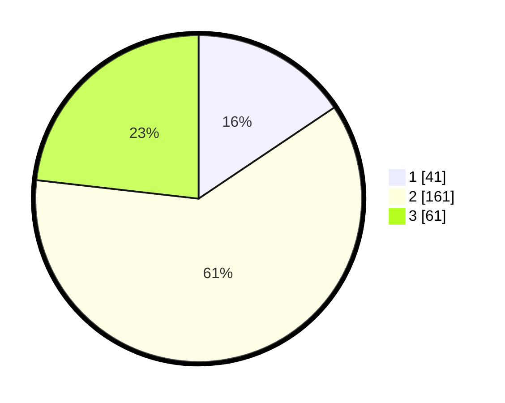

# Hasil

## Grafik

## Tabel

| No. | Nama Paslon    | Suara | Suara (raw) | Persentase |
|:--- |:-------------- | -----:| -----------:| ----------:|
| 1   | ANIES MUHAIMIN | 41    | [41][p-1]   | 15,59      |
| 2   | PRABOWO GIBRAN | 161   | [161][p-2]  | 61,22      |
| 3   | GANJAR MAHFUD  | 61    | [61][p-3]   | 23,19      |

[p-1]: https://github.com/gigit-pemilu/pemilu-2024-35-jawa-timur/blob/main/pilpres/hitung-suara/sub/35-jawa-timur/sub/28-pamekasan/sub/08-larangan/sub/2014-kaduara-barat/sub/009-tps/sub/paslon-1.txt
[p-2]: https://github.com/gigit-pemilu/pemilu-2024-35-jawa-timur/blob/main/pilpres/hitung-suara/sub/35-jawa-timur/sub/28-pamekasan/sub/08-larangan/sub/2014-kaduara-barat/sub/009-tps/sub/paslon-2.txt
[p-3]: https://github.com/gigit-pemilu/pemilu-2024-35-jawa-timur/blob/main/pilpres/hitung-suara/sub/35-jawa-timur/sub/28-pamekasan/sub/08-larangan/sub/2014-kaduara-barat/sub/009-tps/sub/paslon-3.txt

## Foto C Plano

https://sirekap-obj-formc.kpu.go.id/c232/pemilu/ppwp/35/28/08/20/14/3528082014009-20240214-235112--bd50d7b8-7a19-4522-9059-fc74edfe3518.jpg

https://sirekap-obj-formc.kpu.go.id/c232/pemilu/ppwp/35/28/08/20/14/3528082014009-20240215-002804--c2d1bbd1-f1f4-40f5-b712-c55aae871d18.jpg

https://sirekap-obj-formc.kpu.go.id/c232/pemilu/ppwp/35/28/08/20/14/3528082014009-20240214-235424--29fcd402-b5d3-468c-abf3-4e2b0df65e7b.jpg

## Metadata

| Key        | Value               |
| ---------- | ------------------- |
| Time Stamp | 2024-02-17 16:52:47 |

