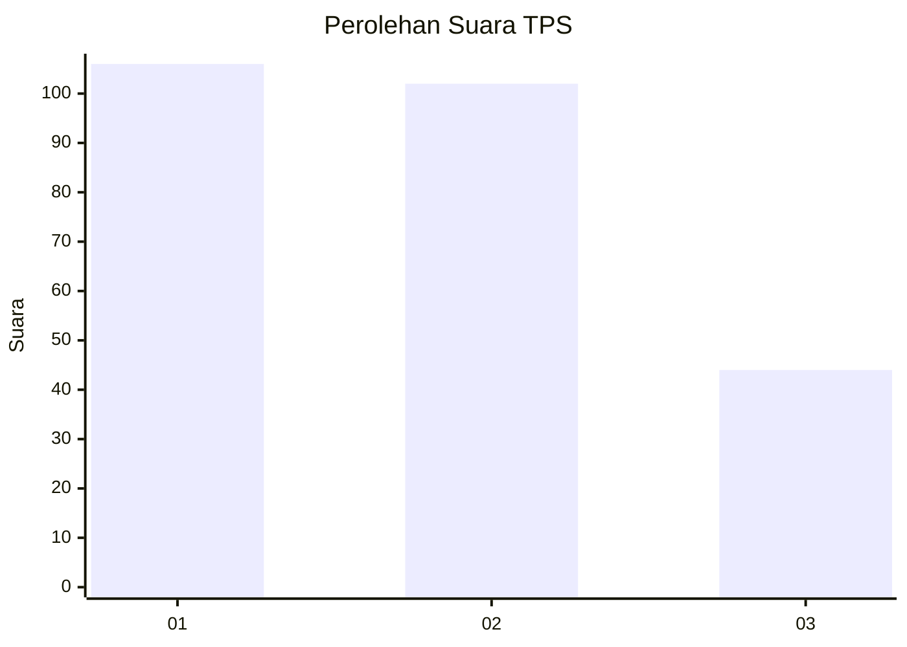
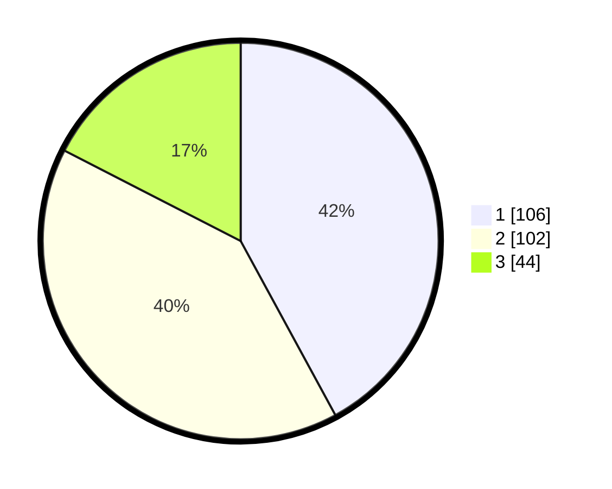

# Hasil

## Grafik

## Tabel

| No. | Nama Paslon    | Suara | Suara (raw) | Persentase |
|:--- |:-------------- | -----:| -----------:| ----------:|
| 1   | ANIES MUHAIMIN | 106   | [106][p-1]  | 42,06      |
| 2   | PRABOWO GIBRAN | 102   | [102][p-2]  | 40,48      |
| 3   | GANJAR MAHFUD  | 44    | [44][p-3]   | 17,46      |

[p-1]: https://github.com/gigit-pemilu/pemilu-2024/blob/main/pilpres/hitung-suara/sub/35-jawa-timur/sub/28-pamekasan/sub/08-larangan/sub/2014-kaduara-barat/sub/010-tps/sub/paslon-1.txt
[p-2]: https://github.com/gigit-pemilu/pemilu-2024/blob/main/pilpres/hitung-suara/sub/35-jawa-timur/sub/28-pamekasan/sub/08-larangan/sub/2014-kaduara-barat/sub/010-tps/sub/paslon-2.txt
[p-3]: https://github.com/gigit-pemilu/pemilu-2024/blob/main/pilpres/hitung-suara/sub/35-jawa-timur/sub/28-pamekasan/sub/08-larangan/sub/2014-kaduara-barat/sub/010-tps/sub/paslon-3.txt

## Foto C Plano

https://sirekap-obj-formc.kpu.go.id/1f6a/pemilu/ppwp/35/28/08/20/14/3528082014010-20240214-214814--f63ae91d-4a4d-4def-9054-c8fd3ae4e29c.jpg

https://sirekap-obj-formc.kpu.go.id/1f6a/pemilu/ppwp/35/28/08/20/14/3528082014010-20240214-214924--3fc03af4-7155-4cc9-89ed-eed7ce94ccc0.jpg

https://sirekap-obj-formc.kpu.go.id/1f6a/pemilu/ppwp/35/28/08/20/14/3528082014010-20240214-215039--96a734c1-02ca-4159-949b-47eba3712e29.jpg

## Metadata

| Key        | Value               |
| ---------- | ------------------- |
| Time Stamp | 2024-02-17 16:52:47 |

