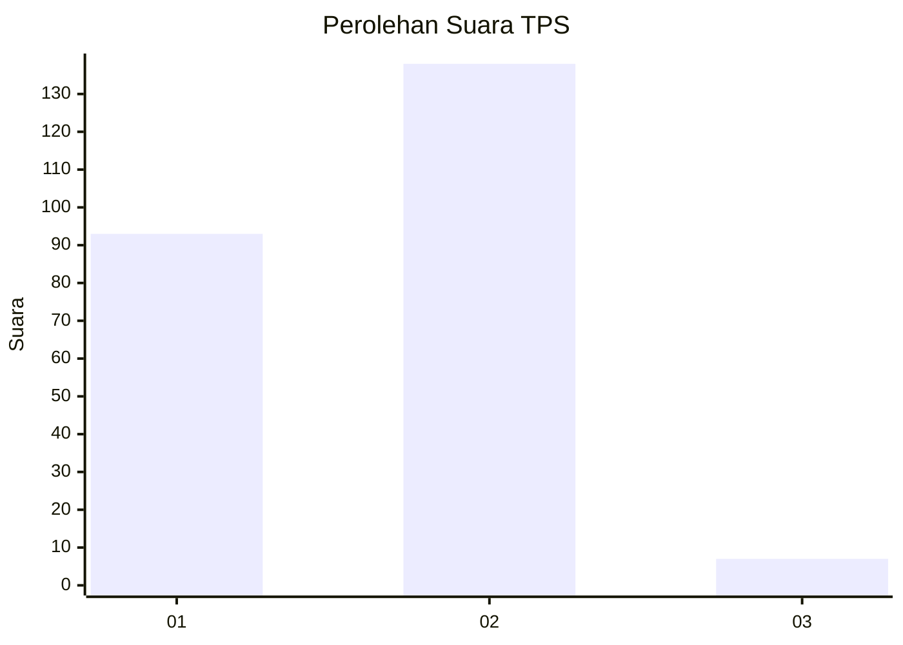
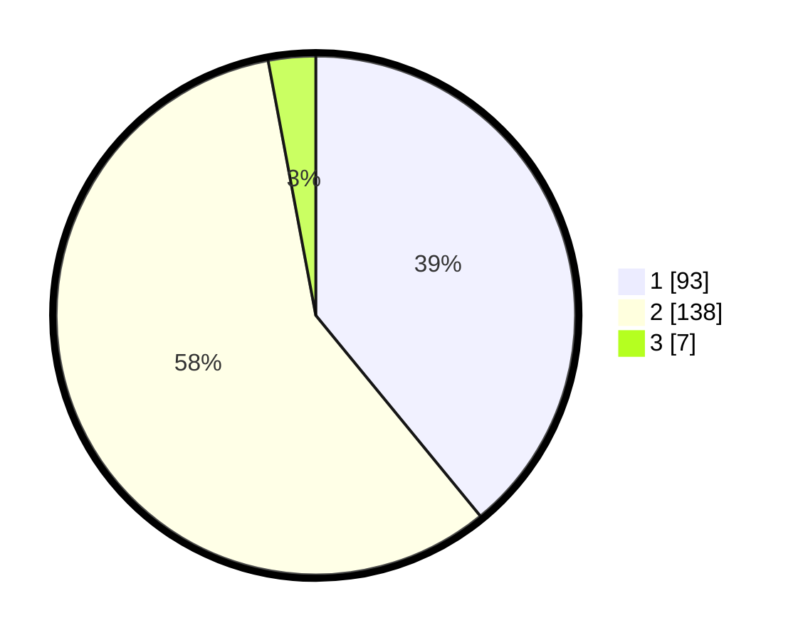

# Hasil

## Grafik

## Tabel

| No. | Nama Paslon    | Suara | Suara (raw) | Persentase |
|:--- |:-------------- | -----:| -----------:| ----------:|
| 1   | ANIES MUHAIMIN | 93    | [93][p-1]   | 39,08      |
| 2   | PRABOWO GIBRAN | 138   | [138][p-2]  | 57,98      |
| 3   | GANJAR MAHFUD  | 7     | [7][p-3]    | 2,94       |

[p-1]: https://github.com/gigit-pemilu/pemilu-2024-35-jawa-timur/blob/main/pilpres/hitung-suara/sub/35-jawa-timur/sub/28-pamekasan/sub/09-pakong/sub/2001-bicorong/sub/002-tps/sub/paslon-1.txt
[p-2]: https://github.com/gigit-pemilu/pemilu-2024-35-jawa-timur/blob/main/pilpres/hitung-suara/sub/35-jawa-timur/sub/28-pamekasan/sub/09-pakong/sub/2001-bicorong/sub/002-tps/sub/paslon-2.txt
[p-3]: https://github.com/gigit-pemilu/pemilu-2024-35-jawa-timur/blob/main/pilpres/hitung-suara/sub/35-jawa-timur/sub/28-pamekasan/sub/09-pakong/sub/2001-bicorong/sub/002-tps/sub/paslon-3.txt

## Foto C Plano

https://sirekap-obj-formc.kpu.go.id/008c/pemilu/ppwp/35/28/09/20/01/3528092001002-20240215-003224--b558d055-4419-4c3c-9852-c737295f2838.jpg

https://sirekap-obj-formc.kpu.go.id/008c/pemilu/ppwp/35/28/09/20/01/3528092001002-20240215-003824--68b338fa-f9f3-4dda-a4db-37f2fb94cc30.jpg

https://sirekap-obj-formc.kpu.go.id/008c/pemilu/ppwp/35/28/09/20/01/3528092001002-20240215-003942--62ed1cca-dd78-4938-8ba4-ae2fb63752c0.jpg

## Metadata

| Key        | Value               |
| ---------- | ------------------- |
| Time Stamp | 2024-02-15 22:00:27 |

