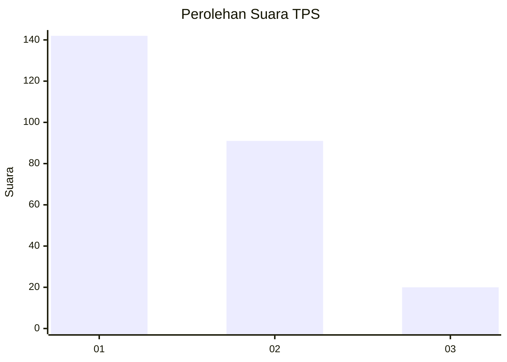
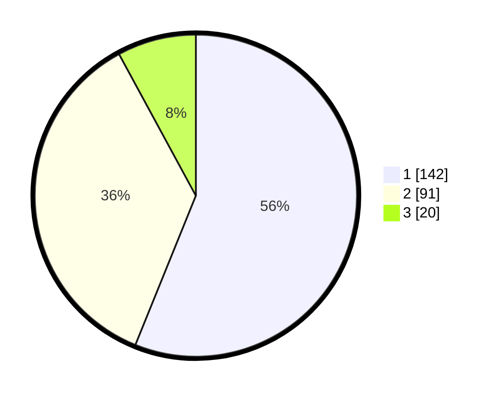

# Hasil

## Grafik

## Tabel

| No. | Nama Paslon    | Suara | Suara (raw) | Persentase |
|:--- |:-------------- | -----:| -----------:| ----------:|
| 1   | ANIES MUHAIMIN | 142   | [142][p-1]  | 56,13      |
| 2   | PRABOWO GIBRAN | 91    | [91][p-2]   | 35,97      |
| 3   | GANJAR MAHFUD  | 20    | [20][p-3]   | 7,91       |

[p-1]: https://github.com/gigit-pemilu/pemilu-2024/blob/main/pilpres/hitung-suara/sub/35-jawa-timur/sub/28-pamekasan/sub/09-pakong/sub/2001-bicorong/sub/003-tps/sub/paslon-1.txt
[p-2]: https://github.com/gigit-pemilu/pemilu-2024/blob/main/pilpres/hitung-suara/sub/35-jawa-timur/sub/28-pamekasan/sub/09-pakong/sub/2001-bicorong/sub/003-tps/sub/paslon-2.txt
[p-3]: https://github.com/gigit-pemilu/pemilu-2024/blob/main/pilpres/hitung-suara/sub/35-jawa-timur/sub/28-pamekasan/sub/09-pakong/sub/2001-bicorong/sub/003-tps/sub/paslon-3.txt

## Foto C Plano

https://sirekap-obj-formc.kpu.go.id/9875/pemilu/ppwp/35/28/09/20/01/3528092001003-20240215-003145--45424f50-17eb-456e-8ec1-082a481322e0.jpg

https://sirekap-obj-formc.kpu.go.id/9875/pemilu/ppwp/35/28/09/20/01/3528092001003-20240214-202518--6ef01e73-1e13-4182-ac0d-85042b92960a.jpg

https://sirekap-obj-formc.kpu.go.id/9875/pemilu/ppwp/35/28/09/20/01/3528092001003-20240214-202618--76c1ad42-883c-494b-a229-9776bb9b4cd7.jpg

## Metadata

| Key        | Value               |
| ---------- | ------------------- |
| Time Stamp | 2024-02-15 22:00:27 |

