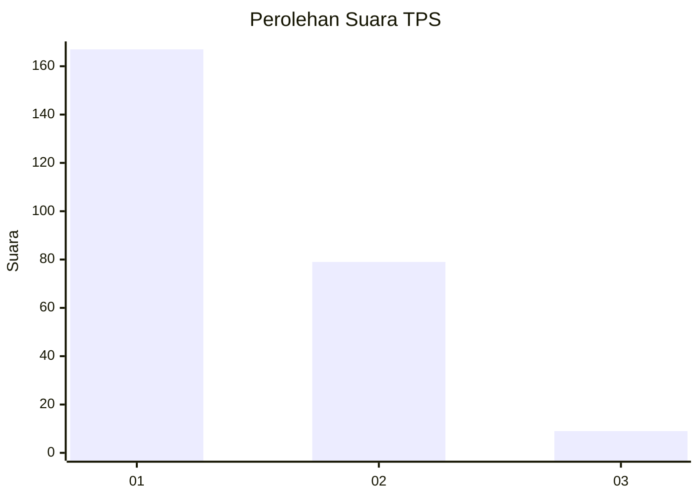
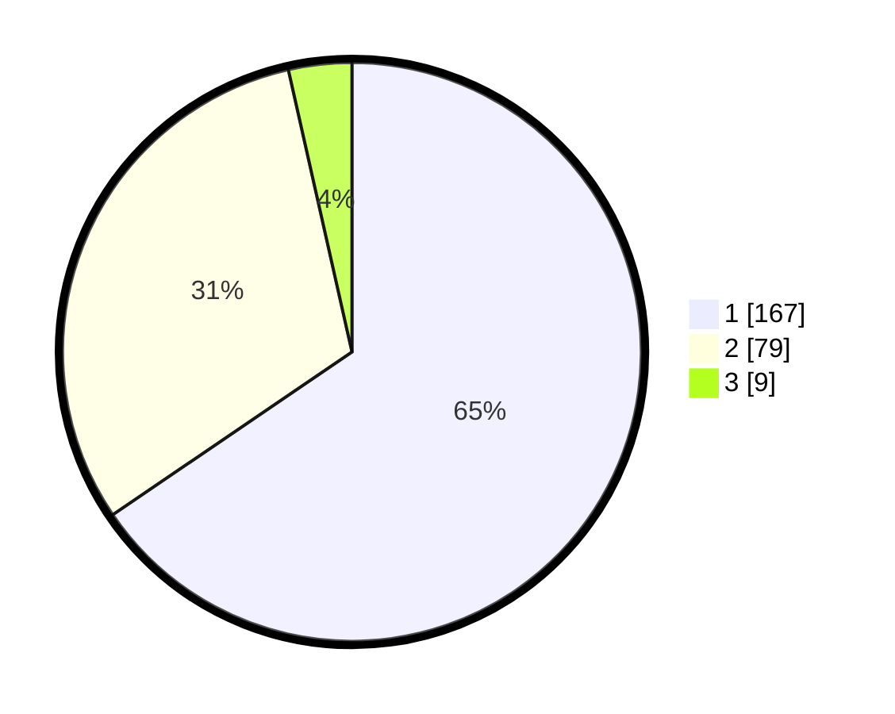

# Hasil

## Grafik

## Tabel

| No. | Nama Paslon    | Suara | Suara (raw) | Persentase |
|:--- |:-------------- | -----:| -----------:| ----------:|
| 1   | ANIES MUHAIMIN | 167   | [167][p-1]  | 65,49      |
| 2   | PRABOWO GIBRAN | 79    | [79][p-2]   | 30,98      |
| 3   | GANJAR MAHFUD  | 9     | [9][p-3]    | 3,53       |

[p-1]: https://github.com/gigit-pemilu/pemilu-2024-35-jawa-timur/blob/main/pilpres/hitung-suara/sub/35-jawa-timur/sub/28-pamekasan/sub/09-pakong/sub/2001-bicorong/sub/012-tps/sub/paslon-1.txt
[p-2]: https://github.com/gigit-pemilu/pemilu-2024-35-jawa-timur/blob/main/pilpres/hitung-suara/sub/35-jawa-timur/sub/28-pamekasan/sub/09-pakong/sub/2001-bicorong/sub/012-tps/sub/paslon-2.txt
[p-3]: https://github.com/gigit-pemilu/pemilu-2024-35-jawa-timur/blob/main/pilpres/hitung-suara/sub/35-jawa-timur/sub/28-pamekasan/sub/09-pakong/sub/2001-bicorong/sub/012-tps/sub/paslon-3.txt

## Foto C Plano

https://sirekap-obj-formc.kpu.go.id/06e5/pemilu/ppwp/35/28/09/20/01/3528092001012-20240214-220136--360067e6-1d07-411e-8fc8-5cfa7ee6d4b8.jpg

https://sirekap-obj-formc.kpu.go.id/06e5/pemilu/ppwp/35/28/09/20/01/3528092001012-20240214-220319--8aff1434-81e4-4878-8e57-02d04f7f35a5.jpg

https://sirekap-obj-formc.kpu.go.id/06e5/pemilu/ppwp/35/28/09/20/01/3528092001012-20240214-220510--a6ec5ec9-83ac-406d-8159-15991d3fb29d.jpg

## Metadata

| Key        | Value               |
| ---------- | ------------------- |
| Time Stamp | 2024-02-15 22:00:27 |

