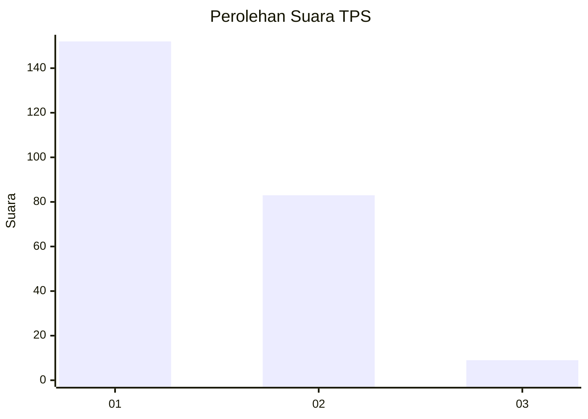
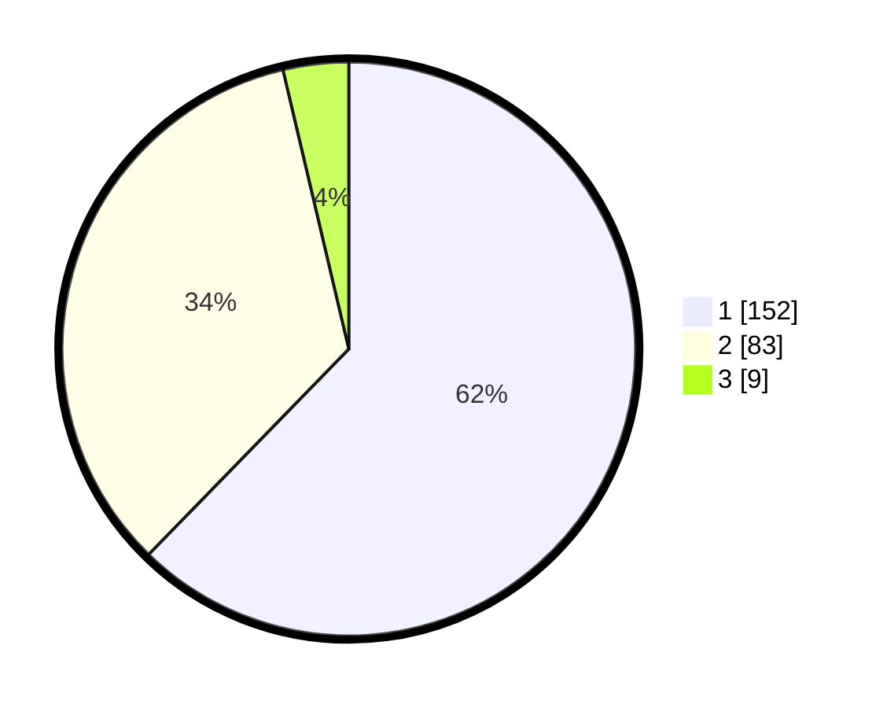

# Hasil

## Grafik

## Tabel

| No. | Nama Paslon    | Suara | Suara (raw) | Persentase |
|:--- |:-------------- | -----:| -----------:| ----------:|
| 1   | ANIES MUHAIMIN | 152   | [152][p-1]  | 62,30      |
| 2   | PRABOWO GIBRAN | 83    | [83][p-2]   | 34,02      |
| 3   | GANJAR MAHFUD  | 9     | [9][p-3]    | 3,69       |

[p-1]: https://github.com/gigit-pemilu/pemilu-2024/blob/main/pilpres/hitung-suara/sub/35-jawa-timur/sub/28-pamekasan/sub/09-pakong/sub/2002-klompang-barat/sub/001-tps/sub/paslon-1.txt
[p-2]: https://github.com/gigit-pemilu/pemilu-2024/blob/main/pilpres/hitung-suara/sub/35-jawa-timur/sub/28-pamekasan/sub/09-pakong/sub/2002-klompang-barat/sub/001-tps/sub/paslon-2.txt
[p-3]: https://github.com/gigit-pemilu/pemilu-2024/blob/main/pilpres/hitung-suara/sub/35-jawa-timur/sub/28-pamekasan/sub/09-pakong/sub/2002-klompang-barat/sub/001-tps/sub/paslon-3.txt

## Foto C Plano

https://sirekap-obj-formc.kpu.go.id/0f43/pemilu/ppwp/35/28/09/20/02/3528092002001-20240214-234822--284e38cc-9294-4c63-a654-9c37c9c4bbf5.jpg

https://sirekap-obj-formc.kpu.go.id/0f43/pemilu/ppwp/35/28/09/20/02/3528092002001-20240214-234944--e902e1c2-bf81-4016-bce8-06cdac48ab4a.jpg

https://sirekap-obj-formc.kpu.go.id/0f43/pemilu/ppwp/35/28/09/20/02/3528092002001-20240214-235050--660d3c6b-6290-4107-8de4-ae1d6804fcd3.jpg

## Metadata

| Key        | Value               |
| ---------- | ------------------- |
| Time Stamp | 2024-02-15 22:00:27 |

