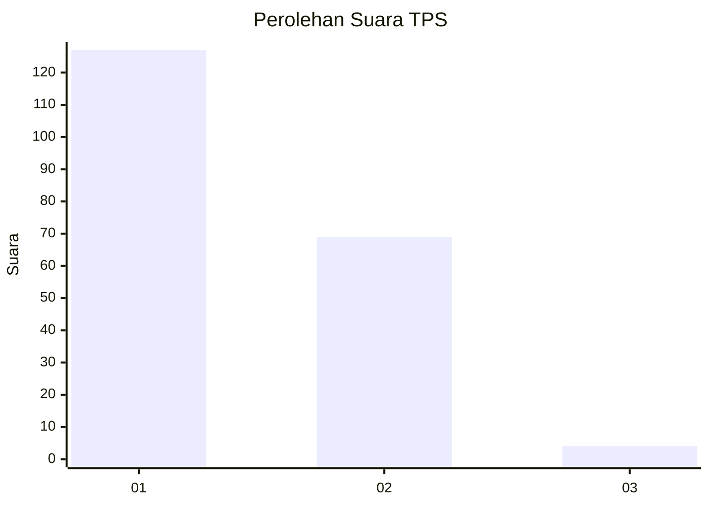
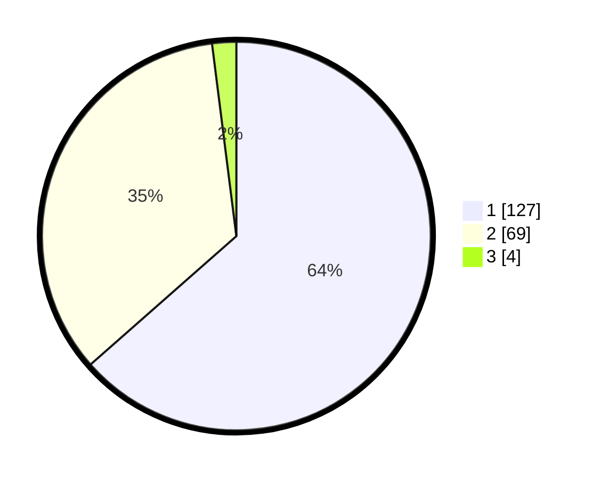

# Hasil

## Grafik

## Tabel

| No. | Nama Paslon    | Suara | Suara (raw) | Persentase |
|:--- |:-------------- | -----:| -----------:| ----------:|
| 1   | ANIES MUHAIMIN | 127   | [127][p-1]  | 63,50      |
| 2   | PRABOWO GIBRAN | 69    | [69][p-2]   | 34,50      |
| 3   | GANJAR MAHFUD  | 4     | [4][p-3]    | 2,00       |

[p-1]: https://github.com/gigit-pemilu/pemilu-2024-35-jawa-timur/blob/main/pilpres/hitung-suara/sub/35-jawa-timur/sub/28-pamekasan/sub/09-pakong/sub/2003-klompang-timur/sub/001-tps/sub/paslon-1.txt
[p-2]: https://github.com/gigit-pemilu/pemilu-2024-35-jawa-timur/blob/main/pilpres/hitung-suara/sub/35-jawa-timur/sub/28-pamekasan/sub/09-pakong/sub/2003-klompang-timur/sub/001-tps/sub/paslon-2.txt
[p-3]: https://github.com/gigit-pemilu/pemilu-2024-35-jawa-timur/blob/main/pilpres/hitung-suara/sub/35-jawa-timur/sub/28-pamekasan/sub/09-pakong/sub/2003-klompang-timur/sub/001-tps/sub/paslon-3.txt

## Foto C Plano

https://sirekap-obj-formc.kpu.go.id/9561/pemilu/ppwp/35/28/09/20/03/3528092003001-20240214-220518--006450da-9659-4a81-ac4e-c7056d4c75df.jpg

https://sirekap-obj-formc.kpu.go.id/9561/pemilu/ppwp/35/28/09/20/03/3528092003001-20240214-220714--2e1fe00d-953d-4ad0-af56-bb27f875b0ed.jpg

https://sirekap-obj-formc.kpu.go.id/9561/pemilu/ppwp/35/28/09/20/03/3528092003001-20240215-014455--60d4765b-3202-4bbf-bc2d-5bffee2e6847.jpg

## Metadata

| Key        | Value               |
| ---------- | ------------------- |
| Time Stamp | 2024-02-15 22:00:27 |

