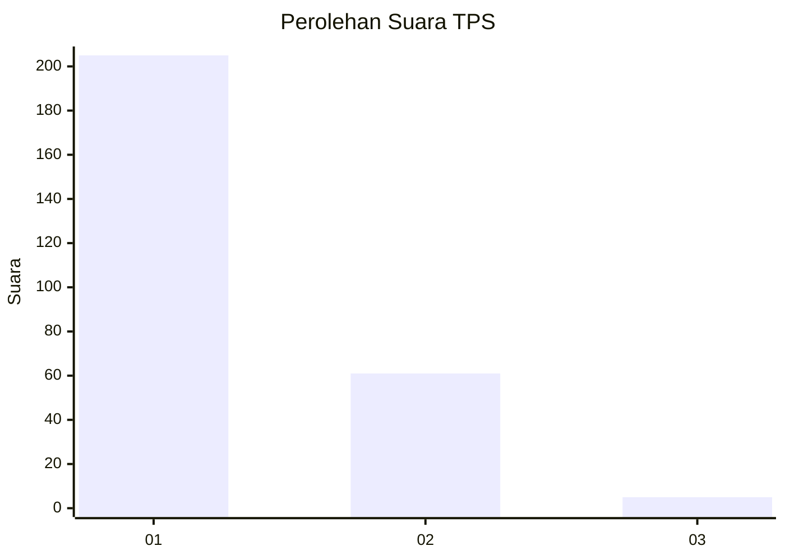
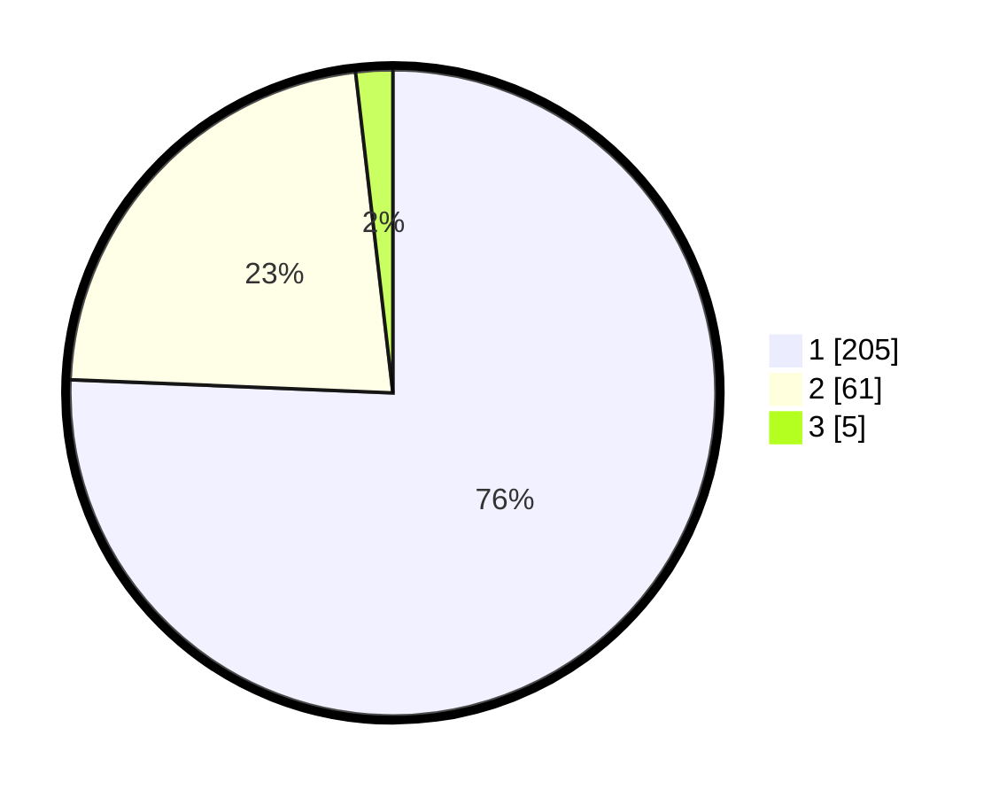

# Hasil

## Grafik

## Tabel

| No. | Nama Paslon    | Suara | Suara (raw) | Persentase |
|:--- |:-------------- | -----:| -----------:| ----------:|
| 1   | ANIES MUHAIMIN | 205   | [205][p-1]  | 75,65      |
| 2   | PRABOWO GIBRAN | 61    | [61][p-2]   | 22,51      |
| 3   | GANJAR MAHFUD  | 5     | [5][p-3]    | 1,85       |

[p-1]: https://github.com/gigit-pemilu/pemilu-2024/blob/main/pilpres/hitung-suara/sub/35-jawa-timur/sub/28-pamekasan/sub/09-pakong/sub/2003-klompang-timur/sub/006-tps/sub/paslon-1.txt
[p-2]: https://github.com/gigit-pemilu/pemilu-2024/blob/main/pilpres/hitung-suara/sub/35-jawa-timur/sub/28-pamekasan/sub/09-pakong/sub/2003-klompang-timur/sub/006-tps/sub/paslon-2.txt
[p-3]: https://github.com/gigit-pemilu/pemilu-2024/blob/main/pilpres/hitung-suara/sub/35-jawa-timur/sub/28-pamekasan/sub/09-pakong/sub/2003-klompang-timur/sub/006-tps/sub/paslon-3.txt

## Foto C Plano

https://sirekap-obj-formc.kpu.go.id/e5ee/pemilu/ppwp/35/28/09/20/03/3528092003006-20240215-015415--1b4c7d80-5abe-4260-98db-d8a4373b482a.jpg

https://sirekap-obj-formc.kpu.go.id/e5ee/pemilu/ppwp/35/28/09/20/03/3528092003006-20240215-015538--8adc71eb-564b-4d02-9a1f-68ed9da1b2c5.jpg

https://sirekap-obj-formc.kpu.go.id/e5ee/pemilu/ppwp/35/28/09/20/03/3528092003006-20240215-015701--abd65abb-50f8-4232-8ae3-4e3e3625464d.jpg

## Metadata

| Key        | Value               |
| ---------- | ------------------- |
| Time Stamp | 2024-02-15 22:00:27 |

